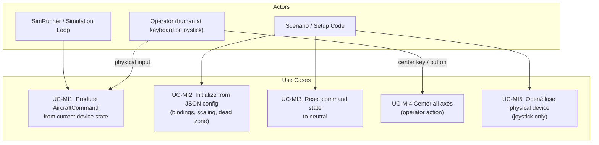

# Manual Input — Architecture and Interface Design

This document is the design authority for the manual input subsystem. It covers the
`ManualInput` abstract interface, the `KeyboardInput` and `JoystickInput` concrete
adapters, the configuration schemas, the integration contract with `SimRunner`, and the
test strategy.

**Layer placement:** Interface Layer. These classes translate raw OS/device input into
`AircraftCommand` values expressed in SI units. They contain no physics, no unit
conversions in the domain sense, and no simulation state. They are the only place in the
system where human control input enters.

**Supported device classes.** `JoystickInput` targets three categories of USB control
device, all of which SDL2 presents through a uniform joystick axis/button interface:

| Device class | Examples | Notes |
| --- | --- | --- |
| USB joystick / HOTAS | Logitech Extreme 3D Pro, Thrustmaster T.16000M | Axis indices and ranges vary by model; configure via JSON |
| Game controller / gamepad | Xbox controller, PS5 DualSense, 8BitDo | SDL2 `SDL_Joystick` API; axis layout differs from `SDL_GameController` standard mapping — use raw axis indices |
| R/C transmitter (USB / trainer port) | FrSky Taranis (USB HID mode), Spektrum DX6e (USB), Radiomaster TX16S | Transmitters often output a sub-range of the full SDL ±32767 span and may require per-axis calibration limits |

Because device axis assignments and raw output ranges differ across all three classes,
`JoystickInput` is fully configurable: every axis assignment, direction, calibrated
raw limit, and command scale is specified in the JSON config. No default axis layout is
assumed to be correct without device-specific configuration.

---

## Use Case Decomposition



| ID | Use Case | Primary Actor | Mechanism |
| --- | --- | --- | --- |
| UC-MI1 | Produce `AircraftCommand` from current device state | Simulation loop | `ManualInput::read()` — non-blocking, returns latest command |
| UC-MI2 | Initialize from JSON config | Scenario / setup | `initialize(config)` on the concrete subclass |
| UC-MI3 | Reset command state to neutral | Scenario, test | `reset()` |
| UC-MI4 | Center all axes | Operator (keyboard key or joystick button) | Handled internally by `read()` when the center binding is active |
| UC-MI5 | Open / close physical joystick device | Scenario, RAII | `JoystickInput` constructor / destructor |

---

## Layer Placement and Namespace

```text
Interface Layer
    liteaero::simulation::ManualInput       (abstract)
    liteaero::simulation::KeyboardInput     (concrete)
    liteaero::simulation::JoystickInput     (concrete)
```

All three classes live in the `liteaero::simulation` namespace, under
`include/input/` and `src/input/`. They depend on `AircraftCommand` from the
Domain Layer (via `include/Aircraft.hpp`) and on SDL2 for device access.
They do not depend on any other Domain Layer class.

---

## `ManualInput` Abstract Interface

```cpp
// include/input/ManualInput.hpp
#pragma once

#include "Aircraft.hpp"   // AircraftCommand
#include <nlohmann/json.hpp>

namespace liteaero::simulation {

// Abstract base for all manual control adapters.
//
// Concrete subclasses translate OS/device input (keyboard state, joystick
// axes) into AircraftCommand values.  read() must be non-blocking.
//
// Lifecycle:  subclass(...) → initialize(config) → reset() → read() [×N]
class ManualInput {
public:
    // Initialize from a JSON config object specific to the concrete subclass.
    // Throws std::invalid_argument on missing or out-of-range fields.
    virtual void initialize(const nlohmann::json& config) = 0;

    // Reset command state to the neutral command (straight-and-level, idle throttle).
    virtual void reset() = 0;

    // Return the AircraftCommand implied by the current device state.
    // Non-blocking.  Must be called from the simulation thread.
    virtual AircraftCommand read() = 0;

    virtual ~ManualInput() = default;
};

} // namespace liteaero::simulation
```

---

## `KeyboardInput`

### Command Integration Model

`KeyboardInput` is **integrating**: holding a key causes the associated command axis
to ramp at a configured rate (units per second). Releasing the key leaves the command
at its current value. This gives the pilot tactile control authority comparable to a
stick held in deflection.

A dedicated **center key** immediately snaps all axes back to the neutral command:
`n_z = 1.0 g`, `n_y = 0.0 g`, `rollRate_Wind_rps = 0.0 rad/s`, `throttle_nd =
idle_throttle_nd`.

The `dt_s` parameter passed to `read(dt_s)` is the simulation timestep. The command
increment per call is `rate * dt_s` for each active key.

```cpp
// include/input/KeyboardInput.hpp
#pragma once

#include "ManualInput.hpp"
#include <SDL2/SDL.h>
#include <cstdint>

namespace liteaero::simulation {

struct KeyboardInputConfig {
    // SDL scancodes for each command axis.  See SDL_scancode.h.
    SDL_Scancode key_pitch_up        = SDL_SCANCODE_UP;
    SDL_Scancode key_pitch_down      = SDL_SCANCODE_DOWN;
    SDL_Scancode key_roll_right      = SDL_SCANCODE_RIGHT;
    SDL_Scancode key_roll_left       = SDL_SCANCODE_LEFT;
    SDL_Scancode key_yaw_right       = SDL_SCANCODE_E;
    SDL_Scancode key_yaw_left        = SDL_SCANCODE_Q;
    SDL_Scancode key_throttle_up     = SDL_SCANCODE_W;
    SDL_Scancode key_throttle_down   = SDL_SCANCODE_S;
    SDL_Scancode key_center          = SDL_SCANCODE_SPACE;

    // Rates (per second) at which each command axis ramps while the key is held.
    float nz_rate_g_s            = 2.0f;    // load factor rate (g/s)
    float ny_rate_g_s            = 1.0f;    // lateral load factor rate (g/s)
    float roll_rate_rate_rad_s2  = 1.0f;    // roll rate command ramp (rad/s²)
    float throttle_rate_nd_s     = 0.5f;    // throttle ramp (fraction/s)

    // Command limits — output is clamped to these ranges.
    float min_nz_g               = -2.0f;
    float max_nz_g               =  4.0f;
    float max_ny_g               =  2.0f;   // symmetric: clamped to [-max, +max]
    float max_roll_rate_rad_s    =  1.57f;  // π/2 rad/s ≈ 90 °/s
    float idle_throttle_nd       =  0.05f;  // throttle value at center/reset

    // Neutral n_z (straight-and-level = 1 g).
    float neutral_nz_g           =  1.0f;
};

class KeyboardInput final : public ManualInput {
public:
    using KeyStateProvider = std::function<const Uint8*()>;

    // Constructs with the default production key-state provider
    // (SDL_GetKeyboardState).  Pass a custom provider for unit testing.
    explicit KeyboardInput(KeyStateProvider provider = defaultKeyStateProvider());

    void         initialize(const nlohmann::json& config) override;
    void         reset() override;

    // Read current keyboard state and advance the integrated command.
    // dt_s — simulation timestep in seconds; used to scale increment rates.
    // In production: caller must have called SDL_PumpEvents() before read().
    AircraftCommand read() override;
    AircraftCommand read(float dt_s);

    // Replace the key-state provider (e.g., swap in a mock after construction).
    void setKeyStateProvider(KeyStateProvider provider);

    static KeyStateProvider defaultKeyStateProvider();

private:
    KeyboardInputConfig config_;
    AircraftCommand     command_;       // current integrated command
    KeyStateProvider    key_provider_;

    void applyKeys(const Uint8* keys, float dt_s);
    void clampCommand();
};

} // namespace liteaero::simulation
```

### SDL2 Keyboard Polling

`KeyboardInput` accepts an injected key-state provider so that unit tests can supply
mock key state without SDL. In production, the provider calls
`SDL_GetKeyboardState(nullptr)` after the caller has pumped SDL events. In tests, the
provider returns a pre-built array.

The provider is a `std::function<const Uint8*(void)>` set at construction time or via
`setKeyStateProvider()`. The default production provider is:

```cpp
[]() -> const Uint8* { return SDL_GetKeyboardState(nullptr); }
```

The caller is still responsible for invoking `SDL_PumpEvents()` before `read()` in
production code. `SDL_PumpEvents()` must be called from the same thread that created
the SDL window (or from the main thread if no SDL window exists).

### `KeyboardInputConfig` — JSON Schema

```json
{
  "key_pitch_up":       82,
  "key_pitch_down":     81,
  "key_roll_right":     79,
  "key_roll_left":      80,
  "key_yaw_right":      26,
  "key_yaw_left":       20,
  "key_throttle_up":    26,
  "key_throttle_down":  22,
  "key_center":          44,
  "nz_rate_g_s":         2.0,
  "ny_rate_g_s":         1.0,
  "roll_rate_rate_rad_s2": 1.0,
  "throttle_rate_nd_s":  0.5,
  "min_nz_g":           -2.0,
  "max_nz_g":            4.0,
  "max_ny_g":            2.0,
  "max_roll_rate_rad_s": 1.5708,
  "idle_throttle_nd":    0.05,
  "neutral_nz_g":        1.0
}
```

Integer values are SDL scancodes (from `SDL_scancode.h`). The JSON schema uses raw
integer scancodes rather than string names to avoid a string-to-scancode lookup table.

---

## `JoystickInput`

### SDL2 Device Lifecycle

`JoystickInput` opens and closes the SDL2 joystick device in its constructor and
destructor. The caller is responsible for having called `SDL_Init(SDL_INIT_JOYSTICK)`
before constructing a `JoystickInput`. A `device_index` of 0 selects the first
enumerated joystick.

If the device is not present at construction, the constructor throws
`std::runtime_error`. Mid-run disconnect handling is described under
[Open Questions](#open-questions).

```cpp
// include/input/JoystickInput.hpp
#pragma once

#include "ManualInput.hpp"
#include <SDL2/SDL.h>

namespace liteaero::simulation {

struct AxisMapping {
    int     sdl_axis_index = 0;       // SDL2 axis index (0-based)
    float   center_output  = 0.0f;    // command value at axis center (normalized = 0)
    float   scale          = 1.0f;    // command units per unit of normalized axis output
    bool    inverted       = false;   // if true, negate the normalized axis before scaling
    int16_t raw_min        = -32768;  // calibrated raw minimum (device full-back/left)
    int16_t raw_max        =  32767;  // calibrated raw maximum (device full-forward/right)
    // raw_min / raw_max allow R/C transmitters and devices that do not use the full
    // SDL ±32767 range to be calibrated correctly.  Values outside [raw_min, raw_max]
    // are clamped before normalization.
};

struct JoystickInputConfig {
    float dead_zone_nd        = 0.05f;  // fraction of full travel; [0, 1)

    // Axis-to-command mappings.  Defaults assume no specific device — all
    // axis indices and raw limits must be set per device in the JSON config.
    AxisMapping nz_axis       = {1, 1.0f,   3.0f,   true,  -32768, 32767};
        // pitch axis, center = 1 g, scale = 3 g per unit, inverted
        // (pull back → positive normalized → +Nz; push forward → −Nz)
    AxisMapping ny_axis       = {3, 0.0f,   1.0f,   false, -32768, 32767};
        // yaw/rudder axis, center = 0 g, scale = 1 g per unit
    AxisMapping roll_axis     = {0, 0.0f,   1.5708f,false, -32768, 32767};
        // aileron axis, center = 0 rad/s, scale = π/2 rad/s per unit
    AxisMapping throttle_axis = {2, 0.0f,   1.0f,   true,  -32768, 32767};
        // throttle axis, center = 0 (idle), scale = 1.0 per unit, inverted
        // R/C transmitters: set raw_min/raw_max to the calibrated travel extents

    // Command limits (applied after axis mapping and dead zone).
    float min_nz_g            = -2.0f;
    float max_nz_g            =  4.0f;
    float max_ny_g            =  2.0f;
    float max_roll_rate_rad_s =  1.5708f;  // π/2 rad/s ≈ 90 °/s

    // Button index for the "center" action; -1 to disable.
    int   center_button_index = 0;
};
```

> **Note on throttle axis:** A typical single-lever throttle reports full forward as
> SDL value −32768 and full back as +32767. Set `inverted = true` so that full forward
> maps to normalized +1, then to `center_output + scale = 1.0` (full throttle). For
> R/C transmitters whose throttle channel spans only part of the SDL range (e.g.,
> [−16000, +16000] from a Taranis in USB HID mode), set `raw_min = −16000` and
> `raw_max = 16000` to calibrate the effective travel extents. The normalization step
> then maps the full transmitter travel to [−1, +1] regardless of the SDL scale.

```cpp
class JoystickInput final : public ManualInput {
public:
    // Provider type for injecting raw axis values — enables unit testing without
    // a physical device.  Returns Sint16 for the given SDL axis index.
    using AxisProvider = std::function<Sint16(int axis_index)>;

    // Production constructor: opens the SDL2 joystick at device_index.
    // Throws std::runtime_error if the device cannot be opened.
    // SDL_Init(SDL_INIT_JOYSTICK) must have been called before construction.
    explicit JoystickInput(int device_index = 0);

    // Test constructor: accepts an injected axis provider; no SDL device is opened.
    explicit JoystickInput(AxisProvider provider);

    // Closes the SDL2 joystick handle (if opened).
    ~JoystickInput() override;

    JoystickInput(const JoystickInput&)            = delete;
    JoystickInput& operator=(const JoystickInput&) = delete;
    JoystickInput(JoystickInput&&)                 = delete;
    JoystickInput& operator=(JoystickInput&&)      = delete;

    void            initialize(const nlohmann::json& config) override;
    void            reset() override;
    AircraftCommand read() override;

    // False after an SDL_JOYDEVICEREMOVED event is detected; true until then.
    // Always true when constructed with an injected AxisProvider.
    bool            isConnected() const;

private:
    SDL_Joystick*       joystick_        = nullptr;
    AxisProvider        axis_provider_;
    JoystickInputConfig config_;
    AircraftCommand     neutral_command_;
    bool                connected_       = true;

    float applyDeadZoneAndScale(Sint16 raw, const AxisMapping& mapping) const;
    void  checkDisconnectEvents();
};
```

### Dead Zone and Axis Scaling

SDL2 axis values are `Sint16` in the range [−32768, +32767]. The normalization and dead
zone application steps are:

1. **Calibrate and normalize** to $[-1, +1]$ using the per-axis configured limits:

$$r = \frac{\text{raw} - m}{\Delta / 2}, \quad m = \frac{\text{raw\_min} + \text{raw\_max}}{2}, \quad \Delta = \text{raw\_max} - \text{raw\_min}$$

Clamp $r$ to $[-1, +1]$ before proceeding. The `raw_min` / `raw_max` fields let
R/C transmitters and other devices that do not use the full SDL ±32767 span be
calibrated correctly. For a standard USB joystick with the default
`raw_min = −32768`, `raw_max = 32767`, this reduces to $r = \text{raw} / 32767.5$,
clamped to $[-1, +1]$.

2. **Apply inversion** if `mapping.inverted`:

$$r \leftarrow -r$$

3. **Apply dead zone** with continuity. For dead zone threshold $d \in [0, 1)$:

$$r' = \begin{cases}
    0 & |r| < d \\[4pt]
    \operatorname{sign}(r)\,\dfrac{|r| - d}{1 - d} & |r| \geq d
\end{cases}$$

This rescaling ensures the output reaches $\pm 1$ at full deflection ($|r| = 1$) for
any dead zone value, while producing zero output at the dead zone boundary. The
transition is continuous (no jump at the boundary, since $|r| = d$ yields $r' = 0$).

4. **Map to command units**:

$$c = \text{center\_output} + r' \times \text{scale}$$

5. **Clamp** to the configured command limit range.

### Axis-to-`AircraftCommand` Mapping

The four `AircraftCommand` fields are each driven by a fully configurable axis:

| `AircraftCommand` field | Default axis index | Typical physical control | Neutral output |
| --- | --- | --- | --- |
| `n_z` | 1 | Pitch (elevator) | 1.0 g |
| `n_y` | 3 | Yaw (rudder pedals) | 0.0 g |
| `rollRate_Wind_rps` | 0 | Roll (aileron) | 0.0 rad/s |
| `throttle_nd` | 2 | Throttle lever | 0.0 (idle) |

The `center_output` for `n_z` is 1.0 g because the `Aircraft` model requires
`n_z = 1.0 g` to maintain level flight — a stick centered at 0.0 g would cause the
aircraft to pitch over.

Default axis indices are illustrative only. Because axis numbering varies across USB
joysticks, game controllers, and R/C transmitters, the axis index for every channel
must be confirmed against the specific device using a joystick diagnostics tool (e.g.,
`SDL2_joystick_test`, `jstest-gtk`, or the Windows Game Controllers control panel)
and then set explicitly in the JSON config. The `sdl_axis_index`, `inverted`,
`raw_min`, and `raw_max` fields together provide complete control over the mapping
for any device.

### `JoystickInputConfig` — JSON Schema

```json
{
  "dead_zone_nd": 0.05,
  "nz_axis":      { "sdl_axis_index": 1, "center_output": 1.0, "scale": 3.0,    "inverted": true,  "raw_min": -32768, "raw_max": 32767 },
  "ny_axis":      { "sdl_axis_index": 3, "center_output": 0.0, "scale": 1.0,    "inverted": false, "raw_min": -32768, "raw_max": 32767 },
  "roll_axis":    { "sdl_axis_index": 0, "center_output": 0.0, "scale": 1.5708, "inverted": false, "raw_min": -32768, "raw_max": 32767 },
  "throttle_axis":{ "sdl_axis_index": 2, "center_output": 0.0, "scale": 1.0,    "inverted": true,  "raw_min": -32768, "raw_max": 32767 },
  "min_nz_g":     -2.0,
  "max_nz_g":      4.0,
  "max_ny_g":      2.0,
  "max_roll_rate_rad_s": 1.5708,
  "center_button_index": 0
}
```

For an R/C transmitter that outputs throttle on axis 5 with a calibrated range of
[−20000, +20000], the throttle entry would be:

```json
"throttle_axis": { "sdl_axis_index": 5, "center_output": 0.0, "scale": 1.0, "inverted": true, "raw_min": -20000, "raw_max": 20000 }
```

---

## Integration with `SimRunner`

The simulation loop in `SimRunner` holds a pointer to `ManualInput` (injected by the
scenario). Each iteration, after `SDL_PumpEvents()`, the loop calls
`ManualInput::read()` to obtain the current `AircraftCommand`, then passes it to
`Aircraft::step()`.

```
SimRunner::runLoop():
    SDL_PumpEvents()
    cmd = manual_input->read(dt_s)     // for KeyboardInput
    aircraft->step(time_s, cmd, wind, rho)
    logger->step(...)
```

`SimRunner` does not own the `ManualInput` pointer. The scenario code constructs and
configures the input adapter, then passes a non-owning pointer to `SimRunner` via a
`setManualInput()` method:

```cpp
// Proposed addition to SimRunner:
void SimRunner::setManualInput(ManualInput* input);
```

If `setManualInput()` has not been called (or is called with `nullptr`), the runner
uses a default `AircraftCommand` (1 g, zero lateral, zero roll rate, idle throttle)
for every step.

> **Open question OQ-MI3:** The `SimRunner` interface currently accepts a single
> `Aircraft&`. Adding `ManualInput*` requires modifying `SimRunner::initialize()` or
> adding a separate setter. The setter form (`setManualInput()`) avoids changing the
> `initialize()` signature and is compatible with batch-mode scenarios where no manual
> input is present. Resolution requires confirming this addition to
> [`docs/architecture/sim_runner.md`](sim_runner.md).

---

## SDL2 Initialization Contract

Both `KeyboardInput` and `JoystickInput` use SDL2. The calling code is responsible for
SDL2 lifecycle. The recommended pattern for a scenario that uses both keyboard and
joystick:

```cpp
// Scenario setup:
SDL_Init(SDL_INIT_JOYSTICK | SDL_INIT_EVENTS);

JoystickInput joystick(0);
joystick.initialize(joystick_config_json);

KeyboardInput keyboard;
keyboard.initialize(keyboard_config_json);

// Sim loop:
SDL_PumpEvents();
AircraftCommand cmd = joystick.read();
// OR: cmd = keyboard.read(runner_dt_s);
aircraft.step(t, cmd, wind, rho);

// Teardown:
SDL_Quit();
```

SDL2 is initialized once per process. Multiple `ManualInput` instances do not each
call `SDL_Init`.

---

## Joystick Disconnect Handling

When the joystick is disconnected mid-simulation, `read()` returns the neutral command
(`n_z = 1.0 g`, `n_y = 0`, `rollRate = 0`, `throttle = idle`). This allows keyboard
input to take over control immediately — the keyboard adapter is unaffected by a
joystick disconnect and can be polled in parallel by the scenario.

**Detection mechanism.** SDL2 posts an `SDL_JOYDEVICEREMOVED` event on the next
`SDL_PumpEvents()` call after a physical disconnect. `read()` checks for this event
and sets an internal `connected_` flag to `false`. While disconnected, `read()`
returns the neutral command without querying the device.

`JoystickInput` exposes an `isConnected()` accessor so that the scenario or HUD can
display a warning:

```cpp
bool isConnected() const;   // false after SDL_JOYDEVICEREMOVED; true until then
```

Reconnection during a run is not handled — `isConnected()` stays `false` until the
`JoystickInput` is destroyed and reconstructed with the new device index. Silent
reconnection to a potentially different physical device mid-flight would be unsafe.

---

## Platform and Dependency Notes

`JoystickInput` and `KeyboardInput` depend on SDL2. SDL2 is added as a
platform-conditional Conan dependency:

```ini
# conanfile.txt addition:
sdl/2.28.5
```

SDL2 is available in ConanCenter. It is a Conan-managed dependency using the standard
pattern. On Linux this provides `libSDL2-dev`-equivalent headers and libraries. On
Windows it provides SDL2.dll and import libs.

The CMake integration adds `src/input/KeyboardInput.cpp` and
`src/input/JoystickInput.cpp` to the `liteaero-sim` library target:

```cmake
# CMakeLists.txt addition:
find_package(SDL2 REQUIRED)
target_sources(liteaero-sim PRIVATE
    src/input/KeyboardInput.cpp
    src/input/JoystickInput.cpp
)
target_link_libraries(liteaero-sim PRIVATE SDL2::SDL2)
```

---

## Test Strategy

### Unit Tests — `KeyboardInput`

Tests pass a mock `KeyStateProvider` lambda to the `KeyboardInput` constructor — no SDL
initialization is required. Test file: `test/KeyboardInput_test.cpp`.

| # | Test | What it verifies |
| --- | --- | --- |
| 1 | No keys pressed → neutral command | `n_z = neutral_nz_g`, `n_y = 0`, `rollRate = 0`, `throttle = idle_throttle_nd` |
| 2 | Pitch-up key held for N steps → n_z increases | `n_z = neutral + nz_rate * N * dt_s` (before clamping) |
| 3 | n_z clamps at max_nz_g | Holding pitch-up past limit does not exceed `max_nz_g` |
| 4 | n_z clamps at min_nz_g | Holding pitch-down past limit does not go below `min_nz_g` |
| 5 | Throttle ramps up, clamps at 1.0 | `throttle_nd` ramps correctly; clamped at 1.0 |
| 6 | Throttle ramps down, clamps at 0.0 | `throttle_nd` clamps at 0.0 |
| 7 | Center key → instant neutral | After centering: all fields equal neutral values |
| 8 | `reset()` → neutral command | Same as center; confirms reset() and center are equivalent |
| 9 | `initialize()` applies config | Non-default rates and limits are respected |
| 10 | `initialize()` rejects invalid config | Missing required field → `std::invalid_argument` |

### Unit Tests — `JoystickInput` (axis math, no hardware)

Tests use the `JoystickInput(AxisProvider)` test constructor, passing a lambda that
returns configured raw values per axis index. No SDL initialization or physical device
is required. Test file: `test/JoystickInput_test.cpp`.

| # | Test | What it verifies |
| --- | --- | --- |
| 1 | Axis at center (0) → output = center_output | Dead zone and scale applied correctly at neutral |
| 2 | Axis at dead zone boundary → output = center_output | $\|r\| = d$ maps to $r' = 0$ |
| 3 | Axis just beyond dead zone → output non-zero | Continuity: small increment past $d$ produces small output |
| 4 | Axis at full deflection (+32767) → output = center + scale | Full deflection maps to `center_output + scale` |
| 5 | Axis at full negative deflection (−32768) → correct output | SDL asymmetric minimum is handled (clamped to −1.0) |
| 6 | Inverted axis: positive raw → negative output | `inverted = true` negates normalized value |
| 7 | n_z clamped at max_nz_g | Beyond full pitch deflection, `n_z` saturates at limit |
| 8 | n_z neutral at stick center | `n_z = 1.0 g` at axis 0 (before dead zone) |
| 9 | `reset()` returns neutral command | Confirms reset does not depend on axis state |
| 10 | `initialize()` applies non-default dead zone | Dead zone threshold respected |
| 11 | `initialize()` rejects out-of-range dead zone (≥ 1.0) | `std::invalid_argument` |
| 12 | Calibrated `raw_min`/`raw_max` sub-range: raw at `raw_max` → normalized +1 | Normalization uses configured limits, not ±32767 |
| 13 | Calibrated sub-range: raw outside `[raw_min, raw_max]` is clamped | No output beyond ±1 for out-of-range raw values |
| 14 | `isConnected()` is `true` for injected-provider instance | Provider path never triggers disconnect |
| 15 | After simulated disconnect event, `read()` returns neutral command | Disconnect handling returns safe fallback |

### Integration Tests (hardware-excluded from CI)

Joystick integration tests require a physical device and are excluded from automated
CI. They verify device enumeration, live axis read, and that the full pipeline from
raw SDL axis to `AircraftCommand` has correct sign and scale for the reference device.

---

## File Map

| File | Purpose |
| --- | --- |
| `include/input/ManualInput.hpp` | Abstract interface |
| `include/input/KeyboardInput.hpp` | `KeyboardInput` class and `KeyboardInputConfig` struct |
| `include/input/JoystickInput.hpp` | `JoystickInput` class, `JoystickInputConfig` struct, `AxisMapping` struct |
| `src/input/KeyboardInput.cpp` | Implementation |
| `src/input/JoystickInput.cpp` | Implementation |
| `test/KeyboardInput_test.cpp` | Unit tests (10 tests) |
| `test/JoystickInput_test.cpp` | Unit tests (15 tests) |

---

## Open Questions

| ID | Question | Impact |
| --- | --- | --- |
| ~~OQ-MI1~~ | ~~Injected key/axis state provider~~ | **Resolved:** `KeyboardInput` accepts a `KeyStateProvider` function at construction; `JoystickInput` has a dedicated test constructor taking an `AxisProvider`. Unit tests supply lambdas — no SDL or hardware required. |
| ~~OQ-MI2~~ | ~~Reference joystick device for default axis layout~~ | **Resolved:** no default axis layout is guaranteed correct for any device. Every axis assignment (`sdl_axis_index`), direction (`inverted`), and calibration range (`raw_min`, `raw_max`) must be set explicitly in the JSON config for the specific device in use. Default values in `JoystickInputConfig` are illustrative only. |
| ~~OQ-MI3~~ | ~~SimRunner integration point~~ | **Resolved:** Option B — `SimRunner::setManualInput(ManualInput*)` separate setter, consistent with `Aircraft::setTerrain()`. See [discussion below](#oq-mi3-simrunner-integration). Requires updating [`sim_runner.md`](sim_runner.md) before implementation. |
| ~~OQ-MI4~~ | ~~Joystick disconnect behavior~~ | **Resolved:** `read()` returns neutral command on disconnect; `isConnected()` accessor added; reconnection requires reconstructing the `JoystickInput`. |

---

## OQ-MI3 — SimRunner Integration

`SimRunner::initialize()` currently takes two parameters: a `RunnerConfig` (timing
configuration) and an `Aircraft&` (the domain object to step). `ManualInput` needs to
be available inside the run loop so the current command can be read each step. The
question is where that pointer is introduced.

There are two viable options.

### Option A — Additional parameter on `initialize()`

```cpp
void SimRunner::initialize(const RunnerConfig& config,
                           Aircraft& aircraft,
                           ManualInput* manual_input = nullptr);
```

The pointer defaults to `nullptr`, which preserves all existing call sites —
batch/scripted scenarios that never use manual input compile and run unchanged.
When non-null, the run loop calls `manual_input->read(dt_s)` each step in place of
the hard-coded default command.

**Consequences:**
- All three dependencies (`RunnerConfig`, `Aircraft`, `ManualInput`) are declared
  together at initialization time. There is no window where the runner is initialized
  but the input adapter has not yet been attached.
- Changing the input adapter between runs requires calling `initialize()` again, which
  also resets the step counter and timing state. If the intent is purely to swap the
  input device (e.g., hot-switch from keyboard to joystick), that side-effect may be
  undesirable.
- `initialize()` already mixes timing config and a domain-object reference; adding
  another pointer is consistent with the existing pattern.

### Option B — Separate setter `setManualInput()`

```cpp
void SimRunner::setManualInput(ManualInput* input);  // call after initialize(), before start()
```

This is the same pattern as `Aircraft::setTerrain()`, which is already in the
codebase: an optional dependency injected via a setter after the primary
initialization. The run loop checks whether the pointer is non-null each step.

**Consequences:**
- `initialize()` signature is unchanged; no existing call site is touched.
- The input adapter can be replaced between runs (or between `stop()` and the next
  `start()`) without calling `initialize()` again.
- There is a valid-state window between `initialize()` and `setManualInput()` during
  which the runner would use the default command if started prematurely. This is the
  same risk as `Aircraft::setTerrain()` — it is accepted elsewhere in the codebase.
- Consistent with established precedent in the codebase.

### Decision

**Option B is selected.** It is consistent with `Aircraft::setTerrain()` and does not
change `SimRunner::initialize()`. The ability to swap the input device between runs
without resetting timing state is a practical advantage for interactive development
sessions. The risk of forgetting `setManualInput()` is the same level as the existing
`setTerrain()` risk and is accepted.

`sim_runner.md` must be updated to document `setManualInput()` before `SimRunner`
implementation begins.
