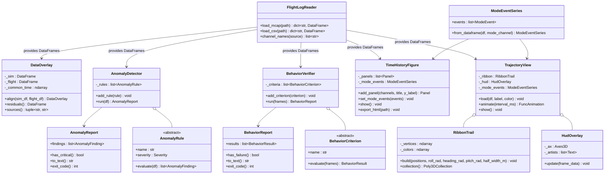

# Post-Processing Tools — Architecture and Design

This document is the design authority for the LiteAero Sim Python post-processing tool
suite. It covers use case decomposition, requirements, module architecture, visual design,
library choices, and test strategy.

**Location:** `python/tools/`

---

## Use Case Decomposition

### Actors and Context

The post-processing tools are Application Layer scripts that operate offline on log files
produced by the simulation. They have no dependency on the simulation runtime or on any
C++ class other than the MCAP and proto schema already encoded in the log file.

The simulation serves two distinct development efforts:

- **Simulation development** — LiteAero Sim developers verifying that the plant physics
  model is correct.
- **Flight software development** — LiteAero Flight (or external autonomy) developers
  using the simulation as a commanded plant to verify that their autopilot, guidance, or
  behavioral autonomy produces the desired closed-loop aircraft behavior. In this context
  the simulation is infrastructure; the post-processing tools are the test oracle.

```mermaid
flowchart TD
    subgraph Actors
        DEV["Sim Developer"]
        INTEG["Integration Tester\n(CI pipeline)"]
        ANALYST["Flight Analyst"]
        FlightDev["Guidance / Autopilot\nDeveloper"]
    end

    subgraph UC["Post-Processing Use Cases"]
        UC1["UC-PP1  Load simulation log\nand inspect channels"]
        UC2["UC-PP2  Detect flight behavior\nanomalies"]
        UC3["UC-PP3  Verify simulation outputs\nagainst integration test criteria"]
        UC4["UC-PP4  Compare simulation run\nto logged real flight data"]
        UC5["UC-PP5  Plot linked, zoomable\ntime history"]
        UC6["UC-PP6  Animate 3D trajectory\nwith ribbon trail"]
        UC7["UC-PP7  Overlay HUD on 3D\nanimation"]
        UC8["UC-PP8  Mark flight control mode\nchanges on all views"]
        UC9["UC-PP9  Verify closed-loop\nbehavior against objectives"]
        UC10["UC-PP10  Plot commands and\nresponses on shared time axis"]
    end

    DEV       --> UC1
    DEV       --> UC5
    DEV       --> UC6
    INTEG     --> UC2
    INTEG     --> UC3
    INTEG     --> UC9
    ANALYST   --> UC4
    ANALYST   --> UC5
    ANALYST   --> UC6
    ANALYST   --> UC7
    ANALYST   --> UC8
    FlightDev --> UC9
    FlightDev --> UC10
    FlightDev --> UC5
    FlightDev --> UC6
    FlightDev --> UC8
```



### Use Case Tracing

| ID | Use Case | Driving Need | Primary Module |
| --- | --- | --- | --- |
| UC-PP1 | Load simulation log | Reconstruct full channel set from MCAP or CSV | `FlightLogReader` |
| UC-PP2 | Detect anomalies | Find physics violations, divergences, discontinuities in batch output | `AnomalyDetector` |
| UC-PP3 | Integration test verification | CI pass/fail gate on simulation scenario outputs | `AnomalyDetector` + `BehaviorReport` |
| UC-PP4 | Sim-to-flight overlay | Side-by-side residual analysis between simulation and real flight log | `DataOverlay` |
| UC-PP5 | Linked time history | Zoomable, scrollable multi-panel plots with a shared time axis | `TimeHistoryFigure` |
| UC-PP6 | 3D trajectory animation | Spatial trajectory with roll-encoded ribbon trail, playback controls | `TrajectoryView` + `RibbonTrail` |
| UC-PP7 | HUD overlay | Numerical flight parameters, sim time, data source shown in 3D animation | `HudOverlay` |
| UC-PP8 | Mode change indication | Flight control mode transitions marked on all time history and 3D views | `ModeEventSeries` |
| UC-PP9 | Closed-loop behavior verification | Verify that autopilot, guidance, or autonomy commands produce the intended aircraft response — pass/fail CI gate for flight software development | `BehaviorVerifier` + `BehaviorReport` |
| UC-PP10 | Command/response time history | Plot commanded inputs alongside aircraft state responses on a shared time axis to inspect tracking error, settling time, and mode transitions | `TimeHistoryFigure` with command channels |

---

## Requirements

### Functional

| ID | Requirement |
| --- | --- |
| PP-F1 | Load MCAP log files using the `mcap` Python SDK; extract all channels from all registered sources into per-source pandas DataFrames. |
| PP-F2 | Load CSV log files exported by `Logger::exportCsv()` into the same DataFrame structure as MCAP. |
| PP-F3 | `AnomalyDetector` evaluates a configurable rule set against a loaded DataFrame and returns a structured `AnomalyReport`. |
| PP-F4 | `AnomalyReport` assigns each finding a severity level (Critical, Warning, Info) and a timestamp. Critical findings cause a non-zero exit code when run from CI. |
| PP-F5 | `DataOverlay` aligns simulation and real-flight DataFrames to a common time base by linear interpolation; computes per-channel residuals. |
| PP-F6 | `TimeHistoryFigure` produces a Plotly figure with multiple subplot panels sharing a single x-axis (time). All panels zoom and scroll together. |
| PP-F7 | Each `TimeHistoryFigure` panel supports up to two y-axes (primary and secondary) to accommodate channels with different units in the same panel. |
| PP-F8 | `TimeHistoryFigure` exports a self-contained HTML file playable in any browser without a running server. |
| PP-F9 | `ModeEventSeries` overlays vertical dashed lines and mode-name annotations at each flight control mode transition on every `TimeHistoryFigure` panel. |
| PP-F10 | `TrajectoryView` animates the aircraft trajectory in 3D using matplotlib `FuncAnimation`. Animation is controllable (play, pause, step, loop). |
| PP-F11 | `RibbonTrail` renders the trajectory as a 3D surface strip whose width direction encodes the aircraft's instantaneous roll attitude. Color encodes roll angle. |
| PP-F12 | `HudOverlay` renders numerical flight parameters, simulation time, and data source identification as fixed-position text overlaid on the 3D animation axes. |
| PP-F13 | `HudOverlay` displays a transient mode-change banner at each flight control mode transition; the banner fades after 2 seconds of animation time. |
| PP-F14 | When two data sources are loaded (UC-PP4), both trajectories are drawn in the same `TrajectoryView` with distinct colors; HUD identifies each source. |
| PP-F15 | `BehaviorVerifier` evaluates a list of `BehaviorCriterion` objects against one or more DataFrames (which may include both aircraft state and command channels from the commanding system) and returns a `BehaviorReport`. |
| PP-F16 | `BehaviorCriterion` checks are expressed in terms of observable channel values — not internal algorithm state — so the verifier operates purely from the log regardless of which system produced the commands. |
| PP-F17 | `BehaviorReport` assigns each criterion a result (Pass, Fail, Inconclusive) with a timestamp range, measured value, and expected bound. Failed criteria cause a non-zero exit code. |
| PP-F18 | `TimeHistoryFigure` accepts command channels and response channels in the same panel, with command traces rendered as dashed lines and response traces as solid lines, to support UC-PP10. |

### Non-Functional

| ID | Requirement |
| --- | --- |
| PP-N1 | `FlightLogReader` loads a 10-minute, 32-channel, 1 kHz MCAP file in ≤ 5 s on a developer workstation. |
| PP-N2 | `AnomalyDetector` completes a full rule sweep of the same 10-minute log in ≤ 2 s. |
| PP-N3 | `TimeHistoryFigure` renders up to 10 panels, 20 channels, 600 000 samples without browser degradation; use Plotly `scattergl` (WebGL) for traces above 50 000 samples. |
| PP-N4 | `TrajectoryView` animation runs at ≥ 20 fps at 1× playback speed with a ribbon trail of 10 000 vertices on a developer workstation. |
| PP-N5 | All tools import cleanly with no side effects; no plot windows open on `import`. |

---

## Dependency Status

The post-processing tool suite has two layers with different dependency profiles. This
determines which modules can be implemented now and which must wait for other design work.

### Visualization Modules — No Blocking Dependencies

The following modules depend only on external Python libraries (all available) and on
whatever channels happen to be present in the log file. They have no dependency on any
simulation design item that is not yet complete.

| Module | External dependencies | Blocking sim design gaps |
| --- | --- | --- |
| `FlightLogReader` | `mcap` Python SDK, `pandas` | None |
| `ModeEventSeries` | `pandas` | None |
| `TimeHistoryFigure` | `plotly` | None |
| `RibbonTrail` | `numpy`, `matplotlib` | None |
| `HudOverlay` | `matplotlib` | None |
| `TrajectoryView` | `matplotlib` | None |

These modules may be implemented as soon as this item is authorized.

### Analysis Modules — Blocked by Undefined Interfaces

The following modules reference channel names, behavioral contracts, or data formats that
are not yet designed. Implementation must wait until the blocking gaps are resolved.

| Module | Blocking gap | Gap owner |
| --- | --- | --- |
| `AnomalyDetector` + rules | **Logged Channel Registry** — no formal spec of which channels the simulation loop logs, under what names | LiteAero Sim — new design item |
| `AnomalyDetector` — `AltitudeBelowTerrain` | Requires a logged AGL channel; `SensorRadAlt` / `SensorLaserAlt` not yet implemented | LiteAero Sim — sensor item |
| `BehaviorVerifier` + criteria | **Logged Channel Registry** (sim side); **LiteAero Flight command channel schema** — autopilot/guidance log source names and channel schema not yet designed | LiteAero Sim + LiteAero Flight |
| `BehaviorVerifier` — `WaypointReached` | **Scenario Reference Data Format** — how waypoint targets are supplied to the criterion; not yet designed | LiteAero Sim |
| `DataOverlay` | **Real Flight Log Format** — what format real aircraft logs come in and how channel names are mapped to the sim schema; not yet designed | LiteAero Sim — new design item |

### Resolution Path

1. Implement visualization modules now (roadmap item 4).
2. Design **Logged Channel Registry** after SimRunner, LandingGear, and the implementable
   sensor subset are complete (roadmap item 7).
3. Design **Real Flight Log Format** independently of other sim items (roadmap item 8).
4. Obtain **LiteAero Flight command channel schema** from the LiteAero Flight roadmap
   (cross-repo dependency; track in LiteAero Flight roadmap).
5. After items 7 and 8 are complete and the LiteAero Flight command schema is defined,
   perform a second design pass to update this document's §Analysis Modules sections with
   concrete channel names and format adapters (roadmap item 10), then implement.

---

## Module Architecture



---

## Data Flow

```
MCAP or CSV log file(s)
  (aircraft state source + command source, same or separate files)
        ↓
  FlightLogReader
        ↓
  dict { source_name → DataFrame }
  (index: time_s float64; columns: SI-suffixed channel names)
        ↓
  ┌──────────────────────────────────────────────────────────────┐
  │                    │                    │                    │
  ↓                    ↓                    ↓                    ↓
AnomalyDetector   BehaviorVerifier     DataOverlay        ModeEventSeries
  ↓                    ↓               (optional,               ↓
AnomalyReport     BehaviorReport       sim + flight)   ┌────────────────┐
  ↓                    ↓                    ↓           ↓               ↓
exit_code()        exit_code()        residuals()  TimeHistoryFigure  TrajectoryView
                                           ↓            ↓                  ↓
                                     (merged df)   HTML file         FuncAnimation
                                                                           ↓
                                                                  HudOverlay + RibbonTrail
```

---

## Module Designs

### `FlightLogReader`

**File:** `python/tools/log_reader.py`

Reads one or more log files and returns a uniform dict of DataFrames regardless of
source format. Every DataFrame has `time_s` as a float64 index and channel names with
SI unit suffixes matching the Logger schema (e.g., `altitude_m`, `roll_rate_rad_s`).

**MCAP reading:** Uses the `mcap` Python SDK (`mcap.reader.make_reader`). For each MCAP
channel, decodes the embedded protobuf schema and deserializes messages into rows. All
channels from a given `LogSource` are merged into one DataFrame per source name.

**CSV reading:** Reads the CSV produced by `Logger::exportCsv()` directly with
`pandas.read_csv`. Source name is derived from the filename.

**Multi-source MCAP:** A single MCAP file may contain multiple sources. `load_mcap`
returns one DataFrame per source name registered in the file.

---

### `AnomalyDetector` and Rule Library

**File:** `python/tools/anomaly.py`

`AnomalyDetector` applies a list of `AnomalyRule` objects to a DataFrame and collects
findings. Each rule is a callable that receives the full DataFrame and returns a list of
zero or more `AnomalyFinding` objects.

**Built-in rules:**

| Rule | Severity | Check |
| --- | --- | --- |
| `AltitudeBelowTerrain` | Critical | `altitude_m` < terrain height at any timestep |
| `AirspeedExceedsVne` | Critical | IAS > configured $V_{ne}$ |
| `AirspeedBelowStall` | Warning | IAS < $V_s$ while `weight_on_wheels` is false |
| `LoadFactorExceedsLimit` | Critical | $\lvert n_z \rvert$ > structural limit |
| `EnergyNotConserved` | Warning | Total energy change exceeds 5% per second with thrust and drag accounted for |
| `AttitudeDiscontinuity` | Critical | Any attitude rate > 50 rad/s between consecutive timesteps (indicates integrator blow-up) |
| `GearContactInconsistent` | Warning | `weight_on_wheels` true but reported altitude > 1 m AGL |
| `TrimDivergence` | Warning | RMS pitch rate > 5°/s over a 10-second window with zero commanded load factor |

**Integration testing usage:**

```python
reader = FlightLogReader()
frames = reader.load_mcap("output/scenario_landing.mcap")
detector = AnomalyDetector.with_default_rules(config)
report = detector.run(frames["aircraft"])
sys.exit(report.exit_code())   # non-zero if any Critical finding
```

---

### `BehaviorVerifier` and Criterion Library

**File:** `python/tools/behavior_verifier.py`

`BehaviorVerifier` is the test oracle for the flight software development use case
(UC-PP9). Where `AnomalyDetector` checks that the simulation plant behaved physically
consistently, `BehaviorVerifier` checks that the commanding system — autopilot, guidance,
or behavioral autonomy — produced the intended closed-loop aircraft response.

`BehaviorVerifier.run()` accepts the full `dict { source_name → DataFrame }` from
`FlightLogReader`, because criteria may span both the aircraft state source (plant
response) and the command source (autopilot output). Each `BehaviorCriterion` selects
whichever channels it needs from whichever sources are present.

**Separation from `AnomalyDetector`:** The two verifiers have different failure semantics.
`AnomalyDetector` failures indicate a broken simulation. `BehaviorVerifier` failures
indicate that the flight software under test did not achieve its behavioral objective —
the simulation itself may be working correctly.

**Built-in criteria:**

| Criterion | Result | Check |
| --- | --- | --- |
| `WaypointReached` | Pass / Fail | Aircraft position comes within a configured radius of a target waypoint within a time window |
| `AltitudeHeld` | Pass / Fail | Altitude error RMS < configured threshold over a steady-state window following a commanded altitude change |
| `HeadingAcquired` | Pass / Fail | Heading error < configured threshold within a configured settling time after a commanded turn |
| `AirspeedTracked` | Pass / Fail | IAS error RMS < configured threshold over a steady-state window |
| `ModeSequenceMatched` | Pass / Fail | Flight control mode transitions follow a configured expected sequence within timing tolerances |
| `LandingRolloutStopped` | Pass / Fail | Ground speed < 1 m/s before the end of the log with `weight_on_wheels` true |
| `TrackingErrorBounded` | Pass / Fail | Cross-track error magnitude < configured bound throughout a defined time window |
| `SettlingTimeMet` | Pass / Inconclusive | Step response settles to within a configured band within a configured time; Inconclusive if the step is not detected |

**Usage — flight software CI:**

```python
reader = FlightLogReader()
frames = reader.load_mcap("output/waypoint_mission.mcap")

verifier = BehaviorVerifier()
verifier.add_criterion(WaypointReached(
    target_ned_m=(500.0, 200.0, -150.0), radius_m=20.0, window_s=(0.0, 120.0)
))
verifier.add_criterion(ModeSequenceMatched(
    expected=["TAKEOFF", "CLIMB", "CRUISE", "APPROACH", "LAND"]
))
report = verifier.run(frames)
print(report.to_text())
sys.exit(report.exit_code())   # non-zero if any criterion Fails
```

**UC-PP10 — command/response time history:** `TimeHistoryFigure` is used directly for
this use case. Command channels (e.g., `nz_command_nd`, `heading_command_rad`) and
response channels (e.g., `load_factor_z_nd`, `heading_rad`) are added to the same panel
with the `command=True` flag on command traces. Command traces render as dashed lines;
response traces render as solid lines. Both are visible at the same time scale with the
shared x-axis linking all panels. `ModeEventSeries` overlays mode transitions so the
analyst can correlate command changes with mode switches.

---

### `DataOverlay`

**File:** `python/tools/data_overlay.py`

Aligns a simulation DataFrame and a real-flight DataFrame to a common time base. The
common time vector is the union of both time grids, bounded by the shorter record. Each
source is linearly interpolated onto the common grid. The `residuals()` method returns
a DataFrame of per-channel differences (sim − flight) on the common grid.

Channel matching is by name. Channels present in one source but not the other are
silently excluded from the residual computation and flagged in a `missing_channels`
attribute.

---

### `ModeEventSeries`

**File:** `python/tools/mode_overlay.py`

Parses a step-function channel (e.g., `flight_control_mode_id`) from a DataFrame and
identifies each rising or changing edge as a `ModeEvent`:

```python
@dataclass
class ModeEvent:
    time_s: float
    mode_id: int
    mode_name: str
```

Mode names are mapped from a configurable `{int: str}` dictionary. `ModeEventSeries` is
consumed by both `TimeHistoryFigure` and `TrajectoryView` to ensure consistent labeling.

---

### `TimeHistoryFigure`

**File:** `python/tools/time_history.py`

Produces a Plotly figure with vertically stacked subplot panels. All panels share a
single x-axis (time in seconds). Pan and zoom on any panel propagates to all others
via Plotly's `shared_xaxes=True` layout option — no custom JavaScript is required.

**Panel definition:**

```python
fig = TimeHistoryFigure(title="Landing Scenario — Channel Review")
fig.add_panel(
    channels=["altitude_m", "altitude_agl_m"],
    title="Altitude",
    y_label="m",
)
fig.add_panel(
    channels=["airspeed_ias_m_s"],
    y2_channels=["load_factor_z_nd"],
    title="Airspeed / Load Factor",
    y_label="m/s",
    y2_label="nd",
)
fig.set_mode_events(mode_events)
fig.export_html("output/landing_review.html")
```

**Mode event overlay:** At each `ModeEvent.time_s`, a vertical dashed line spans the
full figure height. A text annotation above the line shows the mode name. Both are added
as Plotly `shapes` and `annotations` at the layout level so they appear on every panel.

**Sim-vs-flight overlay:** When called with a `DataOverlay` object, each channel trace
is duplicated — one for simulation (solid line), one for real flight (dashed line, same
color, 50% opacity). A third panel is automatically appended for residuals.

**Performance:** Traces with more than 50 000 points use `go.Scattergl` (WebGL
renderer). Traces below this threshold use `go.Scatter` for compatibility.

**Predefined channel groups:**

| Group | Channels | Default panel layout |
| --- | --- | --- |
| `kinematics` | Position, velocity, attitude (roll, pitch, heading) | 3 panels |
| `aerodynamics` | α, β, $C_L$, $C_D$, IAS, Mach | 2 panels |
| `propulsion` | Thrust (N), throttle, motor speed | 1 panel |
| `control` | Load factor command vs. actual, surface deflections | 2 panels |
| `environment` | Wind speed, wind direction, turbulence RMS | 1 panel |
| `landing_gear` | Contact forces per wheel, strut compression, `weight_on_wheels` | 2 panels |

---

### `TrajectoryView` and `RibbonTrail`

**File:** `python/tools/trajectory_view.py`

#### Layout

The figure uses a single matplotlib window divided into two regions:

```
┌───────────────────────────────────────────────────────────────┐
│  3D trajectory axes (mpl_toolkits.mplot3d)       85% height  │
│  Ribbon trail + aircraft marker + HUD overlay                 │
└───────────────────────────────────────────────────────────────┘
┌───────────────────────────────────────────────────────────────┐
│  Playback controls (matplotlib widgets)           8% height   │
│  [◀◀] [▶] [▶▶]  speed: [0.5×] [1×] [2×] [5×]  [loop]       │
└───────────────────────────────────────────────────────────────┘
```

The 3D axes are interactive: the user can rotate and zoom freely; animation continues
during interaction.

#### Ribbon Trail Geometry

The ribbon encodes roll attitude as a 3D surface strip. At each trajectory index $i$:

1. Compute the aircraft body-to-world rotation matrix from heading $\psi_i$, pitch
   $\theta_i$, and roll $\phi_i$ (ZYX Euler, NED convention):

$$R_i = R_z(\psi_i)\, R_y(\theta_i)\, R_x(\phi_i)$$

2. The wing half-span vector in world frame:

$$\mathbf{w}_i = R_i \begin{bmatrix} 0 \\ w/2 \\ 0 \end{bmatrix}$$

where $w$ is the configurable ribbon half-width (default: aircraft wing span).

3. Ribbon edge vertices:

$$\mathbf{v}_{i}^{+} = \mathbf{p}_i + \mathbf{w}_i, \qquad
\mathbf{v}_{i}^{-} = \mathbf{p}_i - \mathbf{w}_i$$

4. Each ribbon quad spans $(\mathbf{v}_i^-, \mathbf{v}_i^+, \mathbf{v}_{i+1}^+, \mathbf{v}_{i+1}^-)$.

5. Face color maps roll angle $\phi_i$ through a diverging colormap (RdBu\_r, centered at
   $\phi = 0$, saturated at $\pm 60°$). A colorbar is placed at the right edge of the
   3D axes.

The ribbon is built once as a `Poly3DCollection` before animation starts. During
playback, the "ghost" ribbon shows the full pre-computed trail; a second shorter
collection (last $N_\text{trail}$ quads) is redrawn in full opacity as the live trail.

**Mode segment coloring:** The trajectory `Line3D` is broken into per-mode segments,
each drawn in a distinct color from the `tab10` palette. A legend identifies each mode
by name.

#### Pre-computation

All geometry is computed before animation starts — no physics or rotation matrices are
evaluated per frame:

```
Pre-computation (runs once on load)
  ↓
  for i in 0..N:
      R_i = rotation_matrix(heading[i], pitch[i], roll[i])
      w_i = R_i @ [0, half_width, 0]
      v_upper[i] = position[i] + w_i
      v_lower[i] = position[i] - w_i
      ribbon_color[i] = colormap(roll[i])

Animation loop (FuncAnimation, ≥ 20 fps)
  ↓
  _update(frame):
      i = frame_index[frame]           ← stride index into pre-computed arrays
      update aircraft marker position
      update live ribbon collection    ← last N_trail quads
      update HUD text artists
      update mode-change banner alpha
```

`blit=False` — the 3D axes cannot blit because the projection changes on rotation.

---

### `HudOverlay`

**File:** `python/tools/trajectory_view.py` (inner class of `TrajectoryView`)

HUD elements are `ax.text2D()` artists at fixed axes-coordinate positions. They are
updated each frame by setting `.set_text()`. No screen-space projection is required.

#### HUD Layout

```
┌─ DATA SOURCE: Simulation — landing_scenario_001.mcap ──────────┐
│                                                SIM TIME  14.22 s│
│                                                                  │
│                                                                  │
│                                                                  │
│                                                                  │
│  IAS   54.3 m/s        ROLL  -12.3°                            │
│  ALT  103.4 m MSL      PITCH   2.1°                            │
│  VS    -2.1 m/s        HDG   247°                              │
│                                                                  │
│  MODE: APPROACH PHASE                          [elapsed 8.3 s]  │
└──────────────────────────────────────────────────────────────────┘
```

| Element | Axes position | Content |
| --- | --- | --- |
| Data source | (0.01, 0.97) top-left | Source label + filename (e.g., `Simulation — file.mcap` or `Flight Log — N12345`) |
| Sim time | (0.99, 0.97) top-right | `SIM TIME  {t:.2f} s` |
| Airspeed | (0.01, 0.07) bottom-left | `IAS  {ias:.1f} m/s` |
| Altitude | (0.01, 0.04) bottom-left | `ALT  {alt:.1f} m MSL` |
| Vertical speed | (0.01, 0.01) bottom-left | `VS  {vs:+.1f} m/s` |
| Roll | (0.25, 0.07) | `ROLL  {roll:+.1f}°` |
| Pitch | (0.25, 0.04) | `PITCH  {pitch:+.1f}°` |
| Heading | (0.25, 0.01) | `HDG  {hdg:.0f}°` |
| Mode | (0.60, 0.01) bottom-right | `MODE: {mode_name}  [elapsed {dt:.1f} s]` |

**Mode-change banner:** A large centered text artist at axes position (0.50, 0.50).
When a mode transition occurs, the banner shows the new mode name at full opacity and
fades linearly to zero over 60 animation frames (2 seconds at 30 fps). Between
transitions the artist is hidden (`alpha = 0`).

**Dual-source overlay:** When two sources are loaded, the HUD shows two columns — one
per source — separated by a vertical divider. Data source labels at top are colored to
match their respective trajectory colors.

---

## Library Choices

| Library | Version | License | Role |
| --- | --- | --- | --- |
| `pandas` | ≥ 2.0 | BSD-3-Clause | Data loading, alignment, channel access |
| `matplotlib` | ≥ 3.8 | PSF | 3D trajectory animation, ribbon trail, HUD, playback widgets |
| `plotly` | ≥ 5.18 | MIT | Interactive linked time history, HTML export |
| `mcap` | ≥ 1.1 | MIT | MCAP file reading (Python SDK from mcap.dev) |
| `numpy` | ≥ 1.26 | BSD-3-Clause | Rotation matrices, ribbon geometry, colormap computation |

All licenses are compatible with the project license preference (MIT → BSD → Apache).

`plotly` and `mcap` are new additions. Add to `python/pyproject.toml`:

```toml
[dependency-groups]
dev = [
    "matplotlib>=3.8",
    "pandas>=2.0",
    "plotly>=5.18",
    "mcap>=1.1",
    "numpy>=1.26",
]
```

---

## Test Strategy

### Unit Tests

**File:** `python/test/test_log_reader.py`

| Test | Pass criterion |
| --- | --- |
| `test_load_csv_returns_dataframe` | `load_csv` on a fixture CSV returns a DataFrame with `time_s` index and expected column names |
| `test_load_csv_si_units_in_columns` | All column names end with a recognized SI unit suffix |
| `test_load_mcap_multi_source` | `load_mcap` on a fixture MCAP returns one DataFrame per registered source |
| `test_load_mcap_matches_csv` | Same log exported as MCAP and CSV produces DataFrames with equal values to within float32 precision |

**File:** `python/test/test_anomaly.py`

| Test | Pass criterion |
| --- | --- |
| `test_no_findings_on_clean_log` | `AnomalyDetector.run()` on a valid nominal trajectory returns an empty `AnomalyReport` |
| `test_altitude_below_terrain_critical` | Injecting a row with altitude below terrain height produces a Critical finding |
| `test_attitude_discontinuity_critical` | Injecting a step-change in roll of 10 rad between two consecutive timesteps produces a Critical finding |
| `test_report_exit_code_nonzero_on_critical` | `AnomalyReport.exit_code()` returns non-zero when any Critical finding is present |
| `test_report_exit_code_zero_on_warning_only` | Exit code is zero when findings are Warning only |

**File:** `python/test/test_data_overlay.py`

| Test | Pass criterion |
| --- | --- |
| `test_align_identical_sources_zero_residuals` | Overlaying a DataFrame with itself produces zero residuals on all channels |
| `test_align_offset_sources_constant_residual` | Overlaying two DataFrames offset by a constant produces uniform residuals equal to the offset |
| `test_missing_channels_reported` | Channels present in only one source appear in `missing_channels`, not in `residuals()` |

**File:** `python/test/test_mode_events.py`

| Test | Pass criterion |
| --- | --- |
| `test_mode_events_from_step_channel` | A step-function channel with 3 transitions produces exactly 3 `ModeEvent` objects with correct timestamps |
| `test_mode_names_mapped` | Mode IDs are mapped to configured name strings |

**File:** `python/test/test_time_history.py`

| Test | Pass criterion |
| --- | --- |
| `test_export_html_creates_file` | `export_html("output.html")` creates a file; matplotlib is not invoked (test calls `export_html` only, no `show()`) |
| `test_add_panel_channel_appears_in_figure` | A channel added via `add_panel` is present as a named trace in the returned Plotly figure |
| `test_shared_xaxis_present` | Exported Plotly figure layout has `shared_xaxes=True` |

**File:** `python/test/test_ribbon_trail.py`

| Test | Pass criterion |
| --- | --- |
| `test_ribbon_wings_level_horizontal` | At $\phi = 0$, $\theta = 0$, wing vector is purely horizontal |
| `test_ribbon_rolled_90_vertical` | At $\phi = 90°$, wing vector is purely vertical |
| `test_ribbon_vertex_count` | Ribbon built from $N$ positions produces $N - 1$ quads, each with 4 vertices |
| `test_ribbon_color_at_zero_roll_is_neutral` | $\phi = 0$ maps to the center (white/neutral) of the diverging colormap |

**File:** `python/test/test_behavior_verifier.py`

| Test | Pass criterion |
| --- | --- |
| `test_waypoint_reached_pass` | `WaypointReached` returns Pass when the trajectory passes within the configured radius at any point in the window |
| `test_waypoint_reached_fail` | `WaypointReached` returns Fail when the trajectory never enters the radius |
| `test_altitude_held_pass` | `AltitudeHeld` returns Pass when altitude RMS error is below threshold over the steady-state window |
| `test_altitude_held_fail` | `AltitudeHeld` returns Fail when RMS error exceeds threshold |
| `test_mode_sequence_matched_pass` | `ModeSequenceMatched` returns Pass when transitions match the expected sequence within timing tolerance |
| `test_mode_sequence_matched_fail_wrong_order` | Returns Fail when a mode is skipped or out of order |
| `test_report_exit_code_nonzero_on_fail` | `BehaviorReport.exit_code()` returns non-zero when any criterion returns Fail |
| `test_report_exit_code_zero_on_all_pass` | Exit code is zero when all criteria return Pass |
| `test_inconclusive_does_not_fail` | A criterion returning Inconclusive does not cause a non-zero exit code |
| `test_multi_source_frames_accessible` | A criterion that reads both `"aircraft"` and `"autopilot"` sources receives both DataFrames correctly |

### Rendering Non-Invocation Requirement

No test invokes `plt.show()`, `fig.show()`, or opens a display. All rendering tests
operate on the returned figure or artist objects only. Matplotlib is configured with the
`Agg` backend in the test environment.

---

## Open Questions

| # | Question | Impact |
| --- | --- | --- |
| OQ-PP-1 | Should `TimeHistoryFigure` support a live-update mode that tails an MCAP file being written by a running simulation? | Affects `FlightLogReader` streaming interface |
| OQ-PP-2 | Is terrain mesh geometry available to `TrajectoryView` for rendering the ground surface under the trajectory? | Affects `TrajectoryView` scene setup |
| OQ-PP-3 | Should mode IDs be embedded directly in the log schema as an enum channel, or inferred post-hoc from command transitions? | Affects `ModeEventSeries` data contract |
| OQ-PP-4 | Should playback controls be implemented as matplotlib `Button` widgets or as a minimal Dash/Panel app for browser-based playback? | Affects `TrajectoryView` playback architecture |
