# Post-Processing Tools — Architecture and Design

This document is the design authority for the LiteAero Sim Python post-processing tool
suite. It covers use case decomposition, requirements, module architecture, visual design,
library choices, and test strategy.

**Location:** `python/tools/`

---

## Use Case Decomposition

### Actors and Context

The post-processing tools are Application Layer scripts that operate offline on log files
produced by the simulation. They have no dependency on the simulation runtime or on any
C++ class other than the MCAP and proto schema already encoded in the log file.

The simulation serves two distinct development efforts:

- **Simulation development** — LiteAero Sim developers verifying that the plant physics
  model is correct.
- **Flight software development** — LiteAero Flight (or external autonomy) developers
  using the simulation as a commanded plant to verify that their autopilot, guidance, or
  behavioral autonomy produces the desired closed-loop aircraft behavior. In this context
  the simulation is infrastructure; the post-processing tools are the test oracle.

```mermaid
flowchart TD
    subgraph Actors
        DEV["Sim Developer"]
        INTEG["Integration Tester\n(CI pipeline)"]
        ANALYST["Flight Analyst"]
        FlightDev["Guidance / Autopilot\nDeveloper"]
    end

    subgraph UC["Post-Processing Use Cases"]
        UC1["UC-PP1  Load simulation log\nand inspect channels"]
        UC2["UC-PP2  Detect flight behavior\nanomalies"]
        UC3["UC-PP3  Verify simulation outputs\nagainst integration test criteria"]
        UC4["UC-PP4  Compare simulation run\nto logged real flight data"]
        UC5["UC-PP5  Plot linked, zoomable\ntime history"]
        UC6["UC-PP6  Animate 3D trajectory\nwith ribbon trail"]
        UC7["UC-PP7  Overlay HUD on 3D\nanimation"]
        UC8["UC-PP8  Mark flight control mode\nchanges on all views"]
        UC9["UC-PP9  Verify closed-loop\nbehavior against objectives"]
        UC10["UC-PP10  Plot commands and\nresponses on shared time axis"]
    end

    DEV       --> UC1
    DEV       --> UC5
    DEV       --> UC6
    INTEG     --> UC2
    INTEG     --> UC3
    INTEG     --> UC9
    ANALYST   --> UC4
    ANALYST   --> UC5
    ANALYST   --> UC6
    ANALYST   --> UC7
    ANALYST   --> UC8
    FlightDev --> UC9
    FlightDev --> UC10
    FlightDev --> UC5
    FlightDev --> UC6
    FlightDev --> UC8
```



### Use Case Tracing

| ID | Use Case | Driving Need | Primary Module |
| --- | --- | --- | --- |
| UC-PP1 | Load simulation log | Reconstruct full channel set from MCAP or CSV | `FlightLogReader` |
| UC-PP2 | Detect anomalies | Find physics violations, divergences, discontinuities in batch output | `AnomalyDetector` |
| UC-PP3 | Integration test verification | CI pass/fail gate on simulation scenario outputs | `AnomalyDetector` + `BehaviorReport` |
| UC-PP4 | Sim-to-flight overlay | Side-by-side residual analysis between simulation and real flight log | `DataOverlay` |
| UC-PP5 | Linked time history | Zoomable, scrollable multi-panel plots with a shared time axis | `TimeHistoryFigure` |
| UC-PP6 | 3D trajectory animation | Spatial trajectory with roll-encoded ribbon trail, playback controls | `TrajectoryView` + `RibbonTrail` |
| UC-PP7 | HUD overlay | Numerical flight parameters, sim time, data source shown in 3D animation | `HudOverlay` |
| UC-PP8 | Mode change indication | Flight control mode transitions marked on all time history and 3D views | `ModeEventSeries` |
| UC-PP9 | Closed-loop behavior verification | Verify that autopilot, guidance, or autonomy commands produce the intended aircraft response — pass/fail CI gate for flight software development | `BehaviorVerifier` + `BehaviorReport` |
| UC-PP10 | Command/response time history | Plot commanded inputs alongside aircraft state responses on a shared time axis to inspect tracking error, settling time, and mode transitions | `TimeHistoryFigure` with command channels |

---

## Requirements

### Functional

| ID | Requirement |
| --- | --- |
| PP-F1 | Load MCAP log files using the `mcap` Python SDK; extract all channels from all registered sources into per-source pandas DataFrames. |
| PP-F2 | Load CSV log files exported by `Logger::exportCsv()` into the same DataFrame structure as MCAP. |
| PP-F3 | `AnomalyDetector` evaluates a configurable rule set against a loaded DataFrame and returns a structured `AnomalyReport`. |
| PP-F4 | `AnomalyReport` assigns each finding a severity level (Critical, Warning, Info) and a timestamp. Critical findings cause a non-zero exit code when run from CI. |
| PP-F5 | `DataOverlay` aligns simulation and real-flight DataFrames to a common time base by linear interpolation; computes per-channel residuals. |
| PP-F6 | `TimeHistoryFigure` produces a Plotly figure with multiple subplot panels sharing a single x-axis (time). All panels zoom and scroll together. |
| PP-F7 | Each `TimeHistoryFigure` panel supports up to two y-axes (primary and secondary) to accommodate channels with different units in the same panel. |
| PP-F8 | `TimeHistoryFigure` exports a self-contained HTML file playable in any browser without a running server. |
| PP-F9 | `ModeEventSeries` overlays vertical dashed lines and mode-name annotations at each flight control mode transition on every `TimeHistoryFigure` panel. |
| PP-F10 | `TrajectoryView` animates the aircraft trajectory in 3D using matplotlib `FuncAnimation`. Animation is controllable (play, pause, step, loop). |
| PP-F11 | `RibbonTrail` renders the trajectory as a 3D surface strip whose width direction encodes the aircraft's instantaneous roll attitude. Color encodes roll angle. |
| PP-F12 | `HudOverlay` renders numerical flight parameters, simulation time, and data source identification as fixed-position text overlaid on the 3D animation axes. |
| PP-F13 | `HudOverlay` displays a transient mode-change banner at each flight control mode transition; the banner fades after 2 seconds of animation time. |
| PP-F14 | When two data sources are loaded (UC-PP4), both trajectories are drawn in the same `TrajectoryView` with distinct colors; HUD identifies each source. |
| PP-F15 | `BehaviorVerifier` evaluates a list of `BehaviorCriterion` objects against one or more DataFrames (which may include both aircraft state and command channels from the commanding system) and returns a `BehaviorReport`. |
| PP-F16 | `BehaviorCriterion` checks are expressed in terms of observable channel values — not internal algorithm state — so the verifier operates purely from the log regardless of which system produced the commands. |
| PP-F17 | `BehaviorReport` assigns each criterion a result (Pass, Fail, Inconclusive) with a timestamp range, measured value, and expected bound. Failed criteria cause a non-zero exit code. |
| PP-F18 | `TimeHistoryFigure` accepts command channels and response channels in the same panel, with command traces rendered as dashed lines and response traces as solid lines, to support UC-PP10. |
| PP-F19 | `LiveTimeHistoryFigure` renders real-time channel data in vertically stacked panels with a rolling time window anchored at the most recently received data point. |
| PP-F20 | `LiveTimeHistoryFigure` uses the same panel layout, color scheme, axis label conventions, and trace styles as `TimeHistoryFigure`. Panel definitions use the same arguments as `TimeHistoryFigure.add_panel` so that the same panel specification can be applied to both views without modification. |
| PP-F21 | `LiveTimeHistoryFigure` exposes user controls for the time axis: zoom in/out, scroll, and reset to present time (re-anchors the rolling window at the live edge after the user has scrolled back). |
| PP-F22 | `LiveTimeHistoryFigure` exposes per-panel vertical axis controls: set explicit y-limits, and reset y-limits to the maximum extents of the data currently buffered in the rolling window. |
| PP-F23 | `TrajectoryView` and all 3D trajectory visualizations render terrain geometry as a surface beneath the aircraft ribbon trail. The terrain surface is rendered in both post-processing and live trajectory views. |
| PP-F24 | Terrain colormap saturation is adjustable from 0.0 (greyscale) to 1.0 (full saturation). Desaturating the terrain increases visual contrast against aircraft markers and ribbon trails. |
| PP-F25 | The default ownship trajectory color is medium blue (`#4A7FC1`); the default exogenous platform color is medium red (`#C14A4A`). Both are drawn from a compatible palette at consistent medium saturation: green (`#4CA64C`), orange (`#C1894A`), purple (`#8A4AC1`), teal (`#4AA6A6`). Exact hex values are proposed defaults subject to visual review — see OQ-PP-22. |
| PP-F26 | Aircraft marker alpha and ribbon trail base alpha are individually configurable per loaded source. |
| PP-F27 | The live ribbon trail alpha fades on a logarithmic scale from fully opaque at the aircraft's current position to fully transparent at the oldest visible segment: $\alpha_i = \log(i+1) / \log(N_\text{trail})$ where $i = 0$ is the tail and $i = N_\text{trail} - 1$ is the head. The log scale ensures the ribbon appears solid for most of its visible length (at $i = N_\text{trail}/2$, $\alpha \approx 0.87$ for $N_\text{trail} = 200$) and fades smoothly to transparent only near the tail. |
| PP-F28 | `TrajectoryView` supports four selectable camera modes: body-axis FPV, 3rd-person trailing, orthographic god's eye, and orthographic local top view. The active camera mode is selectable via a control during playback. |
| PP-F29 | Body-axis FPV camera: camera position equals the aircraft position; view direction is the aircraft nose (body x-axis); up direction is the aircraft dorsal axis (body z-axis). The viewer experiences the full 6DOF attitude of the aircraft. |
| PP-F30 | 3rd-person trailing camera: camera is horizon-leveled (roll = 0); position trails the aircraft by a configurable body-frame offset and a configurable temporal delay (the camera tracks the aircraft's past position so the aircraft appears ahead of centre); altitude is offset above the aircraft by a configurable amount. |
| PP-F31 | God's eye camera: full orthographic top-down projection; view extent is set to encompass the complete trajectory with margin. |
| PP-F32 | Local top-view camera: orthographic top-down projection; supports north-up and track-up orientations; zoom is user-controllable. |
| PP-F33 | `FlightLogReader.load_mcap()` supports both JSON and protobuf MCAP message encodings. Protobuf is preferred for live streaming channels where data compactness is important; JSON is supported for offline post-processing and debugging. |
| PP-F34 | The ring buffer uses a two-level model. **Channel registration is producer-driven:** `SimRunner` registers all channels it can produce with a channel registry when it initializes or when a subsystem starts. **Buffer allocation is subscription-driven:** ring buffer storage is allocated for a channel only when at least one subscriber declares interest in it; channels with no active subscribers are not buffered. `SimRunner` writes to a channel's buffer only while that channel has at least one subscriber. Subscribers do not trigger new computation in `SimRunner` — the simulation always computes what it computes. |
| PP-F35 | New channels can be registered by `SimRunner` at any time without modifying existing subscribers or restarting the buffer infrastructure. Existing subscribers are unaffected. |
| PP-F36 | The ring buffer supports multiple simultaneous subscribers. Each subscriber independently declares the set of registered channels it requires. Buffer storage for a channel is retained as long as at least one subscriber needs it; when the last subscriber for a channel detaches, that channel's buffer may be deallocated. |
| PP-F37 | A late-joining subscriber always starts with an empty buffer regardless of when it attaches. Data accumulates from the moment of subscription. No backfill mechanism is required. |
| PP-F38 | All channels registered by `SimRunner` are discoverable at runtime via the channel registry, regardless of whether they are currently being buffered. A new plot type can enumerate available channels without prior knowledge of the simulation's output schema. |
| PP-F39 | Adding a new data stream to `SimRunner` requires: (a) adding the computation to `SimRunner`, and (b) registering the new channel with the channel registry. No modification to existing plot types or subscribers is required. |

### Non-Functional

| ID | Requirement |
| --- | --- |
| PP-N1 | `FlightLogReader` loads a 10-minute, 32-channel, 1 kHz MCAP file in ≤ 5 s on a developer workstation. |
| PP-N2 | `AnomalyDetector` completes a full rule sweep of the same 10-minute log in ≤ 2 s. |
| PP-N3 | `TimeHistoryFigure` renders up to 10 panels, 20 channels, 600 000 samples without browser degradation; use Plotly `scattergl` (WebGL) for traces above 50 000 samples. |
| PP-N4 | `TrajectoryView` animation runs at ≥ 20 fps at 1× playback speed with a ribbon trail of 10 000 vertices on a developer workstation. |
| PP-N5 | All tools import cleanly with no side effects; no plot windows open on `import`. |

---

## Dependency Status

The post-processing tool suite has two layers with different dependency profiles. This
determines which modules can be implemented now and which must wait for other design work.

### Visualization Modules — No Blocking Dependencies

The following modules depend only on external Python libraries (all available) and on
whatever channels happen to be present in the log file. They have no dependency on any
simulation design item that is not yet complete.

| Module | External dependencies | Blocking sim design gaps |
| --- | --- | --- |
| `FlightLogReader` | `mcap`, `mcap-protobuf-support`, `pandas` | Concrete channel naming convention from C++ Logger design task (architectural decision made in OQ-PP-6; naming convention still pending) |
| `ModeEventSeries` | `pandas` | None |
| `TimeHistoryFigure` | `plotly` | None |
| `LiveTimeHistoryFigure` | `panel`, `plotly` | Ring buffer and channel registry architecture document (OQ-PP-24) |
| `RibbonTrail` | `numpy`, `vispy`, `matplotlib` (colormap utilities) | None (geometry only); terrain rendering blocked on OQ-PP-20 |
| `HudOverlay` | `vispy` | None |
| `TrajectoryView` | `vispy`, `pyside6` | None; terrain rendering blocked on OQ-PP-20 |

These modules may be implemented as soon as this item is authorized.

### Analysis Modules — Blocked by Undefined Interfaces

The following modules reference channel names, behavioral contracts, or data formats that
are not yet designed. Implementation must wait until the blocking gaps are resolved.

| Module | Blocking gap | Gap owner |
| --- | --- | --- |
| `AnomalyDetector` + rules | **Logged Channel Registry** — no formal spec of which channels the simulation loop logs, under what names | LiteAero Sim — new design item |
| `AnomalyDetector` — `AltitudeBelowTerrain` | Requires a logged AGL channel; `SensorRadAlt` / `SensorLaserAlt` not yet implemented | LiteAero Sim — sensor item |
| `BehaviorVerifier` + criteria | **Logged Channel Registry** (sim side); **LiteAero Flight command channel schema** — autopilot/guidance log source names and channel schema not yet designed | LiteAero Sim + LiteAero Flight |
| `BehaviorVerifier` — `WaypointReached` | **Scenario Reference Data Format** — how waypoint targets are supplied to the criterion; not yet designed | LiteAero Sim |
| `DataOverlay` | **Real Flight Log Format** — what format real aircraft logs come in and how channel names are mapped to the sim schema; not yet designed | LiteAero Sim — new design item |

### Resolution Path

1. Implement visualization modules now (roadmap item 4).
2. Design **Logged Channel Registry** after SimRunner, LandingGear, and the implementable
   sensor subset are complete (roadmap item 7).
3. Design **Real Flight Log Format** independently of other sim items (roadmap item 8).
4. Obtain **LiteAero Flight command channel schema** from the LiteAero Flight roadmap
   (cross-repo dependency; track in LiteAero Flight roadmap).
5. After items 7 and 8 are complete and the LiteAero Flight command schema is defined,
   perform a second design pass to update this document's §Analysis Modules sections with
   concrete channel names and format adapters (roadmap item 10), then implement.

---

## Module Architecture

```mermaid
classDiagram
    class FlightLogReader {
        +load_mcap(path) dict~str, DataFrame~
        +load_csv(path) dict~str, DataFrame~
        +channel_names(source) list~str~
    }

    class DataOverlay {
        -_sim : DataFrame
        -_flight : DataFrame
        -_common_time : ndarray
        +align(sim_df, flight_df) DataOverlay
        +residuals() DataFrame
        +sources() tuple~str, str~
    }

    class AnomalyRule {
        <<abstract>>
        +name : str
        +severity : Severity
        +evaluate(df) list~AnomalyFinding~
    }

    class AnomalyDetector {
        -_rules : list~AnomalyRule~
        +add_rule(rule) void
        +run(df) AnomalyReport
    }

    class AnomalyReport {
        +findings : list~AnomalyFinding~
        +has_critical() bool
        +to_text() str
        +exit_code() int
    }

    class BehaviorCriterion {
        <<abstract>>
        +name : str
        +evaluate(frames) BehaviorResult
    }

    class BehaviorVerifier {
        -_criteria : list~BehaviorCriterion~
        +add_criterion(criterion) void
        +run(frames) BehaviorReport
    }

    class BehaviorReport {
        +results : list~BehaviorResult~
        +has_failure() bool
        +to_text() str
        +exit_code() int
    }

    class ModeEventSeries {
        +events : list~ModeEvent~
        +from_dataframe(df, mode_channel) ModeEventSeries
    }

    class TimeHistoryFigure {
        -_panels : list~Panel~
        -_mode_events : ModeEventSeries
        +load(frames) void
        +add_panel(channels, title, y_label) Panel
        +set_mode_events(events) void
        +build() Figure
        +show() void
        +export_html(path) void
    }

    class LiveTimeHistoryFigure {
        -_panels : list~Panel~
        -_mode_events : ModeEventSeries
        -_window_s : float
        +add_panel(channels, title, y_label) Panel
        +set_mode_events(events) void
        +set_time_window(duration_s) void
        +reset_to_present() void
        +set_y_limits(panel_index, y_min, y_max) void
        +reset_y_limits(panel_index) void
        +show() void
    }

    class TrajectoryView {
        -_ribbon : RibbonTrail
        -_hud : HudOverlay
        -_mode_events : ModeEventSeries
        -_camera_mode : CameraMode
        -_terrain_saturation : float
        +load(df, label, color, alpha) void
        +set_mode_events(events) void
        +set_camera_mode(mode) void
        +set_terrain_saturation(value) void
        +animate(interval_ms) void
        +show() void
    }

    class RibbonTrail {
        -_vertices : ndarray
        -_colors : ndarray
        -_alphas : ndarray
        +build(positions, roll_rad, heading_rad, pitch_rad, timestamps, wing_span_m, show_edges) void
        +mesh() VisualMesh
    }

    class HudOverlay {
        -_canvas : SceneCanvas
        -_artists : list~Text~
        +update(frame_data) void
    }

    FlightLogReader --> DataOverlay : provides DataFrames
    FlightLogReader --> AnomalyDetector : provides DataFrames
    FlightLogReader --> BehaviorVerifier : provides DataFrames
    FlightLogReader --> TimeHistoryFigure : provides DataFrames
    FlightLogReader --> TrajectoryView : provides DataFrames
    AnomalyDetector --> AnomalyReport
    AnomalyDetector o-- AnomalyRule
    BehaviorVerifier --> BehaviorReport
    BehaviorVerifier o-- BehaviorCriterion
    ModeEventSeries --> TimeHistoryFigure
    ModeEventSeries --> LiveTimeHistoryFigure
    ModeEventSeries --> TrajectoryView
    TrajectoryView o-- RibbonTrail
    TrajectoryView o-- HudOverlay
```



---

## Data Flow

```text
MCAP or CSV log file(s)
  (aircraft state source + command source, same or separate files)
        ↓
  FlightLogReader
        ↓
  dict { source_name → DataFrame }
  (index: time_s float64; columns: SI-suffixed channel names)
        ↓
  ┌──────────────────────────────────────────────────────────────┐
  │                    │                    │                    │
  ↓                    ↓                    ↓                    ↓
AnomalyDetector   BehaviorVerifier     DataOverlay        ModeEventSeries
  ↓                    ↓               (optional,               ↓
AnomalyReport     BehaviorReport       sim + flight)   ┌────────────────┐
  ↓                    ↓                    ↓           ↓               ↓
exit_code()        exit_code()        residuals()  TimeHistoryFigure  TrajectoryView
                                           ↓            ↓                  ↓
                                     (merged df)   HTML file         FuncAnimation
                                                                           ↓
                                                                  HudOverlay + RibbonTrail
```

---

## Module Designs

### `FlightLogReader`

**File:** `python/tools/log_reader.py`

Reads one or more log files and returns a uniform dict of DataFrames regardless of
source format. Every DataFrame has `time_s` as a float64 index and channel names with
SI unit suffixes matching the Logger schema (e.g., `altitude_m`, `roll_rate_rad_s`).

**MCAP reading:** Uses the `mcap` Python SDK (`mcap.reader.make_reader`). Both JSON
and protobuf message encodings are supported; `mcap-protobuf-support` is required for
protobuf decoding (OQ-PP-5). Each MCAP topic has the form `"source/field_name"`;
`load_mcap()` parses the prefix before `/` as the source name and merges all per-field
channels for each source into one DataFrame on a common time index (OQ-PP-6). The
concrete naming convention is defined by the C++ Logger design task.

**CSV reading:** Reads the CSV produced by `Logger::exportCsv()` directly with
`pandas.read_csv`. The source name is embedded in the CSV header row, not derived from
the filename (OQ-PP-7). The concrete header field name is defined by the C++ Logger
CSV export format.

**State:** `FlightLogReader` is stateful with explicit invalidation (OQ-PP-8). `load_*()`
clears the internal cache, stores the new frames dict, and returns it. A `frames()`
getter exposes the cached dict. `channel_names(source)` raises if called before any
`load_*()` call.

**Multi-source MCAP:** A single MCAP file may contain multiple sources. `load_mcap`
returns one DataFrame per source name registered in the file.

---

### `AnomalyDetector` and Rule Library

**File:** `python/tools/anomaly.py`

`AnomalyDetector` applies a list of `AnomalyRule` objects to a DataFrame and collects
findings. Each rule is a callable that receives the full DataFrame and returns a list of
zero or more `AnomalyFinding` objects.

**Built-in rules:**

| Rule | Severity | Check |
| --- | --- | --- |
| `AltitudeBelowTerrain` | Critical | `altitude_m` < terrain height at any timestep |
| `AirspeedExceedsVne` | Critical | IAS > configured $V_{ne}$ |
| `AirspeedBelowStall` | Warning | IAS < $V_s$ while `weight_on_wheels` is false |
| `LoadFactorExceedsLimit` | Critical | $\lvert n_z \rvert$ > structural limit |
| `EnergyNotConserved` | Warning | Total energy change exceeds 5% per second with thrust and drag accounted for |
| `AttitudeDiscontinuity` | Critical | Any attitude rate > 50 rad/s between consecutive timesteps (indicates integrator blow-up) |
| `GearContactInconsistent` | Warning | `weight_on_wheels` true but reported altitude > 1 m AGL |
| `TrimDivergence` | Warning | RMS pitch rate > 5°/s over a 10-second window with zero commanded load factor |

**Integration testing usage:**

```python
reader = FlightLogReader()
frames = reader.load_mcap("output/scenario_landing.mcap")
detector = AnomalyDetector.with_default_rules(config)
report = detector.run(frames["aircraft"])
sys.exit(report.exit_code())   # non-zero if any Critical finding
```

---

### `BehaviorVerifier` and Criterion Library

**File:** `python/tools/behavior_verifier.py`

`BehaviorVerifier` is the test oracle for the flight software development use case
(UC-PP9). Where `AnomalyDetector` checks that the simulation plant behaved physically
consistently, `BehaviorVerifier` checks that the commanding system — autopilot, guidance,
or behavioral autonomy — produced the intended closed-loop aircraft response.

`BehaviorVerifier.run()` accepts the full `dict { source_name → DataFrame }` from
`FlightLogReader`, because criteria may span both the aircraft state source (plant
response) and the command source (autopilot output). Each `BehaviorCriterion` selects
whichever channels it needs from whichever sources are present.

**Separation from `AnomalyDetector`:** The two verifiers have different failure semantics.
`AnomalyDetector` failures indicate a broken simulation. `BehaviorVerifier` failures
indicate that the flight software under test did not achieve its behavioral objective —
the simulation itself may be working correctly.

**Built-in criteria:**

| Criterion | Result | Check |
| --- | --- | --- |
| `WaypointReached` | Pass / Fail | Aircraft position comes within a configured radius of a target waypoint within a time window |
| `AltitudeHeld` | Pass / Fail | Altitude error RMS < configured threshold over a steady-state window following a commanded altitude change |
| `HeadingAcquired` | Pass / Fail | Heading error < configured threshold within a configured settling time after a commanded turn |
| `AirspeedTracked` | Pass / Fail | IAS error RMS < configured threshold over a steady-state window |
| `ModeSequenceMatched` | Pass / Fail | Flight control mode transitions follow a configured expected sequence within timing tolerances |
| `LandingRolloutStopped` | Pass / Fail | Ground speed < 1 m/s before the end of the log with `weight_on_wheels` true |
| `TrackingErrorBounded` | Pass / Fail | Cross-track error magnitude < configured bound throughout a defined time window |
| `SettlingTimeMet` | Pass / Inconclusive | Step response settles to within a configured band within a configured time; Inconclusive if the step is not detected |

**Usage — flight software CI:**

```python
reader = FlightLogReader()
frames = reader.load_mcap("output/waypoint_mission.mcap")

verifier = BehaviorVerifier()
verifier.add_criterion(WaypointReached(
    target_ned_m=(500.0, 200.0, -150.0), radius_m=20.0, window_s=(0.0, 120.0)
))
verifier.add_criterion(ModeSequenceMatched(
    expected=["TAKEOFF", "CLIMB", "CRUISE", "APPROACH", "LAND"]
))
report = verifier.run(frames)
print(report.to_text())
sys.exit(report.exit_code())   # non-zero if any criterion Fails
```

**UC-PP10 — command/response time history:** `TimeHistoryFigure` is used directly for
this use case. Command channels (e.g., `nz_command_nd`, `heading_command_rad`) and
response channels (e.g., `load_factor_z_nd`, `heading_rad`) are added to the same panel
with the `command=True` flag on command traces. Command traces render as dashed lines;
response traces render as solid lines. Both are visible at the same time scale with the
shared x-axis linking all panels. `ModeEventSeries` overlays mode transitions so the
analyst can correlate command changes with mode switches.

---

### `DataOverlay`

**File:** `python/tools/data_overlay.py`

Aligns a simulation DataFrame and a real-flight DataFrame to a common time base. The
common time vector is the union of both time grids, bounded by the shorter record. Each
source is linearly interpolated onto the common grid. The `residuals()` method returns
a DataFrame of per-channel differences (sim − flight) on the common grid.

Channel matching is by name. Channels present in one source but not the other are
silently excluded from the residual computation and flagged in a `missing_channels`
attribute.

---

### `ModeEventSeries`

**File:** `python/tools/mode_overlay.py`

Parses a step-function channel (e.g., `flight_control_mode_id`) from a DataFrame and
identifies each rising or changing edge as a `ModeEvent`:

```python
@dataclass
class ModeEvent:
    time_s: float
    mode_id: int
    mode_name: str
```

Mode names are mapped from a configurable `{int: str}` dictionary. `ModeEventSeries` is
consumed by `TimeHistoryFigure`, `LiveTimeHistoryFigure`, and `TrajectoryView` to ensure
consistent labeling across all views.

**Mode source (OQ-PP-3 resolved):** Mode IDs are read from an explicit channel logged by
the simulation — not inferred post-hoc from command transitions. Explicit logging is
preferred because live streaming cannot afford the computation overhead of detecting mode
changes through analysis. Inference from command transitions is supported as a fallback
for logs that do not carry an explicit mode channel. The channel name is defined by the
Logged Channel Registry (item 4).

**Initial value:** `from_dataframe()` emits the channel's initial value as a `ModeEvent`
at the first sample time, before any transition has occurred (OQ-PP-9). This ensures
time history and 3D overlays display the starting mode from the beginning of the log.

**Name map location:** The name map is a constructor argument:
`ModeEventSeries(events, name_map=None)`. The map is stored on the object for its
lifetime. `from_dataframe()` accepts a `name_map` parameter and passes it through to
the constructor (OQ-PP-10).

---

### `TimeHistoryFigure`

**File:** `python/tools/time_history.py`

Produces a Plotly figure with vertically stacked subplot panels. All panels share a
single x-axis (time in seconds). Pan and zoom on any panel propagates to all others
via Plotly's `shared_xaxes=True` layout option — no custom JavaScript is required.

**Panel definition:**

```python
fig = TimeHistoryFigure(title="Landing Scenario — Channel Review")
fig.load(frames)   # dict[str, DataFrame] from FlightLogReader — see OQ-PP-11
fig.add_panel(
    channels=["altitude_m", "altitude_agl_m"],
    title="Altitude",
    y_label="m",
)
fig.add_panel(
    channels=["airspeed_ias_m_s"],
    y2_channels=["load_factor_z_nd"],
    title="Airspeed / Load Factor",
    y_label="m/s",
    y2_label="nd",
)
fig.set_mode_events(mode_events)
fig.export_html("output/landing_review.html")
```

**`load()` and `figure()`:** A `load(frames)` method supplies source DataFrames. A
`figure()` accessor triggers the internal build if needed and returns the Plotly `Figure`
object without opening a browser (OQ-PP-11). `show()` and `export_html()` are also
public. `figure()` is defined on a shared base class or protocol so all future plot types
implement a consistent interface.

**Mode event overlay:** At each `ModeEvent.time_s`, a vertical dashed line spans the
full figure height. A text annotation above the line shows the mode name. Both are added
as Plotly `shapes` and `annotations` at the layout level so they appear on every panel.

**Sim-vs-flight overlay:** When called with a `DataOverlay` object, each channel trace
is duplicated — one for simulation (solid line), one for real flight (dashed line, same
color, 50% opacity). A third panel is automatically appended for residuals.

**Performance:** Traces with more than 50 000 points use `go.Scattergl` (WebGL
renderer). Traces below this threshold use `go.Scatter` for compatibility.

**Predefined channel groups:**

| Group | Channels | Default panel layout |
| --- | --- | --- |
| `kinematics` | Position, velocity, attitude (roll, pitch, heading) | 3 panels |
| `aerodynamics` | α, β, $C_L$, $C_D$, IAS, Mach | 2 panels |
| `propulsion` | Thrust (N), throttle, motor speed | 1 panel |
| `control` | Load factor command vs. actual, surface deflections | 2 panels |
| `environment` | Wind speed, wind direction, turbulence RMS | 1 panel |
| `landing_gear` | Contact forces per wheel, strut compression, `weight_on_wheels` | 2 panels |

---

### `LiveTimeHistoryFigure`

**File:** `python/tools/live_time_history.py` (proposed)

Displays real-time channel data in a rolling time window during a running simulation.
Architecturally separate from `TimeHistoryFigure` — the two classes do not share an
interface — but share the same visual language: identical panel layout, color scheme,
axis label conventions, and trace styles. A user switching between live and post-processing
views of the same flight does not need to re-orient.

**Panel definition:** Panel configuration uses the same arguments as
`TimeHistoryFigure.add_panel`. The same panel specification object can be applied to both
views without modification.

**Nominal presentation:** The time axis shows a rolling window of configurable width
anchored at the most recently received data point. When the user interacts with the time
axis (scrolls back to examine earlier data), the anchor is released. The "reset to present"
control re-anchors the window at the live edge.

**User controls:**

- *Time axis:* zoom in/out; scroll left/right; reset to present time.
- *Vertical axis (per panel):* set explicit y-limits; reset y-limits to the maximum
  extents of the data currently buffered in the rolling window.

**Mode event overlay:** Same vertical dashed-line convention as `TimeHistoryFigure`.
`ModeEventSeries` is accepted via `set_mode_events()`.

**Display technology:** Panel (HoloViz) with Plotly panes (`pn.pane.Plotly`).
`pn.state.add_periodic_callback()` drives rolling updates polled from the ring buffer
(OQ-PP-17).

**Data ingestion:** Live plot data is sourced from a shared ring buffer published by
`SimRunner` via pybind11, polled on a timer. `FlightLogReader` is not involved in the
live path (OQ-PP-18, OQ-PP-24).

**Rolling window:** A single figure-level setting shared across all panels; default
30 seconds. Configurable via `set_time_window(duration_s)` (OQ-PP-19).

---

### `TrajectoryView` and `RibbonTrail`

**File:** `python/tools/trajectory_view.py`

#### Layout

The figure uses a single matplotlib window divided into two regions:

```text
┌───────────────────────────────────────────────────────────────┐
│  3D trajectory canvas (Vispy OpenGL)             85% height  │
│  Ribbon trail + aircraft marker + HUD overlay                 │
└───────────────────────────────────────────────────────────────┘
┌───────────────────────────────────────────────────────────────┐
│  Playback and camera controls                     8% height   │
│  [◀◀] [▶] [▶▶]  speed: [0.5×] [1×] [2×] [5×]  [loop]       │
│  camera: [FPV] [3rd] [Eye] [Top▾north/track]                 │
└───────────────────────────────────────────────────────────────┘
```

The 3D axes are interactive: the user can rotate and zoom freely; animation continues
during interaction.

#### Terrain Surface

Terrain geometry is rendered as a surface beneath the ribbon trail (PP-F23). The terrain
provides spatial context for interpreting the trajectory — altitude above terrain, approach
path relative to ridgelines, etc. The terrain surface is required in both post-processing
`TrajectoryView` and any future live 3D trajectory view.

How terrain geometry is made available to the Python view (pybind11 `TerrainMesh` binding,
pre-exported glTF file, or direct numpy mesh arrays) is unresolved — see OQ-PP-20. The
LOD to use for rendering is unresolved — see OQ-PP-21.

#### Visual Design

##### Color Palette

`TrajectoryView.load()` accepts a `color` argument for each loaded source. The palette
below provides the default values and a set of compatible alternatives:

| Role | Name | Hex | HSL (approx.) |
| --- | --- | --- | --- |
| Ownship (default) | Medium blue | `#4A7FC1` | 212° 50% 52% |
| Exogenous platform (default) | Medium red | `#C14A4A` | 0° 50% 52% |
| Alternate | Medium green | `#4CA64C` | 120° 50% 47% |
| Alternate | Medium orange | `#C1894A` | 30° 52% 52% |
| Alternate | Medium purple | `#8A4AC1` | 270° 50% 52% |
| Alternate | Medium teal | `#4AA6A6` | 180° 45% 47% |

All palette entries are matched at approximately the same perceptual saturation and
lightness. They remain visually compatible when multiple sources are overlaid. Arbitrary
CSS hex colors are accepted when the standard palette is insufficient.

The exact hex values are proposed defaults subject to visual verification against terrain
colormap and both light and dark backgrounds — see OQ-PP-22.

##### Terrain Saturation

Terrain colormap saturation is controlled via `set_terrain_saturation(value)` where
`value` is in the range 0.0 (greyscale) to 1.0 (full saturation, default). Reducing
saturation increases visual contrast between terrain and the aircraft marker and ribbon
trail. The API form (method call vs. constructor argument) is unresolved — see OQ-PP-23.

##### Aircraft Alpha

Aircraft marker alpha and ribbon trail base alpha are individually configurable per loaded
source via the `alpha` argument to `load()` (default 1.0 for the marker). The ghost ribbon
(full historical trail at low opacity for spatial context) uses a fixed low alpha (current
default: 0.15).

##### Ribbon Trail Transparency Fade

The live ribbon alpha varies along the trail on a logarithmic scale:

$$\alpha_i = \frac{\log(i + 1)}{\log(N_\text{trail})}$$

where $i = 0$ is the tail (oldest, fully transparent) and $i = N_\text{trail} - 1$ is
the head (current position, fully opaque). At $N_\text{trail} = 200$, the midpoint
($i = 100$) has $\alpha \approx 0.87$, so the ribbon appears solid for most of its visible
length and fades smoothly only near the tail.

Per-quad alpha values are computed during `RibbonTrail.build()` and stored alongside the
color array. The animation loop applies them to the live `Poly3DCollection` each frame.

#### Ribbon Trail Geometry

The ribbon encodes roll attitude as a 3D surface strip. At each trajectory index $i$:

1. Compute the aircraft body-to-world rotation matrix from heading $\psi_i$, pitch
   $\theta_i$, and roll $\phi_i$ (ZYX Euler, NED convention):

$$R_i = R_z(\psi_i)\, R_y(\theta_i)\, R_x(\phi_i)$$

1. The wing half-span vector in world frame (OQ-PP-12):

$$\mathbf{w}_i = R_i \begin{bmatrix} 0 \\ \text{wing\_span\_m}/2 \\ 0 \end{bmatrix}$$

where `wing_span_m` is the full aircraft wing span. The `build()` parameter is named
`wing_span_m`; the half-span division is internal to the formula.

1. Ribbon edge vertices:

$$\mathbf{v}_{i}^{+} = \mathbf{p}_i + \mathbf{w}_i, \qquad
\mathbf{v}_{i}^{-} = \mathbf{p}_i - \mathbf{w}_i$$

4. Each ribbon quad uses CCW vertex winding when viewed from the outward face normal,
   consistent with OpenGL convention (OQ-PP-13):
   $(\mathbf{v}_i^-, \mathbf{v}_{i+1}^-, \mathbf{v}_{i+1}^+, \mathbf{v}_i^+)$.
   The front-face normal points away from the aircraft centerline.

5. Face color maps roll angle at the time-interpolated midpoint of the quad through a
   diverging colormap (RdBu\_r, centered at $\phi = 0$, saturated at $\pm 60°$).
   Normalized age $\tau_i = (t_\text{current} - t_{\text{mid},i}) / \text{trail\_duration\_s}$,
   clamped to $[0, 1]$. Saturation decreases linearly with $\tau$; transparency follows
   $\alpha_i = \log(2 - \tau_i) / \log 2$ (OQ-PP-14). A colorbar is placed at the right
   edge of the 3D axes.

6. Edge lines along the upper and lower wing-tip edges are optional (OQ-PP-15), enabled
   per source via the `show_edges` flag on `load()`. Edge lines follow the same $\tau$-based
   fade as the face color and are rendered in a darkened version of the face color.

The ribbon is built once before animation starts. During playback, the "ghost" ribbon
shows the full pre-computed trail; a second shorter collection (last $N_\text{trail}$
quads) is redrawn as the live trail with the time-based fade applied.

**Mode segment coloring:** The trajectory path is broken into per-mode segments, each
drawn in a distinct color from the `tab10` palette. A legend identifies each mode by
name. This feature is not yet implemented; it depends on OQ-PP-3 (explicit mode channel
in the log — resolved) and requires the concrete channel name from the Logged Channel
Registry (item 4).

#### Pre-computation

All geometry is computed before animation starts — no physics or rotation matrices are
evaluated per frame:

```
Pre-computation (runs once on load)
  ↓
  for i in 0..N:
      R_i = rotation_matrix(heading[i], pitch[i], roll[i])
      w_i = R_i @ [0, wing_span_m / 2, 0]   ← half-span vector (OQ-PP-12)
      v_upper[i] = position[i] + w_i
      v_lower[i] = position[i] - w_i
      ← quad color and alpha computed per-quad from time midpoint (OQ-PP-14)

Animation loop (Vispy, ≥ 20 fps)
  ↓
  _update(frame):
      i = frame_index[frame]           ← stride index into pre-computed arrays
      update aircraft marker position
      update live ribbon collection    ← last N_trail quads
      update HUD text artists
      update mode-change banner alpha
```

The Vispy scene graph handles incremental updates; full-scene redraws are not required
for marker and trail updates.

#### Camera Modes

`TrajectoryView` supports four camera modes selectable via `set_camera_mode(mode)` (PP-F29–PP-F32).
The active mode is stored in `_camera_mode : CameraMode` and applied each animation frame.

| Mode ID | Constant | Description |
| --- | --- | --- |
| Body-axis FPV | `CameraMode.FPV` | Camera placed at the aircraft nose, looking forward along the body x-axis. Roll, pitch, and yaw track the aircraft attitude exactly. Provides a pilot's-eye view of the trajectory (PP-F29). |
| 3rd-person trailing | `CameraMode.TRAIL` | Camera offset behind and above the aircraft in a horizon-leveled frame. The position offset is fixed in the horizontal plane with a configurable altitude offset. The camera response applies a temporal delay so that rapid attitude changes do not whip the view (PP-F30). |
| God's eye orthographic | `CameraMode.GODS_EYE` | Full-map orthographic projection from directly above. The camera covers the entire trajectory extent at a fixed altitude. Provides a complete spatial overview of the flight path (PP-F31). |
| Local orthographic top | `CameraMode.LOCAL_TOP` | Orthographic top-down projection centered on the current aircraft position. Supports both **north-up** and **track-up** orientation. Zoom is user-configurable. North-up holds a fixed heading; track-up rotates the view so the aircraft heading is always toward the top of the frame (PP-F32). |

Camera controls (mode-switch buttons, zoom slider, north/track-up toggle) are implemented
as PySide6 native widgets (`QPushButton`, `QSlider`, `QRadioButton`) in the Qt layout
alongside the Vispy canvas (OQ-PP-4).

---

### `HudOverlay`

**File:** `python/tools/trajectory_view.py` (inner class of `TrajectoryView`)

HUD elements are `ax.text2D()` artists at fixed axes-coordinate positions. They are
updated each frame by setting `.set_text()`. No screen-space projection is required.

#### HUD Layout

```
┌─ DATA SOURCE: Simulation — landing_scenario_001.mcap ──────────┐
│                                                SIM TIME  14.22 s│
│                                                                  │
│                                                                  │
│                                                                  │
│                                                                  │
│  IAS   54.3 m/s        ROLL  -12.3°                            │
│  ALT  103.4 m MSL      PITCH   2.1°                            │
│  VS    -2.1 m/s        HDG   247°                              │
│                                                                  │
│  MODE: APPROACH PHASE                          [elapsed 8.3 s]  │
└──────────────────────────────────────────────────────────────────┘
```

| Element | Axes position | Content |
| --- | --- | --- |
| Data source | (0.01, 0.97) top-left | Source label + filename (e.g., `Simulation — file.mcap` or `Flight Log — N12345`) |
| Sim time | (0.99, 0.97) top-right | `SIM TIME  {t:.2f} s` |
| Airspeed | (0.01, 0.07) bottom-left | `IAS  {ias:.1f} m/s` |
| Altitude | (0.01, 0.04) bottom-left | `ALT  {alt:.1f} m MSL` |
| Vertical speed | (0.01, 0.01) bottom-left | `VS  {vs:+.1f} m/s` |
| Roll | (0.25, 0.07) | `ROLL  {roll:+.1f}°` |
| Pitch | (0.25, 0.04) | `PITCH  {pitch:+.1f}°` |
| Heading | (0.25, 0.01) | `HDG  {hdg:.0f}°` |
| Mode | (0.60, 0.01) bottom-right | `MODE: {mode_name}  [elapsed {dt:.1f} s]` |

**Mode-change banner:** A large centered text artist at axes position (0.50, 0.50).
When a mode transition occurs, the banner shows the new mode name at full opacity and
fades linearly to zero over 60 animation frames (2 seconds at 30 fps). Between
transitions the artist is hidden (`alpha = 0`).

**Dual-source overlay:** When two sources are loaded, the HUD shows two columns — one
per source — separated by a vertical divider. Data source labels at top are colored to
match their respective trajectory colors.

---

## Library Choices

| Library | Version | License | Role |
| --- | --- | --- | --- |
| `pandas` | ≥ 2.0 | BSD-3-Clause | Data loading, alignment, channel access |
| `numpy` | ≥ 1.26 | BSD-3-Clause | Rotation matrices, ribbon geometry, colormap computation |
| `plotly` | ≥ 5.18 | MIT | Interactive linked time history, HTML export |
| `mcap` | ≥ 1.1 | MIT | MCAP file reading (Python SDK from mcap.dev) |
| `mcap-protobuf-support` | ≥ 1.0 | MIT | Protobuf message decoding from MCAP files (OQ-PP-5) |
| `vispy` | ≥ 0.14 | BSD-3-Clause | 3D trajectory canvas, ribbon trail, terrain mesh, HUD overlay (OQ-PP-26) |
| `pyside6` | ≥ 6.6 | LGPL-3.0 | Playback and camera control widgets embedded alongside Vispy canvas (OQ-PP-4) |
| `panel` | ≥ 1.3 | Apache-2.0 | Live time history display — wraps Plotly panes with periodic callbacks (OQ-PP-17) |
| `matplotlib` | ≥ 3.8 | PSF | 2D colormaps and color utilities used in ribbon geometry |

All licenses are compatible with the project license preference (MIT → BSD → Apache).
PySide6 is LGPL and must be dynamically linked.

All listed libraries are declared in `[project] dependencies` in `python/pyproject.toml`
(OQ-PP-16). The minimum versions below reflect the versions verified during initial
implementation:

```toml
pandas>=2.0
numpy>=1.26
plotly>=5.18
mcap>=1.1
mcap-protobuf-support>=1.0
vispy>=0.14
pyside6>=6.6
panel>=1.3
matplotlib>=3.8
```

---

## Test Strategy

### Unit Tests

**File:** `python/test/test_log_reader.py`

| Test | Pass criterion |
| --- | --- |
| `test_load_csv_returns_dataframe` | `load_csv` on a fixture CSV returns a DataFrame with `time_s` index and expected column names |
| `test_load_csv_si_units_in_columns` | All column names end with a recognized SI unit suffix |
| `test_load_mcap_multi_source` | `load_mcap` on a fixture MCAP returns one DataFrame per registered source |
| `test_load_mcap_matches_csv` | Same log exported as MCAP and CSV produces DataFrames with equal values to within float32 precision |

**File:** `python/test/test_anomaly.py`

| Test | Pass criterion |
| --- | --- |
| `test_no_findings_on_clean_log` | `AnomalyDetector.run()` on a valid nominal trajectory returns an empty `AnomalyReport` |
| `test_altitude_below_terrain_critical` | Injecting a row with altitude below terrain height produces a Critical finding |
| `test_attitude_discontinuity_critical` | Injecting a step-change in roll of 10 rad between two consecutive timesteps produces a Critical finding |
| `test_report_exit_code_nonzero_on_critical` | `AnomalyReport.exit_code()` returns non-zero when any Critical finding is present |
| `test_report_exit_code_zero_on_warning_only` | Exit code is zero when findings are Warning only |

**File:** `python/test/test_data_overlay.py`

| Test | Pass criterion |
| --- | --- |
| `test_align_identical_sources_zero_residuals` | Overlaying a DataFrame with itself produces zero residuals on all channels |
| `test_align_offset_sources_constant_residual` | Overlaying two DataFrames offset by a constant produces uniform residuals equal to the offset |
| `test_missing_channels_reported` | Channels present in only one source appear in `missing_channels`, not in `residuals()` |

**File:** `python/test/test_mode_events.py`

| Test | Pass criterion |
| --- | --- |
| `test_mode_events_from_step_channel` | A step-function channel with 3 transitions produces exactly 3 `ModeEvent` objects with correct timestamps |
| `test_mode_names_mapped` | Mode IDs are mapped to configured name strings |

**File:** `python/test/test_time_history.py`

| Test | Pass criterion |
| --- | --- |
| `test_export_html_creates_file` | `export_html("output.html")` creates a file; matplotlib is not invoked (test calls `export_html` only, no `show()`) |
| `test_add_panel_channel_appears_in_figure` | A channel added via `add_panel` is present as a named trace in the returned Plotly figure |
| `test_shared_xaxis_present` | Exported Plotly figure layout has `shared_xaxes=True` |

**File:** `python/test/test_ribbon_trail.py`

| Test | Pass criterion |
| --- | --- |
| `test_ribbon_wings_level_horizontal` | At $\phi = 0$, $\theta = 0$, wing vector is purely horizontal |
| `test_ribbon_rolled_90_vertical` | At $\phi = 90°$, wing vector is purely vertical |
| `test_ribbon_vertex_count` | Ribbon built from $N$ positions produces $N - 1$ quads, each with 4 vertices |
| `test_ribbon_color_at_zero_roll_is_neutral` | $\phi = 0$ maps to the center (white/neutral) of the diverging colormap |

**File:** `python/test/test_behavior_verifier.py`

| Test | Pass criterion |
| --- | --- |
| `test_waypoint_reached_pass` | `WaypointReached` returns Pass when the trajectory passes within the configured radius at any point in the window |
| `test_waypoint_reached_fail` | `WaypointReached` returns Fail when the trajectory never enters the radius |
| `test_altitude_held_pass` | `AltitudeHeld` returns Pass when altitude RMS error is below threshold over the steady-state window |
| `test_altitude_held_fail` | `AltitudeHeld` returns Fail when RMS error exceeds threshold |
| `test_mode_sequence_matched_pass` | `ModeSequenceMatched` returns Pass when transitions match the expected sequence within timing tolerance |
| `test_mode_sequence_matched_fail_wrong_order` | Returns Fail when a mode is skipped or out of order |
| `test_report_exit_code_nonzero_on_fail` | `BehaviorReport.exit_code()` returns non-zero when any criterion returns Fail |
| `test_report_exit_code_zero_on_all_pass` | Exit code is zero when all criteria return Pass |
| `test_inconclusive_does_not_fail` | A criterion returning Inconclusive does not cause a non-zero exit code |
| `test_multi_source_frames_accessible` | A criterion that reads both `"aircraft"` and `"autopilot"` sources receives both DataFrames correctly |

### Rendering Non-Invocation Requirement

No test invokes `plt.show()`, `fig.show()`, or opens a display. All rendering tests
operate on the returned figure or artist objects only. Matplotlib is configured with the
`Agg` backend in the test environment.

---

## Open Questions

| # | Question | Impact |
| --- | --- | --- |
| OQ-PP-1 | **Resolved.** A separate `LiveTimeHistoryFigure` class is required. It does not share the function interface of `TimeHistoryFigure` but uses the same visual style and panel configuration. Nominal presentation is a rolling time window anchored at present time. Required user controls: zoom/scroll time, reset to present, per-panel y-limit set/reset. Three new OQs opened: OQ-PP-17 (display technology), OQ-PP-18 (data ingestion interface), OQ-PP-19 (rolling window duration). | `LiveTimeHistoryFigure` module added to design |
| OQ-PP-2 | **Resolved.** Terrain geometry is rendered as a surface beneath the ribbon trail in all 3D trajectory views — both post-processing (`TrajectoryView`) and any future live 3D trajectory view. Two new OQs opened: OQ-PP-20 (terrain data access mechanism), OQ-PP-21 (LOD selection). | `TrajectoryView` terrain surface required; PP-F23 added |
| OQ-PP-3 | **Resolved.** Mode IDs are embedded as an explicit channel in the log stream. Explicit annotation is preferred over post-hoc inference from command transitions because live presentation cannot afford the computation overhead of analyzing the stream to detect mode changes. Inference from command transitions is a documented fallback for logs that do not carry an explicit mode channel. The concrete channel name (e.g., `flight_control_mode_id`) is defined by the Logged Channel Registry (item 4). OQ-PP-15 is unblocked from its OQ-PP-3 dependency. | `ModeEventSeries.from_dataframe()` reads an explicit mode channel; fallback inference path to be documented; OQ-PP-15 dependency on OQ-PP-3 cleared |
| OQ-PP-4 | **Resolved.** PySide6 native widgets embedded in a Qt window alongside the Vispy canvas (OQ-PP-26). `QPushButton`, `QSlider`, and `QRadioButton` controls in a Qt layout provide play/pause/step/loop, camera mode selection, zoom, and north-up/track-up toggle. PySide6 is LGPL — license-acceptable with dynamic linking. Portable to Linux, Windows, and ARM. | `TrajectoryView` window becomes a `QMainWindow`; Vispy canvas embedded via `QWidget`; PySide6 added to `pyproject.toml` |
| OQ-PP-5 | **Resolved.** Both JSON and protobuf message encodings are supported. Protobuf is preferred for live and streaming use cases for data compactness. `FlightLogReader` must handle both; `mcap-protobuf-support` is added as a required dependency. The concrete protobuf schema is defined by the C++ Logger — that definition is still pending. | Affects `FlightLogReader.load_mcap()`; `mcap-protobuf-support` added to dependency table; schema TBD from C++ Logger |
| OQ-PP-6 | **Resolved.** Option B: one MCAP topic per data field, using the same channel naming convention as the ring buffer (e.g., `"aircraft/altitude_m"`). The source name is the topic prefix before `/`. `FlightLogReader.load_mcap()` parses the prefix as the source name and merges per-field channels into per-source DataFrames on a common time index. Consistent with OQ-PP-24b (per-channel ring buffer) and PP-F35 (new channels without modifying existing consumers). The concrete naming convention is defined by the C++ Logger design task. | `FlightLogReader.load_mcap()` updated to parse topic prefix as source name and merge per-field channels; current `channel.topic`-as-key assumption replaced |
| OQ-PP-7 | **Resolved.** The source name is embedded in the CSV header row, not derived from the filename. This decouples the source identity from how the file is named and is required because the log may contain sources other than the aircraft simulation. The concrete header field name is defined by the C++ Logger CSV export format. | Affects `load_csv()` source-name extraction; `test_load_mcap_matches_csv` fixture must embed the source name in the CSV header |
| OQ-PP-8 | **Resolved.** Option C: `FlightLogReader` is stateful with explicit invalidation. `load_*()` clears the internal cache, stores the new frames dict, and returns it as its value. `channel_names(source)` queries the cache and raises if called before any `load_*()`. A `frames()` getter exposes the cached dict. This gives the compact calling convention of Option A with a clear failure mode if misused and a direct return value for callers that want to capture the frames immediately. | `FlightLogReader.load_*()` returns `dict[str, DataFrame]`; `frames()` getter added; `channel_names()` raises before first load |
| OQ-PP-9 | **Resolved.** `ModeEventSeries.from_dataframe()` emits the channel's initial value as a `ModeEvent` at the first sample time, before any transition has occurred. This ensures that time history and 3D overlays display the starting mode from the beginning of the log, not only from the first mode change. | Affects `from_dataframe()` implementation; initial-value test case required |
| OQ-PP-10 | **Resolved.** Option B: the name map is a constructor argument `ModeEventSeries(events, name_map=None)`. The map is stored on the object for its lifetime. `from_dataframe()` accepts a `name_map` parameter and passes it through to the constructor. This is consistent with OQ-PP-8: objects retain their configuration; omission of the map is a visible constructor decision rather than a silent default. | `ModeEventSeries.__init__` gains `name_map` parameter; `from_dataframe()` passes map through to constructor; `name_map` removed from `from_dataframe()` signature as a top-level parameter |
| OQ-PP-11 | **Resolved.** Option C: `build()` is internal; a `figure()` accessor triggers the build if needed and returns the rendered figure object. `show()` and `export_html()` are also public. This gives full testability without exposing a pipeline-stage method, and `figure()` can be part of a shared base class or protocol as the number of plot types grows. | `TimeHistoryFigure` gains `figure()` accessor; `build()` made internal; `figure()` to be defined on a shared base class or protocol for all future plot types |
| OQ-PP-12 | **Resolved.** The `build()` parameter is the full aircraft wing span. The formula computes the half-span wing vector as $\mathbf{w}_i = R_i [0,\ \text{wing\_span\_m}/2,\ 0]$. The parameter is renamed `wing_span_m`; the current `half_width_m` usage in the code is incorrect and must be updated. | Affects `RibbonTrail.build()` parameter name and the wing vector calculation; all callers updated |
| OQ-PP-13 | **Resolved.** Ribbon quads use counter-clockwise (CCW) vertex winding when viewed from the outward face normal (above the ribbon surface), consistent with OpenGL convention and standard game engine interfaces. Winding order: `v_lower[i] → v_lower[i+1] → v_upper[i+1] → v_upper[i]`. This places the front-face normal pointing away from the aircraft centerline. | Affects `RibbonTrail.build()` quad assembly; winding test required |
| OQ-PP-14 | **Resolved.** Trail length is specified as a duration in seconds (`trail_duration_s`), not a segment count. For each quad, a normalized age $\tau_i \in [0, 1]$ is computed from the time midpoint of the quad: $\tau_i = (t_\text{current} - t_{\text{mid},i}) / \text{trail\_duration\_s}$, clamped to $[0, 1]$, where $t_{\text{mid},i} = (t_i + t_{i+1}) / 2$. Face color is mapped from the roll angle at $t_{\text{mid},i}$ (time-interpolated midpoint). Saturation decreases linearly with $\tau$ (full saturation at $\tau=0$, grayscale at $\tau=1$). Transparency follows the log-scale formula updated for $\tau$: $\alpha_i = \log(2 - \tau_i) / \log 2$ ($\tau=0 \to \alpha=1$; $\tau=1 \to \alpha=0$; $\tau=0.5 \to \alpha \approx 0.585$). The PP-F27 log-scale principle is preserved; its formula is updated to the time-domain form. | Affects `RibbonTrail.build()` (adds `timestamps` parameter), the animation loop (computes τ per frame), and PP-F27 |
| OQ-PP-15 | **Resolved.** The ribbon optionally renders edge lines along its outer edges (both upper and lower wing-tip edges). The edge lines are optional — controlled per source by a flag on `load()`. Edge lines follow the same time-based transparency fade as the ribbon face color ($\alpha_i = \log(2 - \tau_i) / \log 2$). Edge line color is a darkened version of the ribbon face color for contrast. OQ-PP-3 dependency cleared. | Adds `show_edges` parameter to `RibbonTrail.build()` and `TrajectoryView.load()`; edge line color computation required |
| OQ-PP-16 | **Resolved.** `matplotlib`, `pandas`, `plotly`, and `mcap` are declared in `[project] dependencies` in `python/pyproject.toml`. They are required for the primary use case of the package (post-processing visualization) and must be available to all consumers. | Affects `pyproject.toml` `[project] dependencies` section |
| OQ-PP-17 | **Resolved.** Option C: Panel (HoloViz) with Plotly panes. Panel wraps Plotly figures as `pn.pane.Plotly` components; `pn.state.add_periodic_callback()` drives rolling updates from the ring buffer poll (consistent with OQ-PP-24a). Visually consistent with `TimeHistoryFigure`. Browser-based display; portable to Linux and ARM. Apache 2.0 license. Panel added to `pyproject.toml`. | `LiveTimeHistoryFigure` implemented using Panel + Plotly; Panel added to `pyproject.toml`; dependency table updated |
| OQ-PP-18 | **Resolved.** Live plot data is sourced from a shared ring buffer published by `SimRunner`, not from the log. Logging and live visualization are parallel, independent outputs of the simulation: the simulator writes to the log file and publishes to the ring buffer simultaneously. The live plot subscribes to the ring buffer; post-processing reads the log. The log is explicitly excluded from the live plotting loop because it may involve write queuing that adds latency and because the two use cases (durable record vs. real-time display) are disjoint. `FlightLogReader` is not involved in the live path; its scope remains batch post-processing only. A new OQ is opened: OQ-PP-24 (ring buffer interface and schema). | `LiveTimeHistoryFigure` subscribes to `SimRunner` ring buffer; `FlightLogReader` scope unchanged; OQ-PP-24 opened |
| OQ-PP-19 | **Resolved.** The rolling time window is a single figure-level setting shared across all panels (not per-panel). Default duration is 30 seconds. The shared window is required for readability — all panels must show the same time span so the user can correlate events across panels. Configurable via `set_time_window(duration_s)`. | Affects `LiveTimeHistoryFigure.__init__` (adds `window_s: float = 30.0`) and `set_time_window()` |
| OQ-PP-20 | **Not resolvable at this time.** The terrain data access mechanism must be determined by project requirements and use cases — the available options (pybind11 binding, pre-exported glTF, caller-supplied vertex/face array) impose different constraints on the simulation workflow, performance, and deployment. A dedicated requirements and use-case analysis is required before an approach can be selected. | Blocks terrain rendering implementation in `TrajectoryView`; requires use-case and requirements analysis task |
| OQ-PP-21 | **Resolved.** Both adaptive LOD selection (based on current view bounds and zoom level) and user-configurable LOD override are required. The adaptive mode selects the coarsest LOD that maintains acceptable visual quality for the visible area; the user-configurable override allows forcing a specific LOD for performance tuning or reproducible presentation. The concrete LOD selection algorithm and the LOD scale of the terrain mesh are defined by item 9. | Affects `TrajectoryView` terrain rendering; LOD algorithm design deferred to item 9 |
| OQ-PP-22 | **Resolved.** The proposed hex defaults in PP-F25 are accepted as initial defaults. All palette entries are configurable per source via `TrajectoryView.load()`. The default values must be verified against terrain colormaps and both light and dark backgrounds during visual testing; they may be revised as a result of that testing. No design block — implementation may proceed with the proposed defaults. | PP-F25 accepted; configurable palette per source required; visual verification required during testing |
| OQ-PP-23 | **Resolved.** Terrain colormap saturation is runtime-adjustable via `set_terrain_saturation(value)` to support the live use case where the user may change saturation during playback. A constructor default is also accepted (defaults to 1.0 — full saturation). Both the method and a constructor keyword argument are part of the API. | `TrajectoryView.__init__` accepts `terrain_saturation: float = 1.0`; `set_terrain_saturation(value)` updates it at runtime |
| OQ-PP-24 | **Resolved.** (a) Polling: Python subscribers call `read_available()` on a timer. (b) Per-channel scalar or array: each channel carries a single value or array; type and units declared at registration time. (c) Registry object passed by reference: `SimRunner` holds a `ChannelRegistry&`; Python accesses the same object via pybind11 to discover channels and subscribe. (d) Configurable depth in time: buffer depth specified in seconds at registration; converted to samples using the declared sample rate. (e) pybind11 binding to a C++ ring buffer object: in-process, no IPC overhead. | Ring buffer and channel registry design must be specified in a dedicated architecture document; pybind11 binding required; design blocks `LiveTimeHistoryFigure` implementation |
| OQ-PP-25 | **Resolved.** Option B: custom ring buffer and channel registry. `SimRunner` remains a plain C++ object with no framework dependency. The ring buffer and channel registry are implemented in-process; the Python visualization layer subscribes via a pybind11 binding. ROS2 is not adopted — the simulator is standalone and does not require interoperability with external ROS2 systems. OQ-PP-24 must be resolved independently. | `SimRunner` architecture unchanged; ring buffer and channel registry design required; OQ-PP-24 unblocked |
| OQ-PP-26 | **Resolved.** Vispy (OpenGL-based). Correct alpha-blended transparency, per-face color mapping, terrain mesh rendering, and programmatic camera control via direct OpenGL with minimal CPU overhead per frame. BSD license. Portable to Linux, Windows, and ARM. OQ-PP-4 is unblocked — Vispy supports Qt embedding, making PySide6 the natural control widget choice. | `TrajectoryView` rewritten using Vispy; matplotlib 3D dependency removed from `TrajectoryView`; Vispy added to `pyproject.toml`; OQ-PP-4 unblocked |

---

## Open Question Option Analysis

Detailed option analysis for questions requiring a user decision before implementation can proceed.

### OQ-PP-8 — FlightLogReader Statefulness

**Decision: Option C selected.**

`FlightLogReader` is stateful with explicit invalidation. `load_*()` clears the internal cache, stores the new frames dict, and returns it. `channel_names(source)` queries the cache and raises if called before any `load_*()`. A `frames()` getter exposes the cached dict.

Note: thread safety is not a concern — OQ-PP-18 confirmed `FlightLogReader` is batch-only; no concurrent `load_*()` calls arise from the live path.

The option analysis below is retained for context.

**Option A — Stateful (current behavior):** `FlightLogReader` stores `_frames: dict[str, pd.DataFrame]` after each `load_*()` call. `channel_names(source)` queries this internal cache.

- Pro: Compact calling convention — load once, then query freely.
- Pro: Matches the expected post-processing workflow (load a file, then inspect what is in it).
- Con: `channel_names()` is silently stale if called after a second `load_*()` on a different instance or after the loaded data changes. The caller cannot detect this.
- Con: Cannot query channel names from an externally supplied DataFrame (e.g., one constructed in a notebook).

**Option B — Stateless:** `channel_names(df)` takes a DataFrame directly. No internal cache. `load_*()` returns the frames dict; the caller stores it.

- Pro: No hidden state — behavior is predictable and testable with any DataFrame.
- Pro: Can be a `@staticmethod` or `@classmethod`.
- Con: More verbose — the caller must keep the DataFrame in scope and pass it explicitly.
- Con: `FlightLogReader` becomes a thin wrapper around `pandas` I/O; its value as a class is reduced.

**Option C — Stateful with explicit invalidation (selected):** `load_*()` clears the cache and returns the frames dict. A `frames()` getter exposes the cached data. `channel_names()` raises if called without a prior `load_*()`.

- Pro: Compact calling convention of A with an explicit error if misused — no silent failures.
- Pro: `frames()` exposes the cache for inspection without re-loading.
- Pro: `load_*()` return value lets callers capture frames directly without a separate `frames()` call.
- Con: Cannot query channel names from an externally supplied DataFrame.

---

### OQ-PP-10 — Mode-Name Map Location in ModeEventSeries

**Decision: Option B selected.**

The name map is a constructor argument: `ModeEventSeries(events, name_map=None)`. The map is stored on the object for its lifetime. `from_dataframe()` accepts a `name_map` parameter and passes it through to the constructor. Consistent with OQ-PP-8: objects retain their configuration, and omission of the map is a visible constructor decision rather than a silent default.

The option analysis below is retained for context.

**Option A — Parameter of `from_dataframe()` (current behavior):** `from_dataframe(df, mode_channel, name_map=None)`.

- Pro: The map is applied at parse time — events are created with names already set.
- Pro: Minimal API surface — no additional method or constructor argument needed.
- Con: The map is not stored on the `ModeEventSeries` object — inconsistent with OQ-PP-8 (objects retain their configuration).
- Con: `ModeEventSeries` objects created by other means carry no name knowledge.
- **Con (silent error risk): `name_map=None` is the default. A caller who omits the map receives integer mode IDs as display labels with no warning.**

**Option B — Constructor argument (selected):** `ModeEventSeries(events, name_map=None)`.

- Pro: The map stays associated with the series for its lifetime — any display call can use it.
- Pro: Consistent with OQ-PP-8: objects retain their configuration.
- Pro: Supports lazy name resolution: parse the channel first, apply names later.
- Con: The constructor's `events` argument is a list of raw `ModeEvent` objects. Callers constructing a series from scratch must build the event list manually.

**Option C — Separate post-parse mapping step:** `events = ModeEventSeries.from_dataframe(df, mode_channel)`, then `events.apply_name_map(name_map)`.

- Pro: Cleanest separation of concerns — parsing is independent of naming.
- Pro: The map can be applied, changed, or stripped at any point.
- Con: Larger API surface — an extra method on `ModeEventSeries`.
- **Con (silent error risk): A series without the mapping step applied produces integer mode IDs as display labels with no warning. Highest silent-error exposure of the three options.**

---

### OQ-PP-11 — TimeHistoryFigure Load and Build API

**Decision: Option C selected.**

`build()` is internal. A `figure()` accessor triggers the build if needed and returns the rendered figure object. `show()` and `export_html()` are public. `figure()` is to be defined on a shared base class or protocol so all future plot types implement a consistent interface.

The option analysis below is retained for context.

**Extensibility context:** The number of supported plot types is expected to grow substantially over time. The API design must accommodate new plot types without breaking changes to the base interface. This favors a small, stable set of public methods (`load()`, `add_panel()`, `show()`, `export_html()`, and a figure accessor) that all plot types can implement consistently. Any option that exposes rendering-library internals (e.g., `build()` returning a Plotly `Figure`) couples every future plot type to Plotly and makes the interface harder to stabilize. A type-agnostic accessor (Option C's `figure()`) is preferable because it can be part of a shared base class or protocol without committing to a specific return type in the interface contract.

**Option A — `load()` + `build()` public (current behavior):** `fig.load(frames)` → `fig.add_panel(...)` → `fig.build()` → `fig.show()` / `fig.export_html()`.

- Pro: `build()` can be called from tests without opening a window or writing a file, allowing the Plotly `Figure` object to be inspected directly.
- Pro: Explicit pipeline — the caller can see each stage of data loading, panel configuration, and rendering.
- Con: Callers who only want `show()` or `export_html()` must call `build()` explicitly.
- Con: `build()` exposes a rendering-infrastructure concept in the public interface, coupling callers to Plotly internals.
- **Con (extensibility): Every future plot type must also expose `build()` with the same contract, or the interface becomes inconsistent across types.**

**Option B — `build()` internal, only `show()` and `export_html()` public:** `fig.load(frames)` → `fig.add_panel(...)` → `fig.show()` / `fig.export_html()`.

- Pro: Simpler public API — the caller cannot misuse the build lifecycle.
- Pro: `build()` is an implementation detail; future plot types are not required to expose it.
- Con: Tests must call `show()` or `export_html()` to exercise rendering. `export_html()` requires a filesystem path; `show()` opens a browser.
- Con: Loses the ability to directly inspect the rendered object in tests without side effects.

**Option C — `build()` internal, `figure()` accessor public:** `fig.load(frames)` → `fig.add_panel(...)` → `fig.figure()` returns the rendered figure object (triggers build if not already built). `show()` and `export_html()` also available.

- Pro: Tests can inspect the rendered object directly without side effects — same testability as Option A.
- Pro: `build()` is not in the public interface; `figure()` describes what you get rather than naming an internal pipeline stage.
- Pro: Resolves the tension between Options A and B without sacrificing either benefit.
- **Pro (extensibility): `figure()` can be part of a shared base class or protocol for all plot types. Each type returns its own rendered object; callers that need type-specific inspection can use it while callers that only need `show()`/`export_html()` are unaffected.**
- Con: Marginally larger API surface than Option B.

**Option D — Builder pattern:** A `TimeHistoryFigureBuilder` configures via `load()` + `add_panel()`; `build()` returns an immutable `TimeHistoryFigure` that only exposes `show()` and `export_html()`.

- Pro: Clean separation between configuration and rendered output; the built figure cannot be reconfigured.
- Con: Two classes per plot type; more verbose.
- **Con (extensibility): Adding a new plot type requires adding two classes. The builder proliferation grows linearly with plot type count.**

**Option E — Frames passed to constructor:** `TimeHistoryFigure(frames, title="...")` — consistent with the OQ-PP-8/10 pattern of supplying configuration at construction time.

- Pro: Consistent with the pattern established in OQ-PP-8 and OQ-PP-10.
- Con: `frames` is data, not configuration — mixing the two in the constructor may be inappropriate.
- Con: Makes incremental loading of multiple sources harder to express.
- **Con (extensibility): Different plot types have different configuration needs; a constructor-based API does not generalize cleanly to a shared interface across types.**

---

### OQ-PP-18 — Live Data Ingestion for LiveTimeHistoryFigure

The question is how data flows from the running simulation into the live time history display.

**Option A — Push via caller-invoked method:** The simulation (or a bridge layer) calls `fig.push(source_name, row_dict)` for each new data row. The figure buffers the row and updates the display on the next refresh tick.

- Pro: Decoupled from the simulation's I/O mechanism — any caller that can invoke a Python method can push data.
- Pro: No filesystem dependency — works even if the simulation does not write a log file.
- Pro: Lowest latency — data appears as soon as `push()` is called.
- Con: Requires a Python-callable bridge between the C++ simulation and the figure. This bridge is not yet specified (see item 8, Python bindings).
- Con: The figure's update loop must be driven by the caller or by a background thread; `show()` must not block.

**Option B — Poll a partial MCAP file:** The simulation writes MCAP to disk as it runs. `LiveTimeHistoryFigure` polls the file on a timer, reads any new messages appended since the last poll, and updates the display.

- Pro: No C++/Python bridge needed — the log file is the interface.
- Pro: Re-uses `FlightLogReader` for decoding once OQ-PP-5/6 are resolved.
- Con: Latency is bounded below by the poll interval (typically 100–500 ms).
- Con: Requires the simulation to flush MCAP writes in a way that partial reads are safe (i.e., the reader must handle truncated messages at the end of the file).
- Con: The poll mechanism must handle file growth, file rotation, and the simulation stopping mid-flight.

**Option C — Subscribe to a shared ring buffer from SimRunner:** `SimRunner` maintains an in-process ring buffer of recent state rows. `LiveTimeHistoryFigure` subscribes to this buffer and is notified when new rows arrive.

- Pro: Very low latency; no filesystem involvement.
- Pro: Natural fit if `SimRunner` is already in Python (or exposed via pybind11 bindings).
- Con: Tight coupling to `SimRunner`'s internal data model — `LiveTimeHistoryFigure` must know the ring buffer's schema and access API.
- Con: Requires `SimRunner` to be defined and its Python interface to be specified before this can be implemented. Neither exists yet.
- **Note (selected):** Option C is the resolved approach (OQ-PP-18). The ring buffer and channel registry design are the subject of OQ-PP-24 and OQ-PP-25.

---

### OQ-PP-24 — SimRunner Ring Buffer Interface

**Decision: all sub-questions resolved.**

| Sub-question | Decision |
| --- | --- |
| (a) Subscriber attachment | Polling — Python subscribers call `read_available()` on a timer |
| (b) Per-channel schema | Per-channel scalar or array — type and units declared at registration time |
| (c) Channel registry | Registry object passed by reference — `SimRunner` holds `ChannelRegistry&`; Python accesses same object via pybind11 |
| (d) Buffer capacity | Configurable depth in time — depth in seconds declared at registration; converted to samples using declared sample rate |
| (e) Access mechanism | pybind11 binding to a C++ ring buffer object — in-process, no IPC overhead |

The option analysis below is retained for context.

**Architectural constraints (from prior resolutions):**
- Channel registration is producer-driven; buffer allocation is subscription-driven (PP-F34)
- Late-joining subscribers start with an empty buffer — no backfill required (PP-F37)
- `SimRunner` remains a plain C++ object; Python access is via pybind11 (OQ-PP-25)

**Question (a) — Subscriber attachment API:**

How does a Python subscriber attach to a channel and receive data?

- **Callback:** subscriber registers a Python callable; the buffer calls it when new data arrives. Low latency; requires thread safety if the callback fires from a C++ thread.
- **Iterator / generator:** subscriber pulls rows by iterating over a generator that blocks until new data is available. Natural fit for Python's `for row in channel:` idiom; still requires a background thread in the visualization loop.
- **Polling (selected):** subscriber calls `read_available()` on a timer. Simplest to implement; latency bounded by poll interval; no threading complexity in the binding layer.

**Question (b) — Per-channel row schema:**

What data type does a published row use?

- **Channel-keyed dict `dict[str, float]`:** maximally flexible; new fields require no schema change; no type safety.
- **Per-channel scalar or array (selected):** each channel carries a single value (float, int, or numpy array); type declared at registration time. Requires the channel registry to store type metadata. Simpler per-row representation; type-safe at the channel level. Most consistent with PP-F34–PP-F39: each channel is independent, new channels are addable without modifying existing ones.
- **Typed dataclass per source:** all channels from one source packed into one dataclass per timestep. Type-safe and efficient; poor extensibility — adding a channel requires modifying the dataclass.

**Question (c) — Channel registry design:**

How does `SimRunner` register a channel, and how do Python subscribers discover available channels?

- **Registry object passed by reference (selected):** `SimRunner` holds a `ChannelRegistry&`; calls `registry.register(name, type, units, sample_rate_hz, depth_s)` at init. Python side holds a reference to the same registry object via pybind11; calls `registry.available_channels()` to discover and `registry.subscribe(name)` to attach.
- **Global/singleton registry:** simpler; avoids passing the registry through the object graph. Risk: multiple simulation instances share state.

**Question (d) — Buffer capacity:**

How deep is the ring buffer per channel, and how does it relate to the rolling window duration?

- **Fixed depth in samples:** e.g., 4096 samples per channel. Simple; depth must be large enough for the maximum expected sample rate × window duration.
- **Configurable depth per channel:** declared at registration time alongside sample rate. Allows the registry to compute required depth as `ceil(sample_rate_hz × window_s)` automatically.
- **Configurable depth in time (selected):** depth specified in seconds at registration; converted to samples using the declared sample rate as `ceil(sample_rate_hz × depth_s)`. Most natural fit for the rolling time-window display; depth is expressed in the same units as the visualization window.

**Question (e) — Access mechanism:**

- **pybind11 binding to a C++ ring buffer object (selected):** `SimRunner` owns the buffer in C++; Python accesses it via a bound reference. Consistent with OQ-PP-25; no IPC overhead; in-process.
- **Shared-memory IPC:** buffer lives in shared memory; multiple processes can attach. Adds complexity; not required if Python and C++ run in the same process.

---

### OQ-PP-25 — ROS2 vs Custom Ring Buffer and Channel Registry

**Decision: Option B selected.**

Custom ring buffer and channel registry. `SimRunner` remains a plain C++ object with no framework dependency. The Python visualization layer subscribes via a pybind11 binding. ROS2 is not adopted — the simulator is standalone. OQ-PP-24 is unblocked and must be designed independently.

The option analysis below is retained for context.

The question is whether to use ROS2 as the pub/sub transport layer (satisfying PP-F34–PP-F39 with existing infrastructure) or to implement a custom ring buffer and channel registry.

**Option A — Adopt ROS2 as transport layer:**

ROS2's DDS layer directly satisfies the requirements established in PP-F34–PP-F39:

| PP-F requirement | ROS2 mechanism |
| --- | --- |
| Producer-driven channel registration (PP-F34) | Publisher declares topic and message type |
| Subscription-driven buffering (PP-F34) | QoS `KEEP_LAST N` history policy — storage allocated per subscriber |
| `SimRunner` writes only while subscribers exist (PP-F34) | Publishers can check subscriber count; DDS drops messages with no subscribers |
| New channels without modifying subscribers (PP-F35) | New topic registered independently; existing subscribers unaffected |
| Multiple simultaneous subscribers (PP-F36) | Native DDS pub/sub |
| Empty buffer on late join (PP-F37) | QoS `VOLATILE` durability (default) |
| Channel discoverability (PP-F38) | DDS topic discovery |
| MCAP logging compatibility | `ros2bag` uses MCAP natively from ROS2 Humble onwards |

- Pro: Eliminates the design and implementation of the ring buffer, channel registry, subscriber API, and backfill/no-backfill logic entirely.
- Pro: Production-grade, well-tested infrastructure already used in UAV and robotics applications.
- Pro: Apache 2.0 license — acceptable per project license policy.
- Pro: Strong native portability to Linux and ARM (primary targets per PP-F04 analog).
- Pro: Interoperability with external ROS2 systems (autopilots, ground stations) is available without additional work if needed in the future.
- Con: Large framework dependency — adds a DDS daemon, executor model, and node lifecycle to a currently self-contained C++ simulation engine.
- Con: `SimRunner` must become a ROS2 node — this is a significant architectural change to the C++ core. The component lifecycle (`initialize()` → `reset()` → `step()`) must coexist with the ROS2 executor and spin loop.
- Con: Windows support is a second-class citizen in ROS2. The project currently builds on Windows with MSYS2/GCC; ROS2 on Windows requires a separate toolchain (MSVC). This may conflict with the existing build system.
- Con: If the simulator does not need to interoperate with external ROS2 systems, the full framework overhead is disproportionate to the problem.
- Con: The custom Python visualization requirements (ribbon trails, camera modes, HUD overlay, visual design spec) are not satisfied by rviz2 — custom Python visualization is required regardless.

**Option B — Custom ring buffer and channel registry:**

Design and implement a lightweight in-process pub/sub system that satisfies PP-F34–PP-F39 directly. `SimRunner` remains a plain C++ object; the Python visualization layer subscribes via a pybind11 binding.

- Pro: `SimRunner` stays architecturally independent — no framework dependency, no node lifecycle, no DDS daemon.
- Pro: Full control over the API design — can be tailored precisely to the project's requirements.
- Pro: No Windows toolchain conflict — builds with the existing MSYS2/GCC stack.
- Pro: Lighter dependency footprint — the implementation is scoped to what PP-F34–PP-F39 actually require.
- Con: Design and implementation effort required — ring buffer, channel registry, subscriber API, and pybind11 bindings must all be built.
- Con: No interoperability with external ROS2 systems unless a bridge is added later.
- Con: Ongoing maintenance responsibility for infrastructure that ROS2 provides for free.

**Option C — Lightweight pub/sub library (middle ground):**

Use a focused pub/sub library (e.g., ZeroMQ, nanomsg, or a pure-Python option like `pypubsub`) for the transport layer without adopting the full ROS2 stack. `SimRunner` publishes over the library's interface; Python subscribers receive messages.

- Pro: Much lighter than ROS2 — no DDS daemon, no node lifecycle, no framework.
- Pro: Cross-platform including Windows with the existing toolchain.
- Pro: Provides the pub/sub primitive without requiring a custom implementation.
- Con: Does not provide topic discovery, message typing, or logging integration — these must still be designed.
- Con: No ROS2 interoperability.
- Con: Adds a dependency that is not already in the project's dependency registry.

**Key deciding factor:** Whether the simulator needs to interoperate with external ROS2 systems (ROS2-based autopilots, ground control stations, or other robotics infrastructure) is the primary criterion. If yes, Option A is strongly preferred. If the simulator is standalone, Options B or C are more proportionate to the problem.

---

### OQ-PP-4 — Playback and Camera Control Technology

**Decision: Option A selected — PySide6.**

PySide6 native widgets (`QPushButton`, `QSlider`, `QRadioButton`) in a Qt layout alongside the Vispy canvas embedded as a `QWidget` in a `QMainWindow`. Portable to Linux, Windows, and ARM. LGPL license — acceptable with dynamic linking. PySide6 added to `pyproject.toml`.

The option analysis below is retained for context.

Required controls: play/pause/step/loop playback; camera mode selection (FPV, trailing, god's eye, local top); zoom slider; north-up/track-up toggle.

Deciding criteria: portable to Linux and ARM; responsive and reliable; good visual quality.

**Note on matplotlib:** matplotlib widgets are not a viable option for the 3D rendering window. Even setting aside widget responsiveness concerns, the rendering library selected for OQ-PP-26 will carry its own window and event loop. Control widgets must integrate with that loop, not with matplotlib's.

**Option A — PySide6 native widgets in a Qt window:**

The 3D rendering view (whatever library OQ-PP-26 selects) is embedded in a Qt window alongside `QPushButton`, `QSlider`, and `QRadioButton` controls in a Qt layout.

- Pro: Native desktop UI — highly responsive, reliable, and visually polished on all platforms.
- Pro: Full control over layout and widget behavior.
- Pro: Portable to Linux, Windows, and ARM.
- Pro: Most 3D rendering libraries (Vispy, PyVista, Open3D) have Qt embedding support.
- Pro: PySide6 is LGPL — license-acceptable with dynamic linking.
- Con: Requires structuring the application around a Qt event loop (`QApplication.exec()`), which must coexist with the 3D rendering library's loop.
- Con: Adds PySide6 as a dependency.

**Option B — Plotly Dash controls with WebGL rendering:**

If OQ-PP-26 resolves to a WebGL-based renderer (e.g., Plotly 3D traces), controls are Dash `dcc` components in the same browser application.

- Pro: Excellent visual quality and button responsiveness in the browser.
- Pro: Portable — runs in any browser on Linux, Windows, and ARM.
- Pro: No separate window or event loop to manage — everything runs in the browser.
- Con: Only viable if OQ-PP-26 selects a WebGL/browser-based renderer.
- Con: Requires a local Dash server; `show()` opens a browser rather than a native window.
- Con: Adds Dash as a dependency (MIT license, acceptable).

**Option C — Panel (HoloViz) widgets:**

Panel provides high-quality browser-rendered widgets alongside the 3D rendering view. Compatible with several rendering backends.

- Pro: Good widget quality and responsiveness.
- Pro: Portable via browser rendering.
- Pro: Apache 2.0 license.
- Con: Only viable alongside a browser-compatible rendering backend from OQ-PP-26.
- Con: Adds Panel as a dependency.

**Summary:** Option A (PySide6) is the most broadly applicable — it works with any 3D rendering library that supports Qt embedding and provides the best native interactivity. Options B and C are viable only if OQ-PP-26 selects a browser-based renderer. Final decision deferred until OQ-PP-26 is resolved.

---

### OQ-PP-26 — 3D Rendering Library for TrajectoryView

**Decision: Option A selected — Vispy.**

Vispy provides correct OpenGL transparency, per-face color mapping, terrain mesh rendering, and programmatic camera control with minimal CPU overhead per frame. BSD license. Portable to Linux, Windows, and ARM. Supports Qt embedding, making PySide6 the natural choice for OQ-PP-4 controls. `TrajectoryView` must be rewritten using Vispy; the matplotlib 3D dependency is removed from `TrajectoryView`. Vispy is added to `pyproject.toml`.

The option analysis below is retained for context.

The current matplotlib 3D implementation is a known first-pass limitation. matplotlib uses a painter's algorithm without per-fragment depth testing: transparency on overlapping ribbon quads is incorrect, geometry z-fights at intersections, and there is no support for lighting, shadows, or anti-aliasing. A replacement is required.

**Rendering requirements:**
- Correct alpha-blended transparency for ribbon trail fade (PP-F26, PP-F27)
- Per-face color mapping for roll attitude colormap (OQ-PP-14)
- Terrain surface mesh rendering (PP-F23)
- Four camera modes with programmatic camera control (PP-F29–PP-F32)
- Smooth animation at simulation frame rate
- Portable to Linux, Windows, and ARM

**Option A — Vispy (OpenGL-based scientific visualization):**

Vispy is a high-performance interactive 2D/3D visualization library built on OpenGL. It provides `visuals` for points, lines, meshes, and surfaces with correct depth testing and transparency.

- Pro: Designed for scientific data visualization — natural fit for trajectory and terrain rendering.
- Pro: Correct OpenGL transparency and depth testing — ribbon fade works correctly.
- Pro: High performance — GPU-accelerated; handles large mesh geometry efficiently.
- Pro: Portable to Linux, Windows, and ARM; supports Qt, GLFW, and other backends.
- Pro: BSD license.
- Con: Lower-level than PyVista — ribbon and terrain geometry must be expressed as Vispy `Mesh` or `Surface` visuals; more rendering code required than a higher-level library.
- Con: Camera control API is lower-level; the four required camera modes must be implemented explicitly.

**Option B — PyVista (VTK-based):**

PyVista is a high-level 3D visualization library wrapping VTK. It provides mesh, surface, and volume rendering with correct transparency, lighting, and depth sorting via VTK's rendering pipeline.

- Pro: High-level API — terrain and ribbon geometry expressed as `pv.PolyData` meshes; less rendering code than Vispy.
- Pro: Correct transparency via VTK's depth-peeling algorithm.
- Pro: Lighting and shadow support built in.
- Pro: Portable to Linux, Windows, and ARM.
- Pro: MIT license.
- Con: VTK is a large dependency — adds significant package weight.
- Con: PyVista's interactive window uses VTK's own event loop; Qt embedding requires `pyvista.BackgroundPlotter` or similar.
- **Con (performance):** VTK uses OpenGL for the final draw call (GPU-accelerated), but VTK's data pipeline — the mapper and filter chain that converts `PolyData` to GPU buffers — runs on the CPU. Every frame where ribbon geometry changes requires a CPU-side VTK pipeline update before the data reaches the GPU. This per-frame CPU overhead is substantially higher than a direct OpenGL library and is a concern for smooth high-frame-rate animation.

**Option C — Plotly 3D traces (WebGL via Three.js):**

Plotly's 3D scatter, mesh, and surface traces render via WebGL in the browser. Transparency is handled correctly by the WebGL pipeline.

- Pro: Already a project dependency — no new library required.
- Pro: Correct WebGL transparency and depth sorting.
- Pro: Browser-based — portable to any platform with a browser.
- Pro: Consistent toolkit with `TimeHistoryFigure` — unified browser-based visualization stack.
- Pro: Camera control is available via Plotly's built-in scene camera API.
- Con: Ribbon trail geometry (per-quad face color, log-scale alpha fade) must be expressed as a Plotly `Mesh3d` trace — requires pre-computing vertex/face arrays and color arrays; no `Poly3DCollection` equivalent.
- Con: Browser-based display; `show()` opens a browser rather than a native window. Requires Dash or similar for playback controls (ties OQ-PP-4 to Option B).
- Con: Plotly 3D performance for animated large meshes is lower than native OpenGL options.

**Option D — Panda3D:**

Panda3D is a full 3D game engine with a Python API. It provides a complete scene graph, correct transparency sorting, lighting, shadows, and camera control.

- Pro: Best rendering quality of all options — full game engine rendering pipeline.
- Pro: Camera control API directly supports the four required modes via `NodePath` transforms.
- Pro: Correct transparency and depth sorting.
- Pro: Portable to Linux, Windows, and ARM.
- Pro: BSD license.
- Con: Heaviest dependency — a full game engine for a visualization use case may be disproportionate.
- Con: Panda3D owns the window and event loop; Qt embedding is possible but non-trivial.

**Summary against requirements:**

| Option | Correct transparency | Terrain mesh | Camera control | Portable | License | Dependency weight |
| --- | --- | --- | --- | --- | --- | --- |
| A — Vispy | Yes (OpenGL) | Yes (Mesh visual) | Manual (lower-level) | Yes | BSD | Light |
| B — PyVista | Yes (depth-peeling) | Yes (PolyData) | Manual (VTK camera) | Yes | MIT | Heavy (VTK); CPU pipeline overhead per frame |
| C — Plotly WebGL | Yes (WebGL) | Yes (Mesh3d) | Via scene camera API | Yes (browser) | MIT | None (existing) |
| D — Panda3D | Yes (scene graph) | Yes (geometry node) | Native scene graph | Yes | BSD | Heavy (game engine) |

Options A (Vispy) and C (Plotly WebGL) are the strongest candidates. Vispy provides native OpenGL rendering in a desktop window; Plotly WebGL is already a dependency and provides a consistent browser-based stack with `TimeHistoryFigure`. The choice between them depends on whether a native desktop window or a browser-based display is preferred for `TrajectoryView`.

---

### OQ-PP-6 — C++ Logger MCAP Channel Registration Design

**Decision: Option B selected.**

One MCAP topic per data field using the same channel naming convention as the ring buffer (e.g., `"aircraft/altitude_m"`). Source name is the topic prefix before `/`. `FlightLogReader.load_mcap()` parses the prefix as the source name and merges per-field channels into per-source DataFrames on a common time index. The concrete naming convention is defined by the C++ Logger design task.

The option analysis below is retained for context.

**Implications from resolved OQs:**

- **OQ-PP-24b (per-channel scalar/array ring buffer):** The ring buffer registers individual named channels (`ChannelRegistry`) — not per-source aggregate rows. Channels are identified by name strings such as `"aircraft/altitude_m"`. If the Logger uses the same per-channel naming convention in MCAP, the channel names in log files match those in the ring buffer, giving a single consistent channel vocabulary across both the live and post-processing paths. `FlightLogReader` can re-use the same channel name strings that live subscribers use.
- **OQ-PP-5 (protobuf preferred for streaming):** Per-channel individual messages have trivial protobuf schemas (e.g., a `TimestampedScalar` or `TimestampedArray` message). Per-source aggregate schemas (Option A) are more complex and must be updated whenever a field is added.
- **PP-F35 (new channels without modifying existing consumers):** Option A violates this requirement in the log domain — adding a field to a source message requires updating the schema and all consumers of that message. Option B satisfies it — a new field is a new MCAP topic; existing consumers are unaffected.

These constraints together strongly favor **Option B**.

**Option A — One topic per logical source, one message type per topic:**

The Logger registers one MCAP channel per logical data source (e.g., topic `"aircraft_state"`). Each message contains all fields for that source at one timestep.

- Pro: Simple DataFrame reconstruction — one topic maps directly to one DataFrame.
- Pro: All fields for a source arrive in one message; no timestamp alignment required.
- Con: Adding a new field requires updating the protobuf schema and all consumers — inconsistent with PP-F35.
- Con: All fields delivered together even if a consumer needs only a subset — inconsistent with OQ-PP-24b's per-channel model.
- **Con (consistency): Channel granularity is per-source in MCAP but per-field in the ring buffer — two different channel naming vocabularies for the same data.**

**Option B — One topic per data field (preferred):**

Each MCAP channel corresponds to a single named data field using the same naming convention as the ring buffer (e.g., `"aircraft/altitude_m"`). The source name is the topic prefix before `/`.

- Pro: Consistent with OQ-PP-24b — the same channel names used in the ring buffer are used in MCAP. A single channel vocabulary spans both live and post-processing paths.
- Pro: Adding a new field is a new MCAP topic — consistent with PP-F35; no schema update required.
- Pro: Trivial per-channel protobuf schema (e.g., `TimestampedScalar { double timestamp_s = 1; double value = 2; }`) — consistent with OQ-PP-5.
- Pro: Consumers subscribe only to the fields they need.
- Con: Reconstructing a per-source DataFrame in `FlightLogReader` requires merging many per-field channels on timestamp. This is a real implementation cost but is well-handled by `pandas.merge` or `concat` on a common time index.
- Con: Large number of MCAP channels for a high-channel-count simulation — channel metadata overhead grows linearly with field count.

**Option C — One topic per source with metadata carrying source name:**

Multiple MCAP channels share the same `channel.topic`, distinguished by a `source` key in `channel.metadata`.

- Con: Does not resolve the per-field vs. per-source granularity question — still requires a choice from A or B.
- Con: Metadata field naming convention must be standardized separately.
- Con: `channel.topic` is not the channel name — inconsistent with the ring buffer's direct channel-name model.

**Recommendation:** Option B is strongly preferred given the OQ-PP-24b and PP-F35 constraints. The Logger design task should adopt Option B. `FlightLogReader.load_mcap()` must be updated to parse the topic prefix as the source name and merge per-field channels into per-source DataFrames.

---

### OQ-PP-17 — LiveTimeHistoryFigure Display Technology

**Decision: Option C selected — Panel (HoloViz) with Plotly panes.**

Panel wraps Plotly figures as `pn.pane.Plotly` components. `pn.state.add_periodic_callback()` drives rolling updates polled from the ring buffer (consistent with OQ-PP-24a). Visually consistent with `TimeHistoryFigure`. Browser-based; portable to Linux and ARM. Apache 2.0 license. Panel added to `pyproject.toml`.

The option analysis below is retained for context.

**Known requirements from prior resolutions:**
- Rolling time window anchored at present time, shared across all panels (OQ-PP-19, PP-F20)
- User controls: zoom/scroll time, reset to present, per-panel y-limit set/reset (OQ-PP-1, PP-F21–PP-F22)
- Same visual style as `TimeHistoryFigure` (OQ-PP-1) — `TimeHistoryFigure` uses Plotly
- Portable to Linux and ARM (PP-F04 analog)
- Technology must also satisfy OQ-PP-4 criteria (responsive, reliable, good-looking) if controls are shared

**Option A — matplotlib `FuncAnimation` + widgets:**

Consistent with `TrajectoryView`. A `FuncAnimation` drives the rolling update; matplotlib `Button` and `Slider` widgets provide time zoom/scroll controls.

- Pro: No new dependency beyond what `TrajectoryView` already uses.
- Pro: Single toolkit for all live visualization.
- Con: matplotlib's time history plots are visually inferior to Plotly — violates the "same visual style as `TimeHistoryFigure`" requirement (OQ-PP-1).
- Con: Widget responsiveness concerns apply (same as OQ-PP-4 Option A).
- Con: Updating many subplot traces efficiently in a `FuncAnimation` loop requires careful artist management to avoid redraw overhead.

**Option B — Plotly Dash with `dcc.Interval`:**

A Dash app renders Plotly figures (visually consistent with `TimeHistoryFigure`) and polls for new data via a `dcc.Interval` callback. Controls are Dash `dcc` components.

- Pro: Visual consistency with `TimeHistoryFigure` — same Plotly rendering engine.
- Pro: Excellent control responsiveness and visual quality in the browser.
- Pro: Portable to Linux and ARM via any browser.
- Pro: `dcc.Interval` provides a natural polling mechanism compatible with the ring buffer polling model (OQ-PP-24a).
- Con: Requires a local Dash server process; display opens in a browser rather than a native window.
- Con: Adds Dash as a dependency (MIT license, acceptable).
- Con: Server-client architecture introduces slight latency between data availability and display update.

**Option C — Panel (HoloViz) with Plotly panes:**

Panel wraps Plotly figures as `pn.pane.Plotly` components and adds Panel widgets for time controls. Periodic callbacks drive rolling updates.

- Pro: Visual consistency with `TimeHistoryFigure` — Plotly rendering.
- Pro: Responsive browser-based controls.
- Pro: `pn.state.add_periodic_callback()` is a natural fit for the polling model.
- Pro: Apache 2.0 license.
- Con: Panel adds a dependency; Panel+Plotly embedding is functional but the combination is less commonly used than Panel+Bokeh.
- Con: Display opens in a browser or Jupyter — not a native window.

**Option D — Bokeh server:**

Bokeh's `ColumnDataSource` supports efficient live data streaming; a Bokeh server drives updates via periodic callbacks. Controls are Bokeh widgets.

- Pro: Designed for live streaming visualization — `ColumnDataSource.stream()` appends new data efficiently.
- Pro: Browser-based; portable to Linux and ARM.
- Pro: BSD license.
- Con: Visual style differs from Plotly — violates the "same visual style as `TimeHistoryFigure`" requirement unless `TimeHistoryFigure` is also migrated to Bokeh.
- Con: Adds Bokeh as a dependency; Bokeh and Plotly serve overlapping roles — having both is redundant.

**Summary against known criteria:**

| Option | Linux/ARM portable | Responsive controls | Visual consistency with `TimeHistoryFigure` | Dependency |
| --- | --- | --- | --- | --- |
| A — matplotlib | Yes | Poor | No (different renderer) | None |
| B — Plotly Dash | Yes (browser) | Excellent | Yes | Dash (MIT) |
| C — Panel + Plotly | Yes (browser) | Good | Yes | Panel (Apache 2.0) |
| D — Bokeh | Yes (browser) | Good | No (different renderer) | Bokeh (BSD) |

Options B and C are the strongest candidates given the visual consistency requirement. The formal use-case analysis must confirm whether browser-based display is acceptable for the live use case before a final decision can be made.
