# Post-Processing Tools — Architecture and Design

This document is the design authority for the LiteAero Sim Python post-processing tool
suite. It covers use case decomposition, requirements, module architecture, visual design,
library choices, and test strategy.

**Location:** `python/tools/`

---

## Use Case Decomposition

### Actors and Context

The post-processing tools are Application Layer scripts that operate offline on log files
produced by the simulation. They have no dependency on the simulation runtime or on any
C++ class other than the MCAP and proto schema already encoded in the log file.

The simulation serves two distinct development efforts:

- **Simulation development** — LiteAero Sim developers verifying that the plant physics
  model is correct.
- **Flight software development** — LiteAero Flight (or external autonomy) developers
  using the simulation as a commanded plant to verify that their autopilot, guidance, or
  behavioral autonomy produces the desired closed-loop aircraft behavior. In this context
  the simulation is infrastructure; the post-processing tools are the test oracle.

```mermaid
flowchart TD
    subgraph Actors
        DEV["Sim Developer"]
        INTEG["Integration Tester\n(CI pipeline)"]
        ANALYST["Flight Analyst"]
        FlightDev["Guidance / Autopilot\nDeveloper"]
    end

    subgraph UC["Post-Processing Use Cases"]
        UC1["UC-PP1  Load simulation log\nand inspect channels"]
        UC2["UC-PP2  Detect flight behavior\nanomalies"]
        UC3["UC-PP3  Verify simulation outputs\nagainst integration test criteria"]
        UC4["UC-PP4  Compare simulation run\nto logged real flight data"]
        UC5["UC-PP5  Plot linked, zoomable\ntime history"]
        UC6["UC-PP6  Animate 3D trajectory\nwith ribbon trail"]
        UC7["UC-PP7  Overlay HUD on 3D\nanimation"]
        UC8["UC-PP8  Mark flight control mode\nchanges on all views"]
        UC9["UC-PP9  Verify closed-loop\nbehavior against objectives"]
        UC10["UC-PP10  Plot commands and\nresponses on shared time axis"]
    end

    DEV       --> UC1
    DEV       --> UC5
    DEV       --> UC6
    INTEG     --> UC2
    INTEG     --> UC3
    INTEG     --> UC9
    ANALYST   --> UC4
    ANALYST   --> UC5
    ANALYST   --> UC6
    ANALYST   --> UC7
    ANALYST   --> UC8
    FlightDev --> UC9
    FlightDev --> UC10
    FlightDev --> UC5
    FlightDev --> UC6
    FlightDev --> UC8
```



### Use Case Tracing

| ID | Use Case | Driving Need | Primary Module |
| --- | --- | --- | --- |
| UC-PP1 | Load simulation log | Reconstruct full channel set from MCAP or CSV | `FlightLogReader` |
| UC-PP2 | Detect anomalies | Find physics violations, divergences, discontinuities in batch output | `AnomalyDetector` |
| UC-PP3 | Integration test verification | CI pass/fail gate on simulation scenario outputs | `AnomalyDetector` + `BehaviorReport` |
| UC-PP4 | Sim-to-flight overlay | Side-by-side residual analysis between simulation and real flight log | `DataOverlay` |
| UC-PP5 | Linked time history | Zoomable, scrollable multi-panel plots with a shared time axis | `TimeHistoryFigure` |
| UC-PP6 | 3D trajectory animation | Spatial trajectory with roll-encoded ribbon trail, playback controls | `TrajectoryView` + `RibbonTrail` |
| UC-PP7 | HUD overlay | Numerical flight parameters, sim time, data source shown in 3D animation | `HudOverlay` |
| UC-PP8 | Mode change indication | Flight control mode transitions marked on all time history and 3D views | `ModeEventSeries` |
| UC-PP9 | Closed-loop behavior verification | Verify that autopilot, guidance, or autonomy commands produce the intended aircraft response — pass/fail CI gate for flight software development | `BehaviorVerifier` + `BehaviorReport` |
| UC-PP10 | Command/response time history | Plot commanded inputs alongside aircraft state responses on a shared time axis to inspect tracking error, settling time, and mode transitions | `TimeHistoryFigure` with command channels |

---

## Requirements

### Functional

| ID | Requirement |
| --- | --- |
| PP-F1 | Load MCAP log files using the `mcap` Python SDK; extract all channels from all registered sources into per-source pandas DataFrames. |
| PP-F2 | Load CSV log files exported by `Logger::exportCsv()` into the same DataFrame structure as MCAP. |
| PP-F3 | `AnomalyDetector` evaluates a configurable rule set against a loaded DataFrame and returns a structured `AnomalyReport`. |
| PP-F4 | `AnomalyReport` assigns each finding a severity level (Critical, Warning, Info) and a timestamp. Critical findings cause a non-zero exit code when run from CI. |
| PP-F5 | `DataOverlay` aligns simulation and real-flight DataFrames to a common time base by linear interpolation; computes per-channel residuals. |
| PP-F6 | `TimeHistoryFigure` produces a Plotly figure with multiple subplot panels sharing a single x-axis (time). All panels zoom and scroll together. |
| PP-F7 | Each `TimeHistoryFigure` panel supports up to two y-axes (primary and secondary) to accommodate channels with different units in the same panel. |
| PP-F8 | `TimeHistoryFigure` exports a self-contained HTML file playable in any browser without a running server. |
| PP-F9 | `ModeEventSeries` overlays vertical dashed lines and mode-name annotations at each flight control mode transition on every `TimeHistoryFigure` panel. |
| PP-F10 | `TrajectoryView` animates the aircraft trajectory in 3D using matplotlib `FuncAnimation`. Animation is controllable (play, pause, step, loop). |
| PP-F11 | `RibbonTrail` renders the trajectory as a 3D surface strip whose width direction encodes the aircraft's instantaneous roll attitude. Color encodes roll angle. |
| PP-F12 | `HudOverlay` renders numerical flight parameters, simulation time, and data source identification as fixed-position text overlaid on the 3D animation axes. |
| PP-F13 | `HudOverlay` displays a transient mode-change banner at each flight control mode transition; the banner fades after 2 seconds of animation time. |
| PP-F14 | When two data sources are loaded (UC-PP4), both trajectories are drawn in the same `TrajectoryView` with distinct colors; HUD identifies each source. |
| PP-F15 | `BehaviorVerifier` evaluates a list of `BehaviorCriterion` objects against one or more DataFrames (which may include both aircraft state and command channels from the commanding system) and returns a `BehaviorReport`. |
| PP-F16 | `BehaviorCriterion` checks are expressed in terms of observable channel values — not internal algorithm state — so the verifier operates purely from the log regardless of which system produced the commands. |
| PP-F17 | `BehaviorReport` assigns each criterion a result (Pass, Fail, Inconclusive) with a timestamp range, measured value, and expected bound. Failed criteria cause a non-zero exit code. |
| PP-F18 | `TimeHistoryFigure` accepts command channels and response channels in the same panel, with command traces rendered as dashed lines and response traces as solid lines, to support UC-PP10. |
| PP-F19 | `LiveTimeHistoryFigure` renders real-time channel data in vertically stacked panels with a rolling time window anchored at the most recently received data point. |
| PP-F20 | `LiveTimeHistoryFigure` uses the same panel layout, color scheme, axis label conventions, and trace styles as `TimeHistoryFigure`. Panel definitions use the same arguments as `TimeHistoryFigure.add_panel` so that the same panel specification can be applied to both views without modification. |
| PP-F21 | `LiveTimeHistoryFigure` exposes user controls for the time axis: zoom in/out, scroll, and reset to present time (re-anchors the rolling window at the live edge after the user has scrolled back). |
| PP-F22 | `LiveTimeHistoryFigure` exposes per-panel vertical axis controls: set explicit y-limits, and reset y-limits to the maximum extents of the data currently buffered in the rolling window. |
| PP-F23 | `TrajectoryView` and all 3D trajectory visualizations render terrain geometry as a surface beneath the aircraft ribbon trail. The terrain surface is rendered in both post-processing and live trajectory views. |
| PP-F24 | Terrain colormap saturation is adjustable from 0.0 (greyscale) to 1.0 (full saturation). Desaturating the terrain increases visual contrast against aircraft markers and ribbon trails. |
| PP-F25 | The default ownship trajectory color is medium blue (`#4A7FC1`); the default exogenous platform color is medium red (`#C14A4A`). Both are drawn from a compatible palette at consistent medium saturation: green (`#4CA64C`), orange (`#C1894A`), purple (`#8A4AC1`), teal (`#4AA6A6`). Exact hex values are proposed defaults subject to visual review — see OQ-PP-22. |
| PP-F26 | Aircraft marker alpha and ribbon trail base alpha are individually configurable per loaded source. |
| PP-F27 | The live ribbon trail alpha fades on a logarithmic scale from fully opaque at the aircraft's current position to fully transparent at the oldest visible segment: $\alpha_i = \log(i+1) / \log(N_\text{trail})$ where $i = 0$ is the tail and $i = N_\text{trail} - 1$ is the head. The log scale ensures the ribbon appears solid for most of its visible length (at $i = N_\text{trail}/2$, $\alpha \approx 0.87$ for $N_\text{trail} = 200$) and fades smoothly to transparent only near the tail. |
| PP-F28 | `TrajectoryView` supports four selectable camera modes: body-axis FPV, 3rd-person trailing, orthographic god's eye, and orthographic local top view. The active camera mode is selectable via a control during playback. |
| PP-F29 | Body-axis FPV camera: camera position equals the aircraft position; view direction is the aircraft nose (body x-axis); up direction is the aircraft dorsal axis (body z-axis). The viewer experiences the full 6DOF attitude of the aircraft. |
| PP-F30 | 3rd-person trailing camera: camera is horizon-leveled (roll = 0); position trails the aircraft by a configurable body-frame offset and a configurable temporal delay (the camera tracks the aircraft's past position so the aircraft appears ahead of centre); altitude is offset above the aircraft by a configurable amount. |
| PP-F31 | God's eye camera: full orthographic top-down projection; view extent is set to encompass the complete trajectory with margin. |
| PP-F32 | Local top-view camera: orthographic top-down projection; supports north-up and track-up orientations; zoom is user-controllable. |
| PP-F33 | `FlightLogReader.load_mcap()` supports both JSON and protobuf MCAP message encodings. Protobuf is preferred for live streaming channels where data compactness is important; JSON is supported for offline post-processing and debugging. |

### Non-Functional

| ID | Requirement |
| --- | --- |
| PP-N1 | `FlightLogReader` loads a 10-minute, 32-channel, 1 kHz MCAP file in ≤ 5 s on a developer workstation. |
| PP-N2 | `AnomalyDetector` completes a full rule sweep of the same 10-minute log in ≤ 2 s. |
| PP-N3 | `TimeHistoryFigure` renders up to 10 panels, 20 channels, 600 000 samples without browser degradation; use Plotly `scattergl` (WebGL) for traces above 50 000 samples. |
| PP-N4 | `TrajectoryView` animation runs at ≥ 20 fps at 1× playback speed with a ribbon trail of 10 000 vertices on a developer workstation. |
| PP-N5 | All tools import cleanly with no side effects; no plot windows open on `import`. |

---

## Dependency Status

The post-processing tool suite has two layers with different dependency profiles. This
determines which modules can be implemented now and which must wait for other design work.

### Visualization Modules — No Blocking Dependencies

The following modules depend only on external Python libraries (all available) and on
whatever channels happen to be present in the log file. They have no dependency on any
simulation design item that is not yet complete.

| Module | External dependencies | Blocking sim design gaps |
| --- | --- | --- |
| `FlightLogReader` | `mcap` Python SDK, `mcap-protobuf-support`, `pandas` | Protobuf schema from C++ Logger (OQ-PP-6); MCAP source-name mapping (OQ-PP-6) |
| `ModeEventSeries` | `pandas` | None |
| `TimeHistoryFigure` | `plotly` | None |
| `LiveTimeHistoryFigure` | Technology TBD — see OQ-PP-17 | None (time history only); terrain dependency deferred to item 9 if a live 3D trajectory view is added later |
| `RibbonTrail` | `numpy`, `matplotlib` | None (geometry only); terrain rendering blocked on OQ-PP-20 |
| `HudOverlay` | `matplotlib` | None |
| `TrajectoryView` | `matplotlib` | None |

These modules may be implemented as soon as this item is authorized.

### Analysis Modules — Blocked by Undefined Interfaces

The following modules reference channel names, behavioral contracts, or data formats that
are not yet designed. Implementation must wait until the blocking gaps are resolved.

| Module | Blocking gap | Gap owner |
| --- | --- | --- |
| `AnomalyDetector` + rules | **Logged Channel Registry** — no formal spec of which channels the simulation loop logs, under what names | LiteAero Sim — new design item |
| `AnomalyDetector` — `AltitudeBelowTerrain` | Requires a logged AGL channel; `SensorRadAlt` / `SensorLaserAlt` not yet implemented | LiteAero Sim — sensor item |
| `BehaviorVerifier` + criteria | **Logged Channel Registry** (sim side); **LiteAero Flight command channel schema** — autopilot/guidance log source names and channel schema not yet designed | LiteAero Sim + LiteAero Flight |
| `BehaviorVerifier` — `WaypointReached` | **Scenario Reference Data Format** — how waypoint targets are supplied to the criterion; not yet designed | LiteAero Sim |
| `DataOverlay` | **Real Flight Log Format** — what format real aircraft logs come in and how channel names are mapped to the sim schema; not yet designed | LiteAero Sim — new design item |

### Resolution Path

1. Implement visualization modules now (roadmap item 4).
2. Design **Logged Channel Registry** after SimRunner, LandingGear, and the implementable
   sensor subset are complete (roadmap item 7).
3. Design **Real Flight Log Format** independently of other sim items (roadmap item 8).
4. Obtain **LiteAero Flight command channel schema** from the LiteAero Flight roadmap
   (cross-repo dependency; track in LiteAero Flight roadmap).
5. After items 7 and 8 are complete and the LiteAero Flight command schema is defined,
   perform a second design pass to update this document's §Analysis Modules sections with
   concrete channel names and format adapters (roadmap item 10), then implement.

---

## Module Architecture

```mermaid
classDiagram
    class FlightLogReader {
        +load_mcap(path) dict~str, DataFrame~
        +load_csv(path) dict~str, DataFrame~
        +channel_names(source) list~str~
    }

    class DataOverlay {
        -_sim : DataFrame
        -_flight : DataFrame
        -_common_time : ndarray
        +align(sim_df, flight_df) DataOverlay
        +residuals() DataFrame
        +sources() tuple~str, str~
    }

    class AnomalyRule {
        <<abstract>>
        +name : str
        +severity : Severity
        +evaluate(df) list~AnomalyFinding~
    }

    class AnomalyDetector {
        -_rules : list~AnomalyRule~
        +add_rule(rule) void
        +run(df) AnomalyReport
    }

    class AnomalyReport {
        +findings : list~AnomalyFinding~
        +has_critical() bool
        +to_text() str
        +exit_code() int
    }

    class BehaviorCriterion {
        <<abstract>>
        +name : str
        +evaluate(frames) BehaviorResult
    }

    class BehaviorVerifier {
        -_criteria : list~BehaviorCriterion~
        +add_criterion(criterion) void
        +run(frames) BehaviorReport
    }

    class BehaviorReport {
        +results : list~BehaviorResult~
        +has_failure() bool
        +to_text() str
        +exit_code() int
    }

    class ModeEventSeries {
        +events : list~ModeEvent~
        +from_dataframe(df, mode_channel) ModeEventSeries
    }

    class TimeHistoryFigure {
        -_panels : list~Panel~
        -_mode_events : ModeEventSeries
        +load(frames) void
        +add_panel(channels, title, y_label) Panel
        +set_mode_events(events) void
        +build() Figure
        +show() void
        +export_html(path) void
    }

    class LiveTimeHistoryFigure {
        -_panels : list~Panel~
        -_mode_events : ModeEventSeries
        -_window_s : float
        +add_panel(channels, title, y_label) Panel
        +set_mode_events(events) void
        +set_time_window(duration_s) void
        +reset_to_present() void
        +set_y_limits(panel_index, y_min, y_max) void
        +reset_y_limits(panel_index) void
        +show() void
    }

    class TrajectoryView {
        -_ribbon : RibbonTrail
        -_hud : HudOverlay
        -_mode_events : ModeEventSeries
        -_camera_mode : CameraMode
        -_terrain_saturation : float
        +load(df, label, color, alpha) void
        +set_mode_events(events) void
        +set_camera_mode(mode) void
        +set_terrain_saturation(value) void
        +animate(interval_ms) FuncAnimation
        +show() void
    }

    class RibbonTrail {
        -_vertices : ndarray
        -_colors : ndarray
        +build(positions, roll_rad, heading_rad, pitch_rad, half_width_m) void
        +collection() Poly3DCollection
    }

    class HudOverlay {
        -_ax : Axes3D
        -_artists : list~Text~
        +update(frame_data) void
    }

    FlightLogReader --> DataOverlay : provides DataFrames
    FlightLogReader --> AnomalyDetector : provides DataFrames
    FlightLogReader --> BehaviorVerifier : provides DataFrames
    FlightLogReader --> TimeHistoryFigure : provides DataFrames
    FlightLogReader --> TrajectoryView : provides DataFrames
    AnomalyDetector --> AnomalyReport
    AnomalyDetector o-- AnomalyRule
    BehaviorVerifier --> BehaviorReport
    BehaviorVerifier o-- BehaviorCriterion
    ModeEventSeries --> TimeHistoryFigure
    ModeEventSeries --> LiveTimeHistoryFigure
    ModeEventSeries --> TrajectoryView
    TrajectoryView o-- RibbonTrail
    TrajectoryView o-- HudOverlay
```



---

## Data Flow

```
MCAP or CSV log file(s)
  (aircraft state source + command source, same or separate files)
        ↓
  FlightLogReader
        ↓
  dict { source_name → DataFrame }
  (index: time_s float64; columns: SI-suffixed channel names)
        ↓
  ┌──────────────────────────────────────────────────────────────┐
  │                    │                    │                    │
  ↓                    ↓                    ↓                    ↓
AnomalyDetector   BehaviorVerifier     DataOverlay        ModeEventSeries
  ↓                    ↓               (optional,               ↓
AnomalyReport     BehaviorReport       sim + flight)   ┌────────────────┐
  ↓                    ↓                    ↓           ↓               ↓
exit_code()        exit_code()        residuals()  TimeHistoryFigure  TrajectoryView
                                           ↓            ↓                  ↓
                                     (merged df)   HTML file         FuncAnimation
                                                                           ↓
                                                                  HudOverlay + RibbonTrail
```

---

## Module Designs

### `FlightLogReader`

**File:** `python/tools/log_reader.py`

Reads one or more log files and returns a uniform dict of DataFrames regardless of
source format. Every DataFrame has `time_s` as a float64 index and channel names with
SI unit suffixes matching the Logger schema (e.g., `altitude_m`, `roll_rate_rad_s`).

**MCAP reading:** Uses the `mcap` Python SDK (`mcap.reader.make_reader`). For each MCAP
channel, decodes messages into rows. All channels from a given `LogSource` are merged
into one DataFrame per source name. See OQ-PP-5 (message encoding) and OQ-PP-6
(source name mapping) — both are unresolved.

**CSV reading:** Reads the CSV produced by `Logger::exportCsv()` directly with
`pandas.read_csv`. See OQ-PP-7 (source name derivation).

**State:** `channel_names(source)` requires knowing what was previously loaded.
Whether the reader caches the last-loaded frames internally or requires a different
API design is unresolved — see OQ-PP-8.

**Multi-source MCAP:** A single MCAP file may contain multiple sources. `load_mcap`
returns one DataFrame per source name registered in the file.

---

### `AnomalyDetector` and Rule Library

**File:** `python/tools/anomaly.py`

`AnomalyDetector` applies a list of `AnomalyRule` objects to a DataFrame and collects
findings. Each rule is a callable that receives the full DataFrame and returns a list of
zero or more `AnomalyFinding` objects.

**Built-in rules:**

| Rule | Severity | Check |
| --- | --- | --- |
| `AltitudeBelowTerrain` | Critical | `altitude_m` < terrain height at any timestep |
| `AirspeedExceedsVne` | Critical | IAS > configured $V_{ne}$ |
| `AirspeedBelowStall` | Warning | IAS < $V_s$ while `weight_on_wheels` is false |
| `LoadFactorExceedsLimit` | Critical | $\lvert n_z \rvert$ > structural limit |
| `EnergyNotConserved` | Warning | Total energy change exceeds 5% per second with thrust and drag accounted for |
| `AttitudeDiscontinuity` | Critical | Any attitude rate > 50 rad/s between consecutive timesteps (indicates integrator blow-up) |
| `GearContactInconsistent` | Warning | `weight_on_wheels` true but reported altitude > 1 m AGL |
| `TrimDivergence` | Warning | RMS pitch rate > 5°/s over a 10-second window with zero commanded load factor |

**Integration testing usage:**

```python
reader = FlightLogReader()
frames = reader.load_mcap("output/scenario_landing.mcap")
detector = AnomalyDetector.with_default_rules(config)
report = detector.run(frames["aircraft"])
sys.exit(report.exit_code())   # non-zero if any Critical finding
```

---

### `BehaviorVerifier` and Criterion Library

**File:** `python/tools/behavior_verifier.py`

`BehaviorVerifier` is the test oracle for the flight software development use case
(UC-PP9). Where `AnomalyDetector` checks that the simulation plant behaved physically
consistently, `BehaviorVerifier` checks that the commanding system — autopilot, guidance,
or behavioral autonomy — produced the intended closed-loop aircraft response.

`BehaviorVerifier.run()` accepts the full `dict { source_name → DataFrame }` from
`FlightLogReader`, because criteria may span both the aircraft state source (plant
response) and the command source (autopilot output). Each `BehaviorCriterion` selects
whichever channels it needs from whichever sources are present.

**Separation from `AnomalyDetector`:** The two verifiers have different failure semantics.
`AnomalyDetector` failures indicate a broken simulation. `BehaviorVerifier` failures
indicate that the flight software under test did not achieve its behavioral objective —
the simulation itself may be working correctly.

**Built-in criteria:**

| Criterion | Result | Check |
| --- | --- | --- |
| `WaypointReached` | Pass / Fail | Aircraft position comes within a configured radius of a target waypoint within a time window |
| `AltitudeHeld` | Pass / Fail | Altitude error RMS < configured threshold over a steady-state window following a commanded altitude change |
| `HeadingAcquired` | Pass / Fail | Heading error < configured threshold within a configured settling time after a commanded turn |
| `AirspeedTracked` | Pass / Fail | IAS error RMS < configured threshold over a steady-state window |
| `ModeSequenceMatched` | Pass / Fail | Flight control mode transitions follow a configured expected sequence within timing tolerances |
| `LandingRolloutStopped` | Pass / Fail | Ground speed < 1 m/s before the end of the log with `weight_on_wheels` true |
| `TrackingErrorBounded` | Pass / Fail | Cross-track error magnitude < configured bound throughout a defined time window |
| `SettlingTimeMet` | Pass / Inconclusive | Step response settles to within a configured band within a configured time; Inconclusive if the step is not detected |

**Usage — flight software CI:**

```python
reader = FlightLogReader()
frames = reader.load_mcap("output/waypoint_mission.mcap")

verifier = BehaviorVerifier()
verifier.add_criterion(WaypointReached(
    target_ned_m=(500.0, 200.0, -150.0), radius_m=20.0, window_s=(0.0, 120.0)
))
verifier.add_criterion(ModeSequenceMatched(
    expected=["TAKEOFF", "CLIMB", "CRUISE", "APPROACH", "LAND"]
))
report = verifier.run(frames)
print(report.to_text())
sys.exit(report.exit_code())   # non-zero if any criterion Fails
```

**UC-PP10 — command/response time history:** `TimeHistoryFigure` is used directly for
this use case. Command channels (e.g., `nz_command_nd`, `heading_command_rad`) and
response channels (e.g., `load_factor_z_nd`, `heading_rad`) are added to the same panel
with the `command=True` flag on command traces. Command traces render as dashed lines;
response traces render as solid lines. Both are visible at the same time scale with the
shared x-axis linking all panels. `ModeEventSeries` overlays mode transitions so the
analyst can correlate command changes with mode switches.

---

### `DataOverlay`

**File:** `python/tools/data_overlay.py`

Aligns a simulation DataFrame and a real-flight DataFrame to a common time base. The
common time vector is the union of both time grids, bounded by the shorter record. Each
source is linearly interpolated onto the common grid. The `residuals()` method returns
a DataFrame of per-channel differences (sim − flight) on the common grid.

Channel matching is by name. Channels present in one source but not the other are
silently excluded from the residual computation and flagged in a `missing_channels`
attribute.

---

### `ModeEventSeries`

**File:** `python/tools/mode_overlay.py`

Parses a step-function channel (e.g., `flight_control_mode_id`) from a DataFrame and
identifies each rising or changing edge as a `ModeEvent`:

```python
@dataclass
class ModeEvent:
    time_s: float
    mode_id: int
    mode_name: str
```

Mode names are mapped from a configurable `{int: str}` dictionary. `ModeEventSeries` is
consumed by `TimeHistoryFigure`, `LiveTimeHistoryFigure`, and `TrajectoryView` to ensure
consistent labeling across all views.

**Mode source (OQ-PP-3 resolved):** Mode IDs are read from an explicit channel logged by
the simulation — not inferred post-hoc from command transitions. Explicit logging is
preferred because live streaming cannot afford the computation overhead of detecting mode
changes through analysis. Inference from command transitions is supported as a fallback
for logs that do not carry an explicit mode channel. The channel name is defined by the
Logged Channel Registry (item 4).

**Initial value:** Whether the channel's initial value is emitted as a `ModeEvent` (before
any transition occurs) or whether only state changes are emitted is not specified here and
is left as OQ-PP-9.

**Name map location:** The design shows the mode-name dictionary as a property of
`ModeEventSeries`, but it must be supplied at parse time. Whether it is passed to
`from_dataframe()`, to the constructor, or stored as a class attribute is unresolved —
see OQ-PP-10.

---

### `TimeHistoryFigure`

**File:** `python/tools/time_history.py`

Produces a Plotly figure with vertically stacked subplot panels. All panels share a
single x-axis (time in seconds). Pan and zoom on any panel propagates to all others
via Plotly's `shared_xaxes=True` layout option — no custom JavaScript is required.

**Panel definition:**

```python
fig = TimeHistoryFigure(title="Landing Scenario — Channel Review")
fig.load(frames)   # dict[str, DataFrame] from FlightLogReader — see OQ-PP-11
fig.add_panel(
    channels=["altitude_m", "altitude_agl_m"],
    title="Altitude",
    y_label="m",
)
fig.add_panel(
    channels=["airspeed_ias_m_s"],
    y2_channels=["load_factor_z_nd"],
    title="Airspeed / Load Factor",
    y_label="m/s",
    y2_label="nd",
)
fig.set_mode_events(mode_events)
fig.export_html("output/landing_review.html")
```

**`load()` and `build()`:** A `load(frames)` method supplies source DataFrames and a
`build()` method returns the Plotly `Figure` object without opening a browser. Neither
appears in the original class diagram. Whether these belong on the public interface or
whether data should be passed to individual `add_panel()` calls is unresolved — see
OQ-PP-11.

**Mode event overlay:** At each `ModeEvent.time_s`, a vertical dashed line spans the
full figure height. A text annotation above the line shows the mode name. Both are added
as Plotly `shapes` and `annotations` at the layout level so they appear on every panel.

**Sim-vs-flight overlay:** When called with a `DataOverlay` object, each channel trace
is duplicated — one for simulation (solid line), one for real flight (dashed line, same
color, 50% opacity). A third panel is automatically appended for residuals.

**Performance:** Traces with more than 50 000 points use `go.Scattergl` (WebGL
renderer). Traces below this threshold use `go.Scatter` for compatibility.

**Predefined channel groups:**

| Group | Channels | Default panel layout |
| --- | --- | --- |
| `kinematics` | Position, velocity, attitude (roll, pitch, heading) | 3 panels |
| `aerodynamics` | α, β, $C_L$, $C_D$, IAS, Mach | 2 panels |
| `propulsion` | Thrust (N), throttle, motor speed | 1 panel |
| `control` | Load factor command vs. actual, surface deflections | 2 panels |
| `environment` | Wind speed, wind direction, turbulence RMS | 1 panel |
| `landing_gear` | Contact forces per wheel, strut compression, `weight_on_wheels` | 2 panels |

---

### `LiveTimeHistoryFigure`

**File:** `python/tools/live_time_history.py` (proposed)

Displays real-time channel data in a rolling time window during a running simulation.
Architecturally separate from `TimeHistoryFigure` — the two classes do not share an
interface — but share the same visual language: identical panel layout, color scheme,
axis label conventions, and trace styles. A user switching between live and post-processing
views of the same flight does not need to re-orient.

**Panel definition:** Panel configuration uses the same arguments as
`TimeHistoryFigure.add_panel`. The same panel specification object can be applied to both
views without modification.

**Nominal presentation:** The time axis shows a rolling window of configurable width
anchored at the most recently received data point. When the user interacts with the time
axis (scrolls back to examine earlier data), the anchor is released. The "reset to present"
control re-anchors the window at the live edge.

**User controls:**

- *Time axis:* zoom in/out; scroll left/right; reset to present time.
- *Vertical axis (per panel):* set explicit y-limits; reset y-limits to the maximum
  extents of the data currently buffered in the rolling window.

**Mode event overlay:** Same vertical dashed-line convention as `TimeHistoryFigure`.
`ModeEventSeries` is accepted via `set_mode_events()`.

**Open questions:** The display technology (matplotlib with `FuncAnimation`/`Button`/
`Slider` widgets, Plotly `FigureWidget` in Jupyter, or Plotly Dash for browser-based
display) is unresolved — see OQ-PP-17. The data ingestion interface (push via caller,
polling a live MCAP, or subscription to a `SimRunner` buffer) is unresolved — see
OQ-PP-18. The default rolling window duration and whether it is per-figure or per-panel
is unresolved — see OQ-PP-19.

---

### `TrajectoryView` and `RibbonTrail`

**File:** `python/tools/trajectory_view.py`

#### Layout

The figure uses a single matplotlib window divided into two regions:

```
┌───────────────────────────────────────────────────────────────┐
│  3D trajectory axes (mpl_toolkits.mplot3d)       85% height  │
│  Ribbon trail + aircraft marker + HUD overlay                 │
└───────────────────────────────────────────────────────────────┘
┌───────────────────────────────────────────────────────────────┐
│  Playback and camera controls                     8% height   │
│  [◀◀] [▶] [▶▶]  speed: [0.5×] [1×] [2×] [5×]  [loop]       │
│  camera: [FPV] [3rd] [Eye] [Top▾north/track]                 │
└───────────────────────────────────────────────────────────────┘
```

The 3D axes are interactive: the user can rotate and zoom freely; animation continues
during interaction.

#### Terrain Surface

Terrain geometry is rendered as a surface beneath the ribbon trail (PP-F23). The terrain
provides spatial context for interpreting the trajectory — altitude above terrain, approach
path relative to ridgelines, etc. The terrain surface is required in both post-processing
`TrajectoryView` and any future live 3D trajectory view.

How terrain geometry is made available to the Python view (pybind11 `TerrainMesh` binding,
pre-exported glTF file, or direct numpy mesh arrays) is unresolved — see OQ-PP-20. The
LOD to use for rendering is unresolved — see OQ-PP-21.

#### Visual Design

##### Color Palette

`TrajectoryView.load()` accepts a `color` argument for each loaded source. The palette
below provides the default values and a set of compatible alternatives:

| Role | Name | Hex | HSL (approx.) |
| --- | --- | --- | --- |
| Ownship (default) | Medium blue | `#4A7FC1` | 212° 50% 52% |
| Exogenous platform (default) | Medium red | `#C14A4A` | 0° 50% 52% |
| Alternate | Medium green | `#4CA64C` | 120° 50% 47% |
| Alternate | Medium orange | `#C1894A` | 30° 52% 52% |
| Alternate | Medium purple | `#8A4AC1` | 270° 50% 52% |
| Alternate | Medium teal | `#4AA6A6` | 180° 45% 47% |

All palette entries are matched at approximately the same perceptual saturation and
lightness. They remain visually compatible when multiple sources are overlaid. Arbitrary
CSS hex colors are accepted when the standard palette is insufficient.

The exact hex values are proposed defaults subject to visual verification against terrain
colormap and both light and dark backgrounds — see OQ-PP-22.

##### Terrain Saturation

Terrain colormap saturation is controlled via `set_terrain_saturation(value)` where
`value` is in the range 0.0 (greyscale) to 1.0 (full saturation, default). Reducing
saturation increases visual contrast between terrain and the aircraft marker and ribbon
trail. The API form (method call vs. constructor argument) is unresolved — see OQ-PP-23.

##### Aircraft Alpha

Aircraft marker alpha and ribbon trail base alpha are individually configurable per loaded
source via the `alpha` argument to `load()` (default 1.0 for the marker). The ghost ribbon
(full historical trail at low opacity for spatial context) uses a fixed low alpha (current
default: 0.15).

##### Ribbon Trail Transparency Fade

The live ribbon alpha varies along the trail on a logarithmic scale:

$$\alpha_i = \frac{\log(i + 1)}{\log(N_\text{trail})}$$

where $i = 0$ is the tail (oldest, fully transparent) and $i = N_\text{trail} - 1$ is
the head (current position, fully opaque). At $N_\text{trail} = 200$, the midpoint
($i = 100$) has $\alpha \approx 0.87$, so the ribbon appears solid for most of its visible
length and fades smoothly only near the tail.

Per-quad alpha values are computed during `RibbonTrail.build()` and stored alongside the
color array. The animation loop applies them to the live `Poly3DCollection` each frame.

#### Ribbon Trail Geometry

The ribbon encodes roll attitude as a 3D surface strip. At each trajectory index $i$:

1. Compute the aircraft body-to-world rotation matrix from heading $\psi_i$, pitch
   $\theta_i$, and roll $\phi_i$ (ZYX Euler, NED convention):

$$R_i = R_z(\psi_i)\, R_y(\theta_i)\, R_x(\phi_i)$$

2. The wing half-span vector in world frame:

$$\mathbf{w}_i = R_i \begin{bmatrix} 0 \\ w/2 \\ 0 \end{bmatrix}$$

where $w$ is described as the "configurable ribbon half-width (default: aircraft wing
span)". This description is internally inconsistent: if $w$ is a half-width then dividing
by 2 produces a quarter-width; if $w$ is the full wing span then $w/2$ is the half-span.
See OQ-PP-12 for resolution.

3. Ribbon edge vertices:

$$\mathbf{v}_{i}^{+} = \mathbf{p}_i + \mathbf{w}_i, \qquad
\mathbf{v}_{i}^{-} = \mathbf{p}_i - \mathbf{w}_i$$

4. Each ribbon quad spans $(\mathbf{v}_i^-, \mathbf{v}_i^+, \mathbf{v}_{i+1}^+, \mathbf{v}_{i+1}^-)$.
   Vertex winding order within the quad is not specified — see OQ-PP-13.

5. Face color maps roll angle $\phi_i$ through a diverging colormap (RdBu\_r, centered at
   $\phi = 0$, saturated at $\pm 60°$). A colorbar is placed at the right edge of the
   3D axes. Each quad spans two trajectory indices ($i$ and $i+1$); which roll sample
   governs the quad's color is not specified — see OQ-PP-14.

The ribbon is built once as a `Poly3DCollection` before animation starts. During
playback, the "ghost" ribbon shows the full pre-computed trail; a second shorter
collection (last $N_\text{trail}$ quads) is redrawn in full opacity as the live trail.

**Mode segment coloring:** The trajectory `Line3D` is broken into per-mode segments,
each drawn in a distinct color from the `tab10` palette. A legend identifies each mode
by name. This feature is not yet implemented; it depends on OQ-PP-3 (how mode IDs are
available in the log) and OQ-PP-15 (whether the trajectory is drawn as a `Line3D`
alongside the ribbon or only as the ribbon itself).

#### Pre-computation

All geometry is computed before animation starts — no physics or rotation matrices are
evaluated per frame:

```
Pre-computation (runs once on load)
  ↓
  for i in 0..N:
      R_i = rotation_matrix(heading[i], pitch[i], roll[i])
      w_i = R_i @ [0, half_width, 0]   ← half_width interpretation: see OQ-PP-12
      v_upper[i] = position[i] + w_i
      v_lower[i] = position[i] - w_i
      ribbon_color[i] = colormap(roll[i])   ← per-vertex; quad color unspecified: see OQ-PP-14

Animation loop (FuncAnimation, ≥ 20 fps)
  ↓
  _update(frame):
      i = frame_index[frame]           ← stride index into pre-computed arrays
      update aircraft marker position
      update live ribbon collection    ← last N_trail quads
      update HUD text artists
      update mode-change banner alpha
```

`blit=False` — the 3D axes cannot blit because the projection changes on rotation.

#### Camera Modes

`TrajectoryView` supports four camera modes selectable via `set_camera_mode(mode)` (PP-F29–PP-F32).
The active mode is stored in `_camera_mode : CameraMode` and applied each animation frame.

| Mode ID | Constant | Description |
| --- | --- | --- |
| Body-axis FPV | `CameraMode.FPV` | Camera placed at the aircraft nose, looking forward along the body x-axis. Roll, pitch, and yaw track the aircraft attitude exactly. Provides a pilot's-eye view of the trajectory (PP-F29). |
| 3rd-person trailing | `CameraMode.TRAIL` | Camera offset behind and above the aircraft in a horizon-leveled frame. The position offset is fixed in the horizontal plane with a configurable altitude offset. The camera response applies a temporal delay so that rapid attitude changes do not whip the view (PP-F30). |
| God's eye orthographic | `CameraMode.GODS_EYE` | Full-map orthographic projection from directly above. The camera covers the entire trajectory extent at a fixed altitude. Provides a complete spatial overview of the flight path (PP-F31). |
| Local orthographic top | `CameraMode.LOCAL_TOP` | Orthographic top-down projection centered on the current aircraft position. Supports both **north-up** and **track-up** orientation. Zoom is user-configurable. North-up holds a fixed heading; track-up rotates the view so the aircraft heading is always toward the top of the frame (PP-F32). |

The technology selection for camera controls (mode-switch buttons, zoom slider, north/track-up toggle)
is deferred pending OQ-PP-4 resolution.

---

### `HudOverlay`

**File:** `python/tools/trajectory_view.py` (inner class of `TrajectoryView`)

HUD elements are `ax.text2D()` artists at fixed axes-coordinate positions. They are
updated each frame by setting `.set_text()`. No screen-space projection is required.

#### HUD Layout

```
┌─ DATA SOURCE: Simulation — landing_scenario_001.mcap ──────────┐
│                                                SIM TIME  14.22 s│
│                                                                  │
│                                                                  │
│                                                                  │
│                                                                  │
│  IAS   54.3 m/s        ROLL  -12.3°                            │
│  ALT  103.4 m MSL      PITCH   2.1°                            │
│  VS    -2.1 m/s        HDG   247°                              │
│                                                                  │
│  MODE: APPROACH PHASE                          [elapsed 8.3 s]  │
└──────────────────────────────────────────────────────────────────┘
```

| Element | Axes position | Content |
| --- | --- | --- |
| Data source | (0.01, 0.97) top-left | Source label + filename (e.g., `Simulation — file.mcap` or `Flight Log — N12345`) |
| Sim time | (0.99, 0.97) top-right | `SIM TIME  {t:.2f} s` |
| Airspeed | (0.01, 0.07) bottom-left | `IAS  {ias:.1f} m/s` |
| Altitude | (0.01, 0.04) bottom-left | `ALT  {alt:.1f} m MSL` |
| Vertical speed | (0.01, 0.01) bottom-left | `VS  {vs:+.1f} m/s` |
| Roll | (0.25, 0.07) | `ROLL  {roll:+.1f}°` |
| Pitch | (0.25, 0.04) | `PITCH  {pitch:+.1f}°` |
| Heading | (0.25, 0.01) | `HDG  {hdg:.0f}°` |
| Mode | (0.60, 0.01) bottom-right | `MODE: {mode_name}  [elapsed {dt:.1f} s]` |

**Mode-change banner:** A large centered text artist at axes position (0.50, 0.50).
When a mode transition occurs, the banner shows the new mode name at full opacity and
fades linearly to zero over 60 animation frames (2 seconds at 30 fps). Between
transitions the artist is hidden (`alpha = 0`).

**Dual-source overlay:** When two sources are loaded, the HUD shows two columns — one
per source — separated by a vertical divider. Data source labels at top are colored to
match their respective trajectory colors.

---

## Library Choices

| Library | Version | License | Role |
| --- | --- | --- | --- |
| `pandas` | ≥ 2.0 | BSD-3-Clause | Data loading, alignment, channel access |
| `matplotlib` | ≥ 3.8 | PSF | 3D trajectory animation, ribbon trail, HUD, playback widgets |
| `plotly` | ≥ 5.18 | MIT | Interactive linked time history, HTML export |
| `mcap` | ≥ 1.1 | MIT | MCAP file reading (Python SDK from mcap.dev) |
| `numpy` | ≥ 1.26 | BSD-3-Clause | Rotation matrices, ribbon geometry, colormap computation |

All licenses are compatible with the project license preference (MIT → BSD → Apache).

`plotly` and `mcap` are new additions. Add to `python/pyproject.toml`. The appropriate
dependency group (`[project] dependencies` vs `[dependency-groups] dev`) is unresolved
— see OQ-PP-16. The minimum versions below reflect the versions verified during
initial implementation:

```toml
matplotlib>=3.8
pandas>=2.0
plotly>=5.18
mcap>=1.1
numpy>=1.26   # already present in [project] dependencies
```

---

## Test Strategy

### Unit Tests

**File:** `python/test/test_log_reader.py`

| Test | Pass criterion |
| --- | --- |
| `test_load_csv_returns_dataframe` | `load_csv` on a fixture CSV returns a DataFrame with `time_s` index and expected column names |
| `test_load_csv_si_units_in_columns` | All column names end with a recognized SI unit suffix |
| `test_load_mcap_multi_source` | `load_mcap` on a fixture MCAP returns one DataFrame per registered source |
| `test_load_mcap_matches_csv` | Same log exported as MCAP and CSV produces DataFrames with equal values to within float32 precision |

**File:** `python/test/test_anomaly.py`

| Test | Pass criterion |
| --- | --- |
| `test_no_findings_on_clean_log` | `AnomalyDetector.run()` on a valid nominal trajectory returns an empty `AnomalyReport` |
| `test_altitude_below_terrain_critical` | Injecting a row with altitude below terrain height produces a Critical finding |
| `test_attitude_discontinuity_critical` | Injecting a step-change in roll of 10 rad between two consecutive timesteps produces a Critical finding |
| `test_report_exit_code_nonzero_on_critical` | `AnomalyReport.exit_code()` returns non-zero when any Critical finding is present |
| `test_report_exit_code_zero_on_warning_only` | Exit code is zero when findings are Warning only |

**File:** `python/test/test_data_overlay.py`

| Test | Pass criterion |
| --- | --- |
| `test_align_identical_sources_zero_residuals` | Overlaying a DataFrame with itself produces zero residuals on all channels |
| `test_align_offset_sources_constant_residual` | Overlaying two DataFrames offset by a constant produces uniform residuals equal to the offset |
| `test_missing_channels_reported` | Channels present in only one source appear in `missing_channels`, not in `residuals()` |

**File:** `python/test/test_mode_events.py`

| Test | Pass criterion |
| --- | --- |
| `test_mode_events_from_step_channel` | A step-function channel with 3 transitions produces exactly 3 `ModeEvent` objects with correct timestamps |
| `test_mode_names_mapped` | Mode IDs are mapped to configured name strings |

**File:** `python/test/test_time_history.py`

| Test | Pass criterion |
| --- | --- |
| `test_export_html_creates_file` | `export_html("output.html")` creates a file; matplotlib is not invoked (test calls `export_html` only, no `show()`) |
| `test_add_panel_channel_appears_in_figure` | A channel added via `add_panel` is present as a named trace in the returned Plotly figure |
| `test_shared_xaxis_present` | Exported Plotly figure layout has `shared_xaxes=True` |

**File:** `python/test/test_ribbon_trail.py`

| Test | Pass criterion |
| --- | --- |
| `test_ribbon_wings_level_horizontal` | At $\phi = 0$, $\theta = 0$, wing vector is purely horizontal |
| `test_ribbon_rolled_90_vertical` | At $\phi = 90°$, wing vector is purely vertical |
| `test_ribbon_vertex_count` | Ribbon built from $N$ positions produces $N - 1$ quads, each with 4 vertices |
| `test_ribbon_color_at_zero_roll_is_neutral` | $\phi = 0$ maps to the center (white/neutral) of the diverging colormap |

**File:** `python/test/test_behavior_verifier.py`

| Test | Pass criterion |
| --- | --- |
| `test_waypoint_reached_pass` | `WaypointReached` returns Pass when the trajectory passes within the configured radius at any point in the window |
| `test_waypoint_reached_fail` | `WaypointReached` returns Fail when the trajectory never enters the radius |
| `test_altitude_held_pass` | `AltitudeHeld` returns Pass when altitude RMS error is below threshold over the steady-state window |
| `test_altitude_held_fail` | `AltitudeHeld` returns Fail when RMS error exceeds threshold |
| `test_mode_sequence_matched_pass` | `ModeSequenceMatched` returns Pass when transitions match the expected sequence within timing tolerance |
| `test_mode_sequence_matched_fail_wrong_order` | Returns Fail when a mode is skipped or out of order |
| `test_report_exit_code_nonzero_on_fail` | `BehaviorReport.exit_code()` returns non-zero when any criterion returns Fail |
| `test_report_exit_code_zero_on_all_pass` | Exit code is zero when all criteria return Pass |
| `test_inconclusive_does_not_fail` | A criterion returning Inconclusive does not cause a non-zero exit code |
| `test_multi_source_frames_accessible` | A criterion that reads both `"aircraft"` and `"autopilot"` sources receives both DataFrames correctly |

### Rendering Non-Invocation Requirement

No test invokes `plt.show()`, `fig.show()`, or opens a display. All rendering tests
operate on the returned figure or artist objects only. Matplotlib is configured with the
`Agg` backend in the test environment.

---

## Open Questions

| # | Question | Impact |
| --- | --- | --- |
| OQ-PP-1 | **Resolved.** A separate `LiveTimeHistoryFigure` class is required. It does not share the function interface of `TimeHistoryFigure` but uses the same visual style and panel configuration. Nominal presentation is a rolling time window anchored at present time. Required user controls: zoom/scroll time, reset to present, per-panel y-limit set/reset. Three new OQs opened: OQ-PP-17 (display technology), OQ-PP-18 (data ingestion interface), OQ-PP-19 (rolling window duration). | `LiveTimeHistoryFigure` module added to design |
| OQ-PP-2 | **Resolved.** Terrain geometry is rendered as a surface beneath the ribbon trail in all 3D trajectory views — both post-processing (`TrajectoryView`) and any future live 3D trajectory view. Two new OQs opened: OQ-PP-20 (terrain data access mechanism), OQ-PP-21 (LOD selection). | `TrajectoryView` terrain surface required; PP-F23 added |
| OQ-PP-3 | **Resolved.** Mode IDs are embedded as an explicit channel in the log stream. Explicit annotation is preferred over post-hoc inference from command transitions because live presentation cannot afford the computation overhead of analyzing the stream to detect mode changes. Inference from command transitions is a documented fallback for logs that do not carry an explicit mode channel. The concrete channel name (e.g., `flight_control_mode_id`) is defined by the Logged Channel Registry (item 4). OQ-PP-15 is unblocked from its OQ-PP-3 dependency. | `ModeEventSeries.from_dataframe()` reads an explicit mode channel; fallback inference path to be documented; OQ-PP-15 dependency on OQ-PP-3 cleared |
| OQ-PP-4 | **Criteria resolved; technology selection is a design task.** Deciding criteria: (a) portable to Linux and ARM processors, (b) responsive and reliable button interaction, (c) good visual quality. Camera mode controls (mode-switch buttons, zoom slider, north/track-up toggle) are also required in addition to playback controls. The technology selection (matplotlib widgets, Dash, Panel, or other) must be resolved as a dedicated design task before playback and camera controls can be implemented. | Affects `TrajectoryView` playback and camera-control architecture |
| OQ-PP-5 | **Resolved.** Both JSON and protobuf message encodings are supported. Protobuf is preferred for live and streaming use cases for data compactness. `FlightLogReader` must handle both; `mcap-protobuf-support` is added as a required dependency. The concrete protobuf schema is defined by the C++ Logger — that definition is still pending. | Affects `FlightLogReader.load_mcap()`; `mcap-protobuf-support` added to dependency table; schema TBD from C++ Logger |
| OQ-PP-6 | **Not resolvable at this time.** This question depends on the C++ Logger's MCAP channel registration design, which has not yet been specified. A dedicated use-case and design development task is required before the source-name mapping can be resolved. | Affects `load_mcap()` source-name mapping; blocked until C++ Logger MCAP channel design is defined |
| OQ-PP-7 | **Resolved.** The source name is embedded in the CSV header row, not derived from the filename. This decouples the source identity from how the file is named and is required because the log may contain sources other than the aircraft simulation. The concrete header field name is defined by the C++ Logger CSV export format. | Affects `load_csv()` source-name extraction; `test_load_mcap_matches_csv` fixture must embed the source name in the CSV header |
| OQ-PP-8 | **Awaiting decision — see option analysis below.** Should `FlightLogReader` be stateful (internal DataFrame cache) or stateless (caller passes DataFrame to `channel_names`)? Three options are identified; implications are documented in the option analysis below this table. | Affects the class API and `channel_names()` signature |
| OQ-PP-9 | **Resolved.** `ModeEventSeries.from_dataframe()` emits the channel's initial value as a `ModeEvent` at the first sample time, before any transition has occurred. This ensures that time history and 3D overlays display the starting mode from the beginning of the log, not only from the first mode change. | Affects `from_dataframe()` implementation; initial-value test case required |
| OQ-PP-10 | **Awaiting decision — see option analysis below.** Should the mode-name map be a parameter of `from_dataframe()`, a constructor argument, or a separate post-parse mapping step? Three options are identified; implications are documented in the option analysis below this table. | Affects `ModeEventSeries` and `from_dataframe()` signatures |
| OQ-PP-11 | **Awaiting decision — see option analysis below.** Should `TimeHistoryFigure` expose `load()` + `build()` as public API (current), or should `build()` be internal and only `show()` / `export_html()` be public? Two options are identified; implications are documented in the option analysis below this table. | Affects the public API surface and test strategy |
| OQ-PP-12 | **Resolved.** The `build()` parameter is the full aircraft wing span. The formula computes the half-span wing vector as $\mathbf{w}_i = R_i [0,\ \text{wing\_span\_m}/2,\ 0]$. The parameter is renamed `wing_span_m`; the current `half_width_m` usage in the code is incorrect and must be updated. | Affects `RibbonTrail.build()` parameter name and the wing vector calculation; all callers updated |
| OQ-PP-13 | **Resolved.** Ribbon quads use counter-clockwise (CCW) vertex winding when viewed from the outward face normal (above the ribbon surface), consistent with OpenGL convention and standard game engine interfaces. Winding order: `v_lower[i] → v_lower[i+1] → v_upper[i+1] → v_upper[i]`. This places the front-face normal pointing away from the aircraft centerline. | Affects `RibbonTrail.build()` quad assembly; winding test required |
| OQ-PP-14 | **Resolved.** Trail length is specified as a duration in seconds (`trail_duration_s`), not a segment count. For each quad, a normalized age $\tau_i \in [0, 1]$ is computed from the time midpoint of the quad: $\tau_i = (t_\text{current} - t_{\text{mid},i}) / \text{trail\_duration\_s}$, clamped to $[0, 1]$, where $t_{\text{mid},i} = (t_i + t_{i+1}) / 2$. Face color is mapped from the roll angle at $t_{\text{mid},i}$ (time-interpolated midpoint). Saturation decreases linearly with $\tau$ (full saturation at $\tau=0$, grayscale at $\tau=1$). Transparency follows the log-scale formula updated for $\tau$: $\alpha_i = \log(2 - \tau_i) / \log 2$ ($\tau=0 \to \alpha=1$; $\tau=1 \to \alpha=0$; $\tau=0.5 \to \alpha \approx 0.585$). The PP-F27 log-scale principle is preserved; its formula is updated to the time-domain form. | Affects `RibbonTrail.build()` (adds `timestamps` parameter), the animation loop (computes τ per frame), and PP-F27 |
| OQ-PP-15 | **Resolved.** The ribbon optionally renders edge lines along its outer edges (both upper and lower wing-tip edges). The edge lines are optional — controlled per source by a flag on `load()`. Edge lines follow the same time-based transparency fade as the ribbon face color ($\alpha_i = \log(2 - \tau_i) / \log 2$). Edge line color is a darkened version of the ribbon face color for contrast. OQ-PP-3 dependency cleared. | Adds `show_edges` parameter to `RibbonTrail.build()` and `TrajectoryView.load()`; edge line color computation required |
| OQ-PP-16 | **Resolved.** `matplotlib`, `pandas`, `plotly`, and `mcap` are declared in `[project] dependencies` in `python/pyproject.toml`. They are required for the primary use case of the package (post-processing visualization) and must be available to all consumers. | Affects `pyproject.toml` `[project] dependencies` section |
| OQ-PP-17 | **Not resolvable at this time.** Technology selection is driven by the use cases, functional requirements (PP-F19–PP-F22), license requirements, and portability requirements (Linux and ARM — PP-F04 analog) for live visualization. These requirements must be formally documented and evaluated before a technology choice can be made. A dedicated design task is required. | Blocks `LiveTimeHistoryFigure` implementation; requires design task with use-case and requirements analysis |
| OQ-PP-18 | **Awaiting decision — see option analysis below.** How does data reach `LiveTimeHistoryFigure` during a running simulation? Three options identified; implications documented in the option analysis section below this table. | Determines the data ingestion interface and whether `FlightLogReader` is involved in the live path |
| OQ-PP-19 | **Resolved.** The rolling time window is a single figure-level setting shared across all panels (not per-panel). Default duration is 30 seconds. The shared window is required for readability — all panels must show the same time span so the user can correlate events across panels. Configurable via `set_time_window(duration_s)`. | Affects `LiveTimeHistoryFigure.__init__` (adds `window_s: float = 30.0`) and `set_time_window()` |
| OQ-PP-20 | **Not resolvable at this time.** The terrain data access mechanism must be determined by project requirements and use cases — the available options (pybind11 binding, pre-exported glTF, caller-supplied vertex/face array) impose different constraints on the simulation workflow, performance, and deployment. A dedicated requirements and use-case analysis is required before an approach can be selected. | Blocks terrain rendering implementation in `TrajectoryView`; requires use-case and requirements analysis task |
| OQ-PP-21 | **Resolved.** Both adaptive LOD selection (based on current view bounds and zoom level) and user-configurable LOD override are required. The adaptive mode selects the coarsest LOD that maintains acceptable visual quality for the visible area; the user-configurable override allows forcing a specific LOD for performance tuning or reproducible presentation. The concrete LOD selection algorithm and the LOD scale of the terrain mesh are defined by item 9. | Affects `TrajectoryView` terrain rendering; LOD algorithm design deferred to item 9 |
| OQ-PP-22 | **Resolved.** The proposed hex defaults in PP-F25 are accepted as initial defaults. All palette entries are configurable per source via `TrajectoryView.load()`. The default values must be verified against terrain colormaps and both light and dark backgrounds during visual testing; they may be revised as a result of that testing. No design block — implementation may proceed with the proposed defaults. | PP-F25 accepted; configurable palette per source required; visual verification required during testing |
| OQ-PP-23 | **Resolved.** Terrain colormap saturation is runtime-adjustable via `set_terrain_saturation(value)` to support the live use case where the user may change saturation during playback. A constructor default is also accepted (defaults to 1.0 — full saturation). Both the method and a constructor keyword argument are part of the API. | `TrajectoryView.__init__` accepts `terrain_saturation: float = 1.0`; `set_terrain_saturation(value)` updates it at runtime |

---

## Open Question Option Analysis

Detailed option analysis for questions requiring a user decision before implementation can proceed.

### OQ-PP-8 — FlightLogReader Statefulness

The question is whether `channel_names()` queries an internal cache or requires the caller to supply a DataFrame.

**Option A — Stateful (current behavior):** `FlightLogReader` stores `_frames: dict[str, pd.DataFrame]` after each `load_*()` call. `channel_names(source)` queries this internal cache.

- Pro: Compact calling convention — load once, then query freely.
- Pro: Matches the expected post-processing workflow (load a file, then inspect what is in it).
- Con: `channel_names()` is silently stale if called after a second `load_*()` on a different instance or after the loaded data changes. The caller cannot detect this.
- Con: Not thread-safe if concurrent `load_*()` calls are possible.
- Con: Cannot query channel names from an externally supplied DataFrame (e.g., one constructed in a notebook).

**Option B — Stateless:** `channel_names(df)` takes a DataFrame directly. No internal cache. `load_*()` returns the frames dict; the caller stores it.

- Pro: No hidden state — behavior is predictable and testable with any DataFrame.
- Pro: Can be a `@staticmethod` or `@classmethod`.
- Con: More verbose — the caller must keep the DataFrame in scope and pass it explicitly.
- Con: `FlightLogReader` becomes a thin wrapper around `pandas` I/O; its value as a class is reduced.

**Option C — Stateful with explicit invalidation:** Same as Option A, but `load_*()` clears the cache and returns the frames dict. An additional `frames()` method exposes the cached data. `channel_names()` raises if called without a prior `load_*()`.

- Pro: Compact calling convention of A with explicit error if misused.
- Pro: `frames()` exposes the cache for inspection without re-loading.
- Con: Still not thread-safe; still prevents querying an externally supplied DataFrame.

---

### OQ-PP-10 — Mode-Name Map Location in ModeEventSeries

The question is where the integer-to-string name map is attached: at parse time, at construction, or as a post-parse step.

**Option A — Parameter of `from_dataframe()` (current behavior):** `from_dataframe(df, mode_channel, name_map=None)`.

- Pro: The map is applied at parse time — events are created with names already set.
- Pro: Minimal API surface — no additional method or constructor argument needed.
- Con: The map is a one-time argument and is not stored on the `ModeEventSeries` object. If the same series is displayed in two contexts that need different name maps, a re-parse is required.
- Con: `ModeEventSeries` objects created by other means (e.g., from a list of events) carry no name knowledge.

**Option B — Constructor argument:** `ModeEventSeries(events, name_map=None)`.

- Pro: The map stays associated with the series for its lifetime — any display call can use it.
- Pro: Supports lazy name resolution: parse the channel first, apply names later.
- Con: The constructor's `events` argument is a list of raw `ModeEvent` objects, which is an implementation detail. Callers constructing a series from scratch must build the event list manually.

**Option C — Separate post-parse mapping step:** `events = ModeEventSeries.from_dataframe(df, mode_channel)`, then `events.apply_name_map(name_map)` (mutates) or `named = events.with_name_map(name_map)` (returns a new series).

- Pro: Cleanest separation of concerns — parsing is independent of naming.
- Pro: The map can be applied, changed, or stripped at any point.
- Con: Larger API surface — an extra method on `ModeEventSeries`.
- Con: A series without a map applied will produce events with integer mode IDs as display labels — this could silently produce unreadable output if the caller forgets the mapping step.

---

### OQ-PP-11 — TimeHistoryFigure Load and Build API

The question is whether `build()` is part of the public interface.

**Option A — `load()` + `build()` public (current behavior):** `fig.load(frames)` → `fig.add_panel(...)` → `fig.build()` → `fig.show()` / `fig.export_html()`.

- Pro: `build()` can be called from tests without opening a window or writing a file, allowing the Plotly `Figure` object to be inspected directly.
- Pro: Explicit pipeline — the caller can see each stage of data loading, panel configuration, and rendering.
- Con: Callers who only want `show()` or `export_html()` must call `build()` explicitly (or `show()`/`export_html()` must call it internally if not already called).
- Con: `build()` exposes a rendering-infrastructure concept in the public interface, coupling callers to the Plotly internals.

**Option B — `build()` internal, only `show()` and `export_html()` public:** `fig.load(frames)` → `fig.add_panel(...)` → `fig.show()` / `fig.export_html()`.

- Pro: Simpler public API — the caller cannot misuse the build lifecycle.
- Con: Tests must call `show()` or `export_html()` to exercise rendering, which is heavier than calling `build()` directly. `export_html()` requires a filesystem path; `show()` opens a browser.
- Con: Loses the ability to directly inspect the `Figure` object in tests without side effects.

---

### OQ-PP-18 — Live Data Ingestion for LiveTimeHistoryFigure

The question is how data flows from the running simulation into the live time history display.

**Option A — Push via caller-invoked method:** The simulation (or a bridge layer) calls `fig.push(source_name, row_dict)` for each new data row. The figure buffers the row and updates the display on the next refresh tick.

- Pro: Decoupled from the simulation's I/O mechanism — any caller that can invoke a Python method can push data.
- Pro: No filesystem dependency — works even if the simulation does not write a log file.
- Pro: Lowest latency — data appears as soon as `push()` is called.
- Con: Requires a Python-callable bridge between the C++ simulation and the figure. This bridge is not yet specified (see item 8, Python bindings).
- Con: The figure's update loop must be driven by the caller or by a background thread; `show()` must not block.

**Option B — Poll a partial MCAP file:** The simulation writes MCAP to disk as it runs. `LiveTimeHistoryFigure` polls the file on a timer, reads any new messages appended since the last poll, and updates the display.

- Pro: No C++/Python bridge needed — the log file is the interface.
- Pro: Re-uses `FlightLogReader` for decoding once OQ-PP-5/6 are resolved.
- Con: Latency is bounded below by the poll interval (typically 100–500 ms).
- Con: Requires the simulation to flush MCAP writes in a way that partial reads are safe (i.e., the reader must handle truncated messages at the end of the file).
- Con: The poll mechanism must handle file growth, file rotation, and the simulation stopping mid-flight.

**Option C — Subscribe to a shared ring buffer from SimRunner:** `SimRunner` maintains an in-process ring buffer of recent state rows. `LiveTimeHistoryFigure` subscribes to this buffer and is notified when new rows arrive.

- Pro: Very low latency; no filesystem involvement.
- Pro: Natural fit if `SimRunner` is already in Python (or exposed via pybind11 bindings).
- Con: Tight coupling to `SimRunner`'s internal data model — `LiveTimeHistoryFigure` must know the ring buffer's schema and access API.
- Con: Requires `SimRunner` to be defined and its Python interface to be specified before this can be implemented. Neither exists yet.
