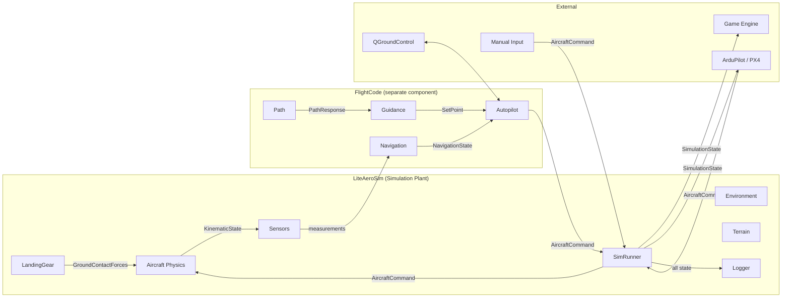
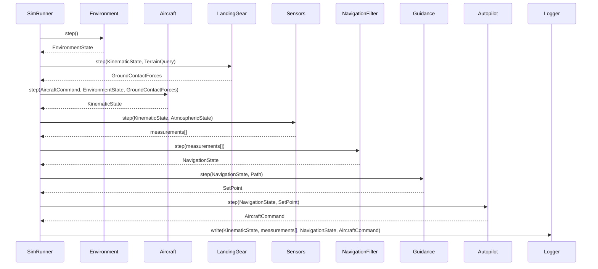
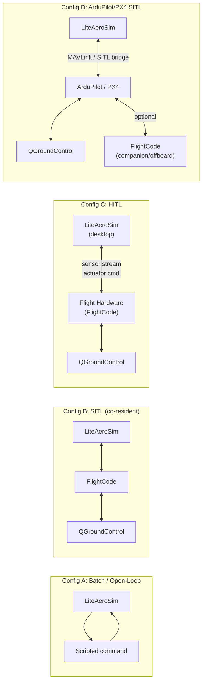
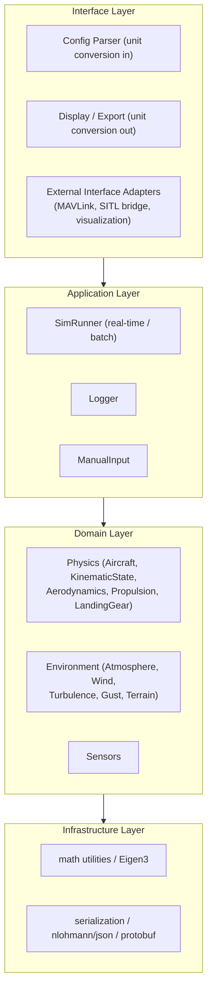

# System Architecture — Future State

This document defines the target architecture as described in the project roadmap. It
establishes the system boundary, component responsibilities, deployment configurations,
and interface requirements that subsequent design and implementation work must satisfy.

**Status:** Initial draft for review. Pending user review, editing, and authorization
before any design or implementation work proceeds.

---

## 1. Originating Requirements

These requirements are drawn from the roadmap and from the answers to architectural
uncertainty questions recorded during roadmap development.

### Simulation Requirements

| ID | Requirement |
| --- | --- |
| SR-1 through SR-12 | All present-state simulation requirements carry forward unchanged (see `present_state.md §1`). |
| SR-13 | LiteAeroSim is the simulation plant. It does not contain autopilot, guidance, path management, or navigation functions. These are flight code components that are architecturally separate. |
| SR-14 | The simulation must be able to operate with no flight code present (simulation-only mode for batch processing, Monte Carlo, and algorithmic development). |
| SR-15 | The simulation must be able to accept commands from and provide outputs to a co-resident flight code component without modification to the simulation internals. |
| SR-16 | The simulation must be able to interface with flight code running on a separate compute node (hardware-in-the-loop, remote SITL). |
| SR-17 | The simulation must support a landing gear dynamic model that produces ground contact forces and moments in the body frame, integrated with the terrain model. |

### Flight Code Requirements

| ID | Requirement |
| --- | --- |
| FC-1 | Autopilot, guidance, path management, and navigation are flight code components. They are designed to flight software standards and are not simulation-specific. |
| FC-2 | Flight code components must support simulation use cases: reset and initialization to arbitrary conditions, deterministic replay, and state serialization. |
| FC-3 | The autopilot must not include estimation functions within its architectural boundary. Estimation belongs to the navigation component. |
| FC-4 | Flight code components must support integration with ArduPilot and PX4, using MAVLink where sufficient and custom interfaces where MAVLink does not meet requirements. |
| FC-5 | Flight code components may be collocated with the simulation (same process or same host) or deployed on separate compute resources (companion computer, flight hardware). The architecture must accommodate all of these configurations. |
| FC-6 | The architecture must accommodate future perception functions (image-based navigation, inference-based state estimation) without requiring a redesign. The architecture definition identifies the kinds of perception functions anticipated and sets requirements for future expansion. |

### Integration and External Interface Requirements

| ID | Requirement |
| --- | --- |
| EI-1 | The system must support connection to a game engine for real-time and scaled-real-time 3D visualization. |
| EI-2 | The system must support pilot-in-the-loop control input via joystick and RC transmitter (USB). |
| EI-3 | The system must support connection to QGroundControl for mission planning and telemetry display. |
| EI-4 | The system must support ArduPilot hardware-in-the-loop (HITL) and software-in-the-loop (SITL) simulation modes. |
| EI-5 | The system must support PX4 HITL and SITL simulation modes. |
| EI-6 | The simulation loop timing must support real-time, scaled real-time, and full-rate batch execution modes. |
| EI-7 | The system must support traffic pattern operations at FAA non-towered airfields and AMA club fields, including off-nominal handling (aborted takeoff, aborted landing, go-around, expedited approach). |
| EI-8 | The system must support full ground operations: from power-up through GPS/EKF alignment, runway survey, takeoff, landing rollout, and taxi. |

---

## 2. Use Cases

### UC-1 — Batch Simulation (Simulation-Only)

**Actor:** Engineer or automated test harness

**Configuration:** LiteAeroSim only; no flight code.

**Steps:**

1. Load simulation configuration.
2. Initialize all simulation components.
3. Drive `Aircraft` with a scripted `AircraftCommand` sequence (open-loop or tabulated).
4. Run N timesteps at full rate (no wall-clock pacing).
5. Log output; analyze results offline.

**Use:** Algorithm development, aero model validation, Monte Carlo, CI regression.

---

### UC-2 — Software-in-the-Loop Simulation (Co-Resident SITL)

**Actor:** Engineer

**Configuration:** LiteAeroSim + FlightCode co-resident on same host (same or separate processes).

**Steps:**

1. Start LiteAeroSim simulation runner in real-time or scaled-real-time mode.
2. Start flight code components (Autopilot, Navigation) in the same process or as a local co-process.
3. Flight code receives sensor measurements from LiteAeroSim and produces `AircraftCommand`.
4. Simulation runner feeds command to `Aircraft::step()` and returns updated state to flight code.
5. Operator monitors via QGroundControl connection.

**Use:** Closed-loop autopilot development and testing; gain validation; traffic pattern development.

---

### UC-3 — Hardware-in-the-Loop Simulation (HITL)

**Actor:** Test engineer

**Configuration:** LiteAeroSim on desktop; flight code on flight hardware (companion computer or autopilot board).

**Steps:**

1. LiteAeroSim runs on desktop; flight hardware is connected via Ethernet or serial link.
2. Sensor measurements are streamed from LiteAeroSim to flight hardware at sensor update rate.
3. Flight hardware runs flight code; produces actuator commands.
4. Actuator commands are received by LiteAeroSim and fed to `Aircraft::step()`.

**Use:** Flight software integration testing on actual hardware; hardware timing and latency characterization.

---

### UC-4 — ArduPilot / PX4 Integration

**Actor:** Engineer

**Configuration:** LiteAeroSim + ArduPilot or PX4 (co-resident SITL or HITL).

**Integration options (any of the following):**

- Full replacement of ArduPilot/PX4 autopilot internals with the LiteAeroSim flight code components.
- Partial override: flight code runs as a companion-computer or offboard node, interfacing to ArduPilot/PX4 via MAVLink or custom protocol.
- Mode sequencing via Lua scripting within ArduPilot/PX4; flight code provides outer-loop set points.

**Steps:**

1. Configure the integration mode.
2. LiteAeroSim provides plant dynamics; the autopilot source (ArduPilot/PX4 internal, custom flight code, or hybrid) closes the control loop.
3. QGroundControl connects for telemetry and mission management.

---

### UC-5 — Traffic Pattern Operations

**Actor:** Operator (RC pilot) or automated mission

**Preconditions:** Closed-loop autopilot operational (UC-2 or UC-3); landing gear model implemented (for ground phases).

**Steps:**

1. Operator initiates autotakeoff or traffic pattern entry.
2. Flight code executes the pattern sequence: departure, crosswind, downwind, base, final.
3. Operator may intervene via RC transmitter switch inputs (abort, go-around, sequencing).
4. Flight code handles off-nominal cases per defined behavior.

---

### UC-6 — Ground Operations

**Actor:** Operator

**Preconditions:** Landing gear model implemented; ground operations design complete.

**Steps:**

1. Power-up; GPS acquisition; EKF alignment.
2. Systems test on test stand; pre-takeoff test.
3. Taxi sequence; runway survey; takeoff roll with abort capability.
4. Landing rollout; back-taxi; taxi to parking.

---

### UC-7 — Post-Flight Analysis

**Actor:** Engineer (offline)

**Steps:** As in present-state UC-6; extended to cover flight code state logs (autopilot commands, navigation state) in addition to simulation state.

---

## 3. System Element Registry

### 3.1 System Boundary

The future-state system comprises four top-level architectural components:

| Component | Boundary | Deployment |
| --- | --- | --- |
| **LiteAeroSim** | Simulation plant: aircraft physics, environment, terrain, sensors, logger | Desktop / test server |
| **FlightCode** | Autopilot, guidance, path management, navigation | Flight hardware, companion computer, or co-resident with LiteAeroSim |
| **SimulationRunner** | Execution loop, timing control, batch / real-time modes | Co-resident with LiteAeroSim |
| **External Interfaces** | QGroundControl, game engine, manual input, ArduPilot/PX4 | Various |

### 3.2 LiteAeroSim Elements

All present-state elements carry forward (see `present_state.md §3`), with the following
additions and clarifications.

| Element | New / Changed | Notes |
| --- | --- | --- |
| `LandingGear` | **New** | Ground contact forces and moments; Pacejka magic formula for tyre; 2nd-order suspension; compatible with `V_Terrain` interface |
| `SimulationRunner` | **New** | Execution loop with real-time, scaled-real-time, and batch modes |
| Flight code stubs | **Relocated** | `Autopilot`, `Guidance`, `Path` stubs removed from LiteAeroSim; relocated to FlightCode component |

### 3.3 FlightCode Elements

The FlightCode component is a separable software system. It is not a subsystem of
LiteAeroSim. Its repository location is to be determined by this architecture definition.

| Element | Responsibility | Ports — Inputs | Ports — Outputs |
| --- | --- | --- | --- |
| `Autopilot` | Inner-loop closed-loop control; tracks set-point commands for altitude hold, vertical speed hold, heading hold, roll attitude hold | `KinematicState` (or `NavigationState`), `AtmosphericState`, set-point struct | `AircraftCommand` |
| `PathGuidance` | Lateral path tracking; nonlinear guidance law (L1 or similar); nulls cross-track error | `PathResponse`, `KinematicState` | heading/roll set point |
| `VerticalGuidance` | Altitude / climb-rate tracking | target altitude, `KinematicState` | altitude / vertical-speed set point |
| `ParkTracking` | Loiter / station-keep | target point, `KinematicState` | heading and altitude set points |
| `V_PathSegment`, `PathSegmentHelix`, `Path` | Path representation; cross-track error, along-track distance, desired heading at a query point | `PathQuery` (position, heading) | `PathResponse` |
| `NavigationFilter` | EKF/UKF navigation: fuses GNSS, air data, magnetometer, INS into navigation state | sensor measurements | `NavigationState` |
| `WindEstimator` | Estimates wind NED from navigation state and air data | `NavigationState`, `AirDataMeasurement` | wind_NED_mps |
| `FlowAnglesEstimator` | Estimates alpha and beta from wind estimate and air data | wind estimate, `AirDataMeasurement` | alpha_rad, beta_rad |

**Key architectural constraints on FlightCode:**

- No FlightCode element may hold a pointer or reference into LiteAeroSim simulation
  internals. All communication is through defined interface data types.
- FlightCode elements must support `reset()` and initialization to arbitrary conditions.
- Estimation functions (`NavigationFilter`, `WindEstimator`, `FlowAnglesEstimator`) are
  within the Navigation subsystem boundary; they are not within the Autopilot boundary.

### 3.4 SimulationRunner Elements

| Element | Responsibility | Ports — Inputs | Ports — Outputs |
| --- | --- | --- | --- |
| `SimRunner` | Execution loop; paces steps to wall clock (real-time / scaled) or runs free (batch); calls `Aircraft::step()` and environment steps in correct order | `RunnerConfig` | step counter, elapsed sim time |

### 3.5 External Interface Elements

| Element | Responsibility | Protocol |
| --- | --- | --- |
| `ManualInput` | Translates joystick / RC transmitter inputs to `AircraftCommand` | USB HID (SDL2 or platform API) |
| `QGroundControlLink` | Telemetry and mission planning interface to QGroundControl | MAVLink over UDP |
| `ArduPilotInterface` | SITL/HITL interface to ArduPilot | ArduPilot SITL protocol / MAVLink |
| `PX4Interface` | SITL/HITL interface to PX4 | PX4 SITL bridge / MAVLink |
| `VisualizationLink` | Real-time or scaled-real-time state stream to game engine | TBD (JSON over WebSocket, or binary protocol) |

---

## 4. Data Flow Types and Registry

### 4.1 New and Modified Data Flow Types

Present-state DFT-1 through DFT-8 carry forward. The following types are added.

| ID | Type | Producer | Consumers | Description |
| --- | --- | --- | --- | --- |
| DFT-9 | `NavigationState` | `NavigationFilter` | `Autopilot`, `WindEstimator`, Logger | Estimated position (NED or WGS84), NED velocity, attitude, angular rates, covariance |
| DFT-10 | `SetPoint` | Guidance components | `Autopilot` | Target altitude (m), vertical speed (m/s), heading (rad), roll attitude (rad) |
| DFT-11 | `PathQuery` / `PathResponse` | `PathGuidance` | `Path` | Query: position NED, heading. Response: crosstrack error (m), along-track (m), desired heading (rad), desired altitude (m), segment-complete flag |
| DFT-12 | `GroundContactForces` | `LandingGear` | `Aircraft` | Body-frame forces (N) and moments (N·m) from all active wheel contact points |
| DFT-13 | `SimulationState` | `SimRunner` (aggregated) | External interfaces, Logger | Full simulation snapshot: `KinematicState` + sensor measurements + flight code state; used for HITL streaming, visualization, and logging |
| DFT-14 | Telemetry / command stream | `QGroundControlLink`, `ArduPilotInterface`, `PX4Interface` | External ground stations / autopilot platforms | MAVLink messages (attitude, position, airspeed, mode, mission items) |

### 4.2 Data Flow Instance Registry (Future State)

| Instance | Type | From | To | Notes |
| --- | --- | --- | --- | --- |
| aircraft-command | DFT-1 | `Autopilot` (or manual input) | `Aircraft::step()` | In closed-loop mode, produced by Autopilot; in open-loop, by test harness or `ManualInput` |
| navigation-state | DFT-9 | `NavigationFilter` | `Autopilot`, `WindEstimator`, Logger | In simulation, may be replaced by `SensorInsSimulation` output |
| set-point | DFT-10 | Guidance (`PathGuidance`, `VerticalGuidance`, `ParkTracking`) | `Autopilot` | Outer loop → inner loop |
| path-query | DFT-11 | `PathGuidance` | `Path` | Path geometry query each step |
| ground-contact | DFT-12 | `LandingGear` | `Aircraft::step()` | Active only when any wheel is in contact; zero force/moment when airborne |
| simulation-state | DFT-13 | `SimRunner` | Visualization, HITL link | Streamed at simulation update rate |
| sensor-measurements | DFT-5 (+ others) | All sensors | `NavigationFilter` (or `SensorInsSimulation`) | In SITL/HITL, also streamed to flight hardware |
| telemetry-up | DFT-14 | `SimRunner` → interface adapters | QGroundControl, ArduPilot/PX4 | State encoded as MAVLink or custom |
| command-down | DFT-14 | QGroundControl, ArduPilot/PX4 | Interface adapters → Autopilot or `ManualInput` | Mode changes, mission items, override commands |

---

## 5. Data Flow Diagrams

### 5.1 System Context

### 5.2 Closed-Loop Step Sequence (SITL)

### 5.3 Deployment Configurations

### 5.4 LiteAeroSim Internal Layer Architecture (Future State)

**Note:** FlightCode (Autopilot, Guidance, Path, Navigation) is outside this layer diagram.
It communicates with LiteAeroSim only through the Interface Layer adapters (ICD-8, ICD-9).

---

## 6. Interface Control Documents

---

### ICD-8 — Simulation ↔ FlightCode Interface (Plant Interface)

This is the primary runtime boundary between LiteAeroSim and the FlightCode component.

**Producers / Consumers:**

- LiteAeroSim → FlightCode: sensor measurements, navigation state (if produced by simulation)
- FlightCode → LiteAeroSim: `AircraftCommand`

**Transport options (any of the following; selected by deployment configuration):**

- Direct in-process function call (co-resident SITL, same process)
- Local IPC (co-resident SITL, separate processes on same host)
- Network message (HITL; companion-computer SITL)
- MAVLink over UDP (ArduPilot/PX4 integration)

**Data crossing this boundary:**

| Direction | Data | Type | Notes |
| --- | --- | --- | --- |
| LAS → FC | Sensor measurements | DFT-5 and others | Per-sensor measurement structs |
| LAS → FC | Simulation time | float (s) | Elapsed simulation time |
| FC → LAS | Aircraft command | DFT-1 | Normal/lateral load factor, throttle |

**Constraints:**

- All values SI units regardless of transport encoding.
- The interface must be encodable in MAVLink for ArduPilot/PX4 compatibility. Where
  MAVLink message types are insufficient, custom message definitions are required.
- Timing: in real-time SITL, commands must arrive within one timestep; late commands
  are held at last value (zero-order hold).
- The interface is stateless: LiteAeroSim does not depend on any FlightCode internal state.

---

### ICD-9 — FlightCode ↔ Navigation State Interface

**Producer:** `NavigationFilter` (or `SensorInsSimulation` as a simulation substitute)

**Consumer:** `Autopilot`, `WindEstimator`, Logger

**Transport:** Direct function call (FlightCode component-internal)

**Content:**

| Field group | Content | Unit |
| --- | --- | --- |
| Position | NED position or WGS84 | m or deg |
| Velocity | NED velocity estimate | m/s |
| Attitude | Estimated quaternion + Euler | rad |
| Angular rates | Body-frame rate estimate | rad/s |
| Covariance | Position, velocity, attitude estimate covariances | SI² |
| Validity flags | Fix quality, sensor health flags | nd |

**Constraints:**

- The autopilot consumes `NavigationState` only; it has no direct access to raw sensor data.
- In simulation, `SensorInsSimulation` may substitute for `NavigationFilter` to reduce
  computational cost (truth-plus-error model, ~35× faster than a full EKF).

---

### ICD-10 — External Ground Station Interface (QGroundControl)

**Producer/Consumer:** `QGroundControlLink` adapter (bidirectional)

**Transport:** MAVLink over UDP

**Key message types (inbound to system):**

- `MISSION_ITEM`, `MISSION_COUNT`, `MISSION_REQUEST` — mission upload
- `COMMAND_LONG` (`MAV_CMD_DO_SET_MODE`, etc.) — mode changes
- `RC_CHANNELS_OVERRIDE` — manual override from GCS

**Key message types (outbound from system):**

- `ATTITUDE`, `GLOBAL_POSITION_INT` — state telemetry
- `VFR_HUD` — airspeed, altitude, heading, throttle display
- `MISSION_CURRENT`, `MISSION_ITEM_REACHED` — mission progress
- `STATUSTEXT` — status and alert messages

**Constraints:**

- Where MAVLink provides insufficient expressiveness, the interface definition must
  identify the gap and propose a resolution (custom message, companion protocol, or
  architectural workaround).

---

### ICD-11 — Visualization Interface (Game Engine)

**Producer:** `SimRunner` / `VisualizationLink` adapter

**Consumer:** Game engine (external)

**Transport:** TBD (JSON over WebSocket and binary UDP protocol are candidate options)

**Content:** `SimulationState` (DFT-13): position, attitude, airspeed, control surface deflections, landing gear state, terrain mesh reference.

**Constraints:**

- Must support real-time streaming at simulation update rate.
- Must support scaled-real-time (playback faster or slower than real time).
- Coordinate frame conversion (NED → game-engine convention) is the responsibility of the adapter, not the simulation.

---

### ICD-12 — Manual Input Interface

**Producer:** Joystick / RC transmitter (USB HID)

**Consumer:** `ManualInput` adapter → `AircraftCommand`

**Transport:** USB HID (SDL2 or platform API)

**Content:**

- Axis values mapped to throttle, roll rate command, pitch command, yaw command.
- Button / switch states mapped to mode selections and override commands.

**Constraints:**

- Dead zone and axis scaling are configurable.
- `ManualInput` outputs `AircraftCommand` in SI units.
- Pilot inputs should be mappable to RC transmitter switch inputs for traffic pattern operator interface requirements.

---

## 7. Architectural Decisions and Open Questions

### Decisions Made

| Decision | Choice | Rationale |
| --- | --- | --- |
| LiteAeroSim scope | Simulation plant only | Separates flight-code reuse from simulation-specific code; enables flight software deployment without simulation dependencies |
| FlightCode as separate component | Yes — not a LiteAeroSim subsystem | Flight code must meet flight-software standards; including it in a simulation library creates wrong-level dependencies |
| MAVLink as baseline external protocol | Yes, with custom extension where needed | ArduPilot and PX4 compatibility; QGroundControl integration; extensible |
| Autopilot / Navigation boundary | Navigation is outside Autopilot boundary | Separation of estimation and control; enables navigation filter replacement |
| Perception functions | Accommodated in architecture, not yet designed | Identifies kinds of perception capabilities; sets requirements for future integration without redesign |

### Open Questions Requiring Resolution

These questions must be answered before the software design phase begins.

| ID | Question |
| --- | --- |
| OQ-1 | What is the repository structure for FlightCode? Separate repository, monorepo subdirectory, or git submodule within LiteAeroSim? |
| OQ-2 | What is the C++ namespace and build target name for FlightCode components? |
| OQ-3 | For co-resident SITL (same process): is the ICD-8 boundary a direct function call, or should a thin adapter enforce the architectural boundary (preventing accidental coupling)? |
| OQ-4 | What is the minimum viable MAVLink message set for the ICD-10 QGroundControl interface? Where does the current MAVLink standard fall short? |
| OQ-5 | What is the preferred game engine for real-time visualization (ICD-11)? What transport protocol does it support? |
| OQ-6 | What specific kinds of perception functions should the architecture accommodate in ICD-9 and the Navigation component design (OQ-6a: image-based navigation; OQ-6b: radar-based track estimation; OQ-6c: other inference-based functions)? |
| OQ-7 | For the `LandingGear` component: should it integrate with `Aircraft::step()` directly, or should the `SimRunner` collect landing gear forces separately and pass them to `Aircraft` together with aerodynamic and propulsion forces? |
| OQ-8 | For HITL configurations (ICD-8 over network): what is the maximum acceptable latency for the command path, and what is the timestep rate of the simulation loop? |
