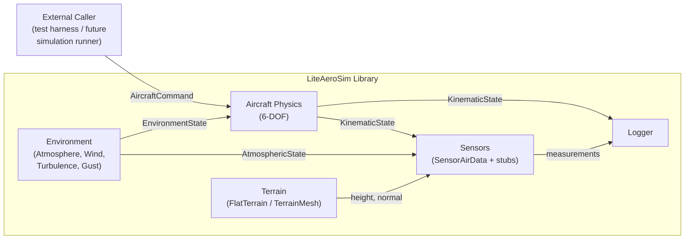
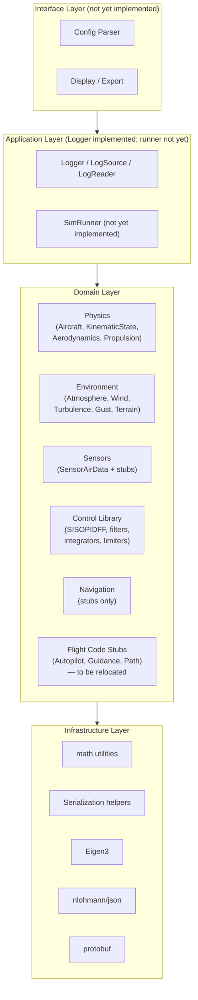
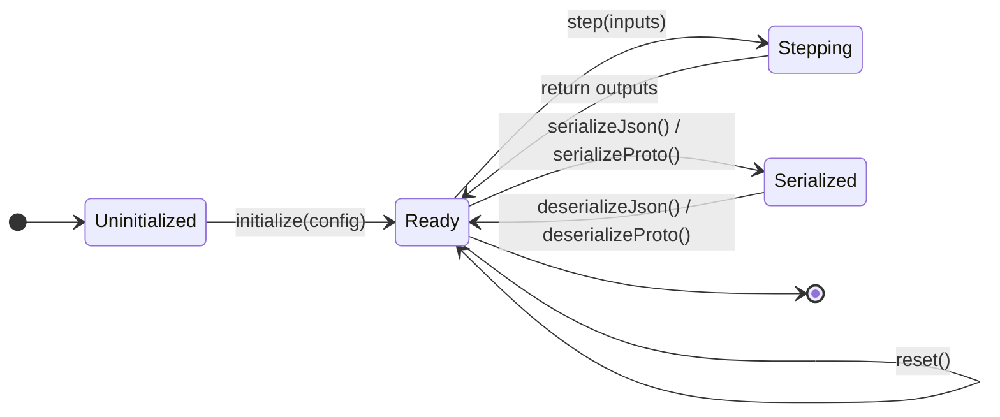

# System Architecture — Present State

This document defines the architecture of the system as it exists in the current codebase.
It reflects the implemented code and the design documentation that governs it. Components
described as "stub only" are defined architecturally but not yet implemented.

**Status:** Present-state baseline. Subject to review and revision before the future-state
architecture is authorized to proceed.

---

## 1. Originating Requirements

These requirements are derived from the implemented codebase, the design documents, and
the project guidelines. They represent the constraints that shaped the current architecture.

| ID | Requirement |
| --- | --- |
| SR-1 | Simulate the 6-DOF rigid-body dynamics of a fixed-wing aircraft at a fixed timestep. |
| SR-2 | Model the atmospheric environment: ISA pressure, temperature, and density with configurable deviations; relative humidity; wind (constant, power-law, logarithmic profile); continuous turbulence (Dryden, 6 filters, Tustin-discretized); discrete gust (1-cosine, MIL-SPEC-8785C). |
| SR-3 | Model terrain geometry with variable level of detail; support height and surface normal queries from arbitrary NED positions. |
| SR-4 | Provide sensor measurement models that produce realistic instrument outputs (noise, lag, bias, geometric error) from simulation truth state. |
| SR-5 | Log simulation state to file in a format suitable for post-flight analysis. |
| SR-6 | Support deterministic replay: given the same configuration seed and initial conditions, the simulation produces bitwise-identical output across runs. |
| SR-7 | Support batch simulation: reset and re-initialize all components to arbitrary conditions without re-reading configuration files. |
| SR-8 | Serialize and restore complete simulation state at any point (checkpoint and restore for branched Monte Carlo and reproducible debugging). |
| SR-9 | All domain-layer computations use SI units. Unit conversion is permitted only at external interfaces (configuration parsing, display). |
| SR-10 | Every stateful component implements a common lifecycle: `initialize(config)` → `reset()` → `step()×N` → `serializeJson()` / `deserializeJson()`. |
| SR-11 | Every stateful component supports both JSON and protobuf serialization with round-trip fidelity. |
| SR-12 | The control library (filters, integrators, PID) is general-purpose and usable within simulation physics models and, in future, in flight code. |

---

## 2. Use Cases

### UC-1 — Configure and Initialize a Simulation

**Actor:** Simulation framework (external caller, not yet implemented)

**Preconditions:** JSON configuration files are available.

**Steps:**

1. Caller loads component JSON configurations.
2. Caller constructs each component and calls `initialize(config)`.
3. Caller establishes any inter-component data references (e.g., terrain pointer injected into sensors).
4. Caller calls `reset()` to set initial conditions.

**Postconditions:** All components are in a consistent, ready-to-step state.

---

### UC-2 — Run a Simulation Step

**Actor:** Simulation framework

**Preconditions:** All components initialized and reset.

**Steps:**

1. Step environment: query `Atmosphere`, `Wind`, `Turbulence`, `Gust`; assemble `EnvironmentState`.
2. Step `Aircraft` with `AircraftCommand` and `EnvironmentState`; receive updated `KinematicState`.
3. Step each `Sensor` with truth state and `AtmosphericState`; receive measurement structs.
4. Write logged quantities to `Logger`.

**Postconditions:** `KinematicState` advanced by one timestep; all sensor outputs current; log updated.

**Note:** No simulation runner is currently implemented. This use case describes the intended
orchestration pattern; the caller currently performs this sequence manually.

---

### UC-3 — Reset Between Runs

**Actor:** Simulation framework

**Steps:**

1. Call `reset()` on all components in dependency order.
2. Optionally supply new initial conditions (e.g., a new starting `KinematicState`).
3. Resume at UC-2.

---

### UC-4 — Checkpoint and Restore State

**Actor:** Simulation framework

**Steps:**

1. Call `serializeJson()` (or `serializeProto()`) on all components; store snapshots.
2. Later, call `deserializeJson()` (or `deserializeProto()`) on each component to restore state.
3. Next `step()` call on each component produces output consistent with the checkpoint.

---

### UC-5 — Ingest Terrain Data

**Actor:** Python terrain pipeline (offline)

**Steps:**

1. Download digital elevation model (DEM) from Copernicus or NASA EarthData.
2. Mosaic and reproject to ENU reference frame.
3. Apply geoid undulation correction.
4. Triangulate DEM into a triangle mesh (Delaunay TIN).
5. Colorize facets from imagery raster.
6. Simplify mesh using quadric error metric.
7. Verify mesh quality; export to `.las_terrain` binary format.
8. (Optional) Export to `.glb` (glTF) for visualization.

**Postconditions:** `.las_terrain` file ready for `TerrainMesh` initialization.

---

### UC-6 — Post-Flight Analysis

**Actor:** Engineer (offline)

**Steps:**

1. Load `.csv` or MCAP log file produced by `Logger`.
2. Use Python post-processing tools to produce time-series plots.
3. Inspect physical quantities, sensor outputs, and trajectory.

---

## 3. System Element Registry

All elements below reside within the LiteAeroSim C++ library unless noted as Python tooling.
Elements marked **stub** are defined architecturally and have header files but no implementation.

### 3.1 Root Abstractions

| Element | Layer | Responsibility | Ports — Inputs | Ports — Outputs |
| --- | --- | --- | --- | --- |
| `DynamicElement` | Infrastructure | NVI lifecycle base for all stateful components; enforces `initialize` / `reset` / `serialize` contract | JSON config | — |
| `SisoElement` | Infrastructure | SISO wrapper over `DynamicElement`; provides `step(float) → float` NVI for scalar signal-chain elements | `float u` | `float y` |

### 3.2 Physics

| Element | Layer | Responsibility | Ports — Inputs | Ports — Outputs |
| --- | --- | --- | --- | --- |
| `Aircraft` | Domain | 6-DOF rigid body; integrates aerodynamic and propulsion forces; owns kinematic state | `AircraftCommand`, `EnvironmentState` | `KinematicState` |
| `KinematicState` | Domain | Value object: position (WGS84), NED velocity, attitude (quaternion + Euler), body angular rates, body acceleration | — | consumed by sensors, guidance |
| `LiftCurveModel` | Domain | Lift curve parameterization; config-only (no step) | aero coefficients config | — |
| `LoadFactorAllocator` | Domain | Distributes commanded load factor to control surface deflections | `n`, `n_y`, `alpha`, `beta` | surface deflections |
| `AeroCoeffEstimator` | Domain | Derives trim aero coefficients from airframe geometry (DATCOM/Hoerner methods) | `AircraftGeometry` | `AeroPerformance` |
| `AeroPerformance` | Domain | Value object: trimmed aerodynamic coefficient set | — | consumed by `Aircraft` |
| `AirframePerformance` | Domain | Value object: combined aero + propulsion performance | — | consumed by `Aircraft` |
| `Inertia` | Domain | Mass and moment-of-inertia tensor | — | consumed by `Aircraft` |

### 3.3 Propulsion

| Element | Layer | Responsibility | Ports — Inputs | Ports — Outputs |
| --- | --- | --- | --- | --- |
| `Propulsion` (abstract) | Domain | Base interface for all propulsion models | throttle, `AtmosphericState`, airspeed | thrust_n |
| `PropulsionJet` | Domain | Turbojet thrust model (Mach + altitude lapse) | throttle, Mach, altitude | thrust_n |
| `PropulsionEDF` | Domain | Electric ducted fan thrust model | throttle, airspeed | thrust_n |
| `PropulsionProp` | Domain | Propeller + motor thrust model | throttle, airspeed, RPM | thrust_n, torque_nm |
| `Motor` (abstract) | Domain | Stateless motor torque/RPM interface | throttle | torque_nm, RPM |
| `MotorElectric` | Domain | Electric motor: torque–RPM–throttle relationship | throttle, RPM | torque_nm |
| `MotorPiston` | Domain | Piston engine: power curve model | throttle, RPM, altitude | torque_nm |

### 3.4 Environment

| Element | Layer | Responsibility | Ports — Inputs | Ports — Outputs |
| --- | --- | --- | --- | --- |
| `Atmosphere` | Domain | ISA 3-layer model + temperature deviation + humidity; density altitude | geometric altitude (m) | `AtmosphericState` |
| `Wind` | Domain | Steady wind: Constant / PowerLaw / Log profile variants | altitude (m) | wind velocity NED (m/s) |
| `Turbulence` | Domain | Dryden continuous turbulence; 6-filter Tustin-discretized | `V_a` (m/s), altitude (m) | `TurbulenceVelocity` (body frame, m/s + rad/s) |
| `Gust` | Domain | 1-cosine discrete gust (MIL-SPEC-8785C) | time (s), gust activation | gust velocity body (m/s) |
| `EnvironmentState` | Domain | Aggregate value object: `AtmosphericState` + wind + turbulence + gust | — | consumed by `Aircraft`, sensors |

### 3.5 Terrain

| Element | Layer | Responsibility | Ports — Inputs | Ports — Outputs |
| --- | --- | --- | --- | --- |
| `V_Terrain` (abstract) | Domain | Interface: height and surface normal query | NED position (m) | height_m, surface_normal |
| `FlatTerrain` | Domain | Trivial flat terrain at sea level | NED position | height = 0, normal = (0,0,−1) |
| `TerrainMesh` | Domain | LOD triangle mesh terrain; queries closest facet at range-selected LOD | NED position, observer range (m) | height_m, surface_normal, facet color |
| `TerrainTile` | Domain | Subdomain mesh tile (7 LOD levels) | — | — |
| `TerrainCell` | Domain | Single LOD mesh for one tile | — | — |
| `LodSelector` | Domain | Selects LOD for each active cell based on slant range with hysteresis | slant range (m) per cell | `TerrainLod` per cell |
| `MeshQualityVerifier` | Domain | Verifies minimum angle, aspect ratio, and degenerate facet criteria | `TerrainMesh` | `MeshQualityReport` |
| `SimulationFrame` | Domain | ENU coordinate frame origin (WGS84 reference point); converts NED ↔ ECEF | WGS84 datum | transform matrix |

### 3.6 Sensors

| Element | Layer | Responsibility | Ports — Inputs | Ports — Outputs |
| --- | --- | --- | --- | --- |
| `SensorAirData` | Domain | Pitot-static ADC: differential pressure + static pressure transducers with noise, lag, crossflow error; derives IAS, CAS, EAS, TAS, Mach, baro altitude, OAT | airspeed_body_mps, `AtmosphericState` | `AirDataMeasurement` |
| `SensorGnss` | Domain | GNSS receiver model — **stub only** | `KinematicState` | `GnssMeasurement` |
| `SensorMag` | Domain | Triaxial magnetometer model — **stub only** | `KinematicState` | `MagMeasurement` |
| `SensorLaserAlt` | Domain | Laser altimeter — **stub only** | `KinematicState`, `V_Terrain` | `LaserAltMeasurement` |
| `SensorRadAlt` | Domain | Radar altimeter — **stub only** | `KinematicState`, `V_Terrain` | `RadAltMeasurement` |
| `SensorInsSimulation` | Domain | INS truth-plus-error replacement — **stub only** | `KinematicState` | `InsMeasurement` |
| `SensorAA` | Domain | Angle/angle passive sensor — **stub only** | `KinematicState`, target position | `AngleMeasurement` |
| `SensorAAR` | Domain | Angle/angle/range active sensor — **stub only** | `KinematicState`, target position | `AngleRangeMeasurement` |
| `SensorTrackEstimator` | Domain | Kinematic track estimator — **stub only** | angle/range measurements | `TrackEstimate` |
| `SensorForwardTerrainProfile` | Domain | Forward terrain profiling sensor — **stub only** | `KinematicState`, `V_Terrain` | terrain range returns |

### 3.7 Control Library

| Element | Layer | Responsibility | Ports — Inputs | Ports — Outputs |
| --- | --- | --- | --- | --- |
| `SISOPIDFF` | Domain | PID with feedforward; derivative filter; integral antiwindup; computes error internally as `command − measurement` | `float command`, `float measurement` (or `float measurement_derivative`) | `float y` (actuator command) |
| `FilterTF`, `FilterSS`, `FilterSS2`, `FilterSS2Clip`, `FilterFIR` | Domain | Discrete-time filter bank (transfer-function, state-space, FIR forms) | `float u` | `float y` |
| `Integrator` | Domain | Trapezoid integrator with optional antiwindup limits | `float u` | `float y` |
| `Derivative` | Domain | Filtered derivative (first-order Tustin) | `float u` | `float y` |
| `Limit` | Domain | Symmetric or asymmetric scalar clamp | `float u` | `float y` |
| `RateLimit` | Domain | Rate-of-change limiter | `float u` | `float y` |
| `Unwrap` | Domain | Phase unwrapper for angular quantities | `float u` | `float y` |
| `Gain` | Domain | Scalar gain with scheduled-gain stub (scheduling not yet implemented) | `float u` | `float y` |

### 3.8 Logging

| Element | Layer | Responsibility | Ports — Inputs | Ports — Outputs |
| --- | --- | --- | --- | --- |
| `Logger` | Application | Records logged values at each step; writes MCAP and CSV | named scalar / vector values | `.mcap`, `.csv` files |
| `LogSource` | Application | Per-component logging interface; submits named channels to `Logger` | component state | — |
| `LogReader` | Application | Reads and decodes MCAP log files | `.mcap` file | data frames |

### 3.9 Navigation (Stubs)

| Element | Layer | Responsibility | Ports — Inputs | Ports — Outputs |
| --- | --- | --- | --- | --- |
| `NavigationFilter` | Domain | EKF/UKF navigation filter — **stub only** | sensor measurements | `NavigationState` |
| `WindEstimator` | Domain | Wind estimation from navigation + air data — **stub only** | `NavigationState`, `AirDataMeasurement` | wind_NED_mps |
| `FlowAnglesEstimator` | Domain | Alpha/beta estimation — **stub only** | wind estimate, `AirDataMeasurement` | alpha_rad, beta_rad |

### 3.10 Flight Code Stubs (Not Part of LiteAeroSim)

These elements have stub headers in the repository as temporary placeholders. Per the
future-state architecture, they will be relocated to a separate flight code component.

| Element | Responsibility |
| --- | --- |
| `Autopilot` | Inner-loop flight control — **stub only** |
| `PathGuidance`, `VerticalGuidance`, `ParkTracking` | Guidance laws — **stub only** |
| `V_PathSegment`, `PathSegmentHelix`, `Path` | Path representation — **stub only** |

### 3.11 Python Tooling

| Element | Responsibility |
| --- | --- |
| Terrain pipeline (`las_terrain.py`, `download.py`, `mosaic.py`, `geoid_correct.py`, `triangulate.py`, `colorize.py`, `simplify.py`, `verify.py`, `export.py`, `export_gltf.py`) | Offline terrain data ingestion from DEM sources to `.las_terrain` |

---

## 4. Data Flow Types and Registry

### 4.1 Data Flow Types

| ID | Type | Producer | Consumers | Description |
| --- | --- | --- | --- | --- |
| DFT-1 | `AircraftCommand` | Simulation framework (or Autopilot, when implemented) | `Aircraft` | Commanded normal load factor (g), lateral load factor (g), load factor rates (1/s), wind-frame roll rate (rad/s), normalized throttle [0, 1] |
| DFT-2 | `AtmosphericState` | `Atmosphere` | `Aircraft`, `SensorAirData`, `Propulsion` | Ambient temperature (K), static pressure (Pa), density (kg/m³), speed of sound (m/s), relative humidity (nd), density altitude (m) |
| DFT-3 | `EnvironmentState` | Assembled by simulation framework from environment components | `Aircraft` | Aggregate: `AtmosphericState` + wind NED (m/s) + `TurbulenceVelocity` (body, m/s + rad/s) + gust velocity body (m/s) |
| DFT-4 | `KinematicState` | `Aircraft` | Sensors, Logger, (Autopilot — future) | Position (WGS84), NED velocity (m/s), attitude (quaternion + Euler angles), body angular rates (rad/s), body acceleration (m/s²), alpha (rad), beta (rad), airspeed (m/s) |
| DFT-5 | `AirDataMeasurement` | `SensorAirData` | Logger, (NavigationFilter — future) | IAS, CAS, EAS, TAS (m/s), Mach (nd), barometric altitude (m), OAT (K) |
| DFT-6 | `TerrainQuery` / `TerrainResponse` | Simulation framework | — | Input: NED position (m), observer range (m). Output: height_m (m), surface normal (unit vector NED) |
| DFT-7 | Log channel values | All components (via `LogSource`) | `Logger` | Named scalar or vector quantity at each timestep |
| DFT-8 | `TurbulenceVelocity` | `Turbulence` | `EnvironmentState` | Body-frame turbulence: u\_t, v\_t, w\_t (m/s); p\_t, q\_t, r\_t (rad/s) |

### 4.2 Data Flow Instance Registry

| Instance | Type | From | To | Notes |
| --- | --- | --- | --- | --- |
| aircraft-command | DFT-1 | Simulation framework | `Aircraft::step()` | Currently driven by test harness; Autopilot will produce this in future |
| atmospheric-state | DFT-2 | `Atmosphere::step()` | `EnvironmentState`, `SensorAirData::step()` | Queried once per step at current geometric altitude |
| environment-state | DFT-3 | Assembled in simulation loop | `Aircraft::step()` | Wind from `Wind`; turbulence from `Turbulence`; gust from `Gust` |
| kinematic-state | DFT-4 | `Aircraft::step()` | `SensorAirData::step()`, Logger | Airspeed body vector extracted for sensor input |
| air-data-measurement | DFT-5 | `SensorAirData::step()` | Logger | Available for NavigationFilter (future) |
| terrain-query | DFT-6 | Sensors, future guidance | `V_Terrain` implementation | Currently used by terrain pipeline; will be used by RadAlt, LaserAlt |
| turbulence-velocity | DFT-8 | `Turbulence::step()` | `EnvironmentState` | Expressed in body frame |

---

## 5. Data Flow Diagrams

### 5.1 System Context



### 5.2 Per-Step Data Flow (Single Simulation Step)

```mermaid
sequenceDiagram
    participant Loop as Simulation Loop
    participant Atm as Atmosphere
    participant Wind as Wind/Turbulence/Gust
    participant AC as Aircraft
    participant SAD as SensorAirData
    participant Log as Logger

    Loop->>Atm: step(altitude_m)
    Atm-->>Loop: AtmosphericState

    Loop->>Wind: step(altitude_m, Va_mps)
    Wind-->>Loop: EnvironmentState (wind + turbulence + gust)

    Loop->>AC: step(AircraftCommand, EnvironmentState)
    AC-->>Loop: KinematicState

    Loop->>SAD: step(airspeed_body_mps, AtmosphericState)
    SAD-->>Loop: AirDataMeasurement

    Loop->>Log: write(KinematicState, AirDataMeasurement, ...)
```

### 5.3 Layer Architecture



### 5.4 Component Lifecycle State Machine



---

## 6. Interface Control Documents

At the present stage, ICDs identify each interface, its data content, and the
architectural constraints that govern it. Field-level schema definitions are in the C++
headers and `proto/liteaerosim.proto`; they are not reproduced here.

---

### ICD-1 — AircraftCommand

**Producer:** Simulation framework (test harness); future Autopilot component.

**Consumer:** `Aircraft::step()`

**Transport:** Direct function-call argument (in-process, same translation unit).

**Content:**

| Field | Unit | Description |
| --- | --- | --- |
| `n` | g | Commanded normal load factor |
| `n_y` | g | Commanded lateral load factor |
| `n_dot` | 1/s | Rate of change of `n` (for alpha-dot feed-forward) |
| `n_y_dot` | 1/s | Rate of change of `n_y` (for beta-dot feed-forward) |
| `rollRate_Wind_rps` | rad/s | Commanded wind-frame roll rate |
| `throttle_nd` | nd | Normalized throttle [0, 1] |

**Constraints:**

- All values SI. No unit conversion inside `Aircraft`.
- `n = 1` is 1 g (level, unaccelerated flight). `n = 0` is zero g (free fall).
- `throttle_nd` is clamped to [0, 1] inside `Aircraft`; the caller need not pre-clamp.

---

### ICD-2 — AtmosphericState

**Producer:** `Atmosphere::step()`

**Consumers:** `EnvironmentState` assembly; `SensorAirData::step()`; `Propulsion` subclasses.

**Transport:** Value struct passed by value or const reference.

**Content:**

| Field | Unit | Description |
| --- | --- | --- |
| `temperature_k` | K | Static (ambient) temperature |
| `pressure_pa` | Pa | Static pressure |
| `density_kgm3` | kg/m³ | Moist air density |
| `speed_of_sound_mps` | m/s | Speed of sound |
| `relative_humidity_nd` | nd | Relative humidity [0, 1] |
| `density_altitude_m` | m | ISA altitude at which ρ\_ISA = ρ\_actual |

**Constraints:**

- Queried once per step at the current geometric altitude of the aircraft.
- The struct is immutable after production; no consumer modifies it.

---

### ICD-3 — EnvironmentState

**Producer:** Simulation loop (assembles from Atmosphere, Wind, Turbulence, Gust).

**Consumer:** `Aircraft::step()`

**Transport:** Value struct.

**Content:**

| Field | Type/Unit | Description |
| --- | --- | --- |
| `atmosphere` | `AtmosphericState` | See ICD-2 |
| `wind_NED_mps` | m/s (NED vector) | Steady ambient wind velocity |
| `turbulence` | `TurbulenceVelocity` | Body-frame continuous turbulence (m/s + rad/s) |
| `gust_body_mps` | m/s (body vector) | Discrete gust velocity |

**Constraints:**

- All velocities SI.
- Wind is expressed in NED frame; turbulence and gust in body frame.

---

### ICD-4 — KinematicState

**Producer:** `Aircraft::step()` (updates internal state; accessor returns const reference).

**Consumers:** All sensors; Logger; future Autopilot and Navigation components.

**Transport:** Const reference or value copy.

**Key content (selected fields):**

| Group | Content | Unit |
| --- | --- | --- |
| Position | WGS84 datum (latitude, longitude, altitude above ellipsoid) | deg, deg, m |
| NED velocity | `velocity_NED_mps` | m/s |
| Attitude | Quaternion `q_nb` (NED to body); Euler angles (roll, pitch, yaw) | rad |
| Body rates | `p`, `q`, `r` | rad/s |
| Body acceleration | `acceleration_body_mps2` | m/s² |
| Aerodynamic angles | `alpha_rad`, `beta_rad` | rad |
| Airspeed | `Va_mps` | m/s |

**Constraints:**

- `KinematicState` is owned by `Aircraft`; external components hold const references or
  copy the struct.
- Angular rates are body-frame; Euler angles use 3-2-1 (yaw–pitch–roll) sequence.

---

### ICD-5 — AirDataMeasurement

**Producer:** `SensorAirData::step()`

**Consumers:** Logger; future NavigationFilter; future Autopilot (altitude/airspeed hold).

**Transport:** Return value from `step()`.

**Content:**

| Field | Unit | Description |
| --- | --- | --- |
| `ias_mps` | m/s | Indicated airspeed (incompressible Bernoulli, ρ₀ reference) |
| `cas_mps` | m/s | Calibrated airspeed (isentropic, ρ₀ reference) |
| `eas_mps` | m/s | Equivalent airspeed (dynamic pressure equivalent at ρ₀) |
| `tas_mps` | m/s | True airspeed |
| `mach_nd` | nd | Mach number |
| `baro_altitude_m` | m | Barometric altitude (Kollsman-referenced) |
| `oat_k` | K | Outside air temperature |

**Constraints:**

- All values include configured noise, lag, and crossflow pressure error.
- `ias_mps`, `cas_mps`, `eas_mps`, `tas_mps`, `mach_nd` are clamped to ≥ 0.

---

### ICD-6 — Terrain Query Interface (`V_Terrain`)

**Producer:** `FlatTerrain` or `TerrainMesh`

**Consumers:** Future `SensorRadAlt`, `SensorLaserAlt`; future landing gear contact model; future guidance.

**Transport:** Virtual function call.

**Interface:**

```cpp
float heightAboveSeaLevel_m(Eigen::Vector3f position_NED_m) const
Eigen::Vector3f surfaceNormal_NED(Eigen::Vector3f position_NED_m) const
```

**Constraints:**

- Height is above the WGS84 ellipsoid (approximately MSL for low-altitude operations).
- Surface normal is unit vector expressed in NED frame.
- Both `FlatTerrain` and `TerrainMesh` are conforming implementations.

---

### ICD-7 — Logger Write Interface

**Producer:** All domain components (via `LogSource`)

**Consumer:** `Logger`

**Transport:** Method call.

**Constraints:**

- All logged quantities must be in SI units.
- Channel names are strings; units are encoded in the name where not obvious.
- The `Logger` is write-only during simulation; reading uses `LogReader`.
