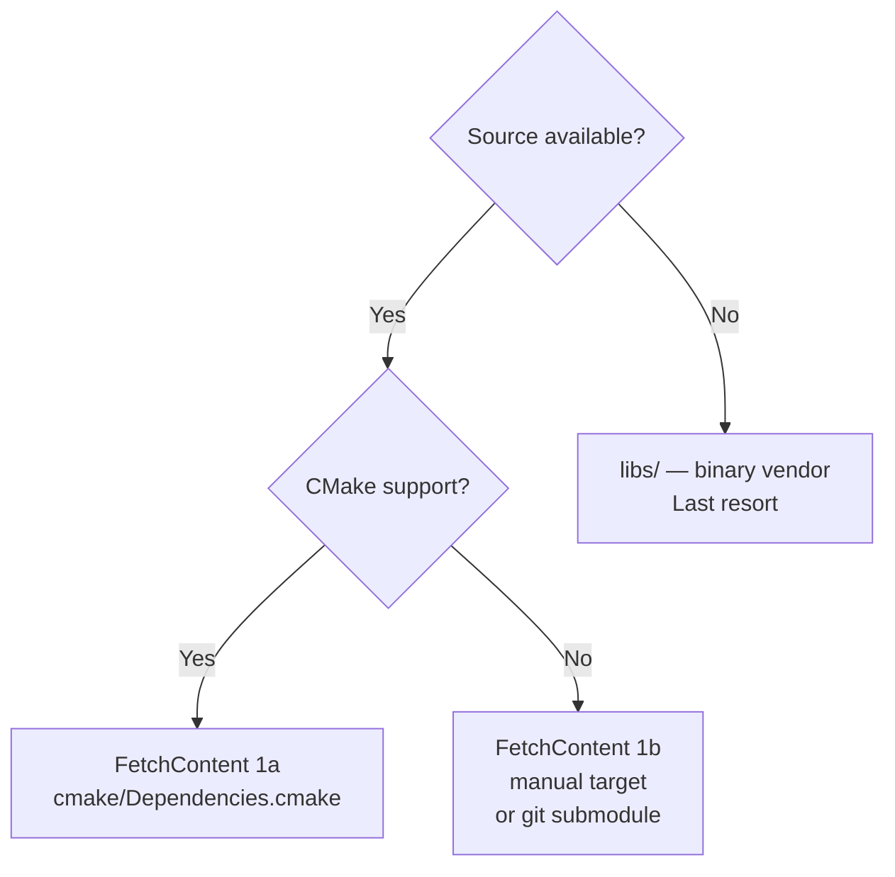

# External Dependencies

## License Policy

Prefer permissive open-source licenses. See [guidelines/general.md](../guidelines/general.md#external-dependencies-and-licensing) for the full policy.

| License | Acceptability |
|---|---|
| MIT, BSD-2/3-Clause, Clear BSD, Apache 2.0, Boost, ISC | ✅ Preferred |
| LGPL (any) | ⚠️ Acceptable with dynamic linking only |
| GPL (any) | ❌ Avoid |
| Proprietary | ❌ Avoid |

## Current Dependencies

### C++ Runtime Dependencies

| Library | Version / SHA | License | Integration | Purpose |
|---|---|---|---|---|
| [Eigen3](https://eigen.tuxfamily.org) | 3.4+ | MPL-2 | System `find_package` | Linear algebra — matrices, vectors, state-space |
| [nlohmann/json](https://github.com/nlohmann/json) | v3.12.0 | MIT | FetchContent (tarball) | JSON serialization / deserialization |
| [trochoids](https://github.com/castacks/trochoids) | `38d23eb` | Clear BSD | FetchContent (source, pattern 1b) | Dubins and trochoidal path planning |

### C++ Test Dependencies

| Library | Version | License | Integration | Purpose |
|---|---|---|---|---|
| [googletest](https://github.com/google/googletest) | v1.17.0 | BSD-3-Clause | FetchContent (zip) | Unit testing (gtest + gmock) |

### Python Dependencies

Declared in `python/pyproject.toml`.

| Package | License | Purpose |
|---|---|---|
| numpy | BSD-3-Clause | Numerical arrays |
| matplotlib | PSF | Plotting |
| pytest | MIT | Unit testing |
| pytest-cov | MIT | Coverage reporting |
| mypy | MIT | Static type checking |
| black | MIT | Code formatting |
| ruff | MIT | Linting |

## Integration Methods

### FetchContent Pattern 1a — CMake-native (nlohmann/json, googletest)

Used when the upstream library has a compatible `CMakeLists.txt`.

```cmake
FetchContent_Declare(
    nlohmann_json
    URL https://github.com/nlohmann/json/releases/download/v3.12.0/json.tar.xz
)
FetchContent_MakeAvailable(nlohmann_json)
```

### FetchContent Pattern 1b — Source with incompatible build system (trochoids)

Used when the upstream uses a non-CMake build system (catkin/ROS in this case). Source is downloaded and compiled with a manually defined target, bypassing the upstream `CMakeLists.txt`.

```cmake
FetchContent_Declare(
    trochoids
    GIT_REPOSITORY https://github.com/castacks/trochoids.git
    GIT_TAG        38d23eb3346737fe9d6e9ff57c742113e29dfe4f
)
FetchContent_GetProperties(trochoids)
if(NOT trochoids_POPULATED)
    FetchContent_Populate(trochoids)
    add_library(trochoids STATIC
        ${trochoids_SOURCE_DIR}/src/trochoids.cpp
        ${trochoids_SOURCE_DIR}/src/trochoid_utils.cpp
        ${trochoids_SOURCE_DIR}/src/DubinsStateSpace.cpp
    )
    target_include_directories(trochoids SYSTEM PUBLIC
        ${trochoids_SOURCE_DIR}/include
    )
endif()
```

> **Note:** `FetchContent_Populate(<name>)` is deprecated in CMake 3.30. If the project minimum is raised to 3.28+, migrate to `FetchContent_MakeAvailable` with a cmake override directory.

### System `find_package` (Eigen3)

Eigen3 is a large header-only library that is better installed system-wide than fetched per-build.

```cmake
if(DEFINED ENV{EIGEN3_INCLUDE_DIR})
    list(APPEND CMAKE_PREFIX_PATH "$ENV{EIGEN3_INCLUDE_DIR}")
endif()
find_package(Eigen3 3.4 REQUIRED NO_MODULE)
```

## Adding a New Dependency

1. Check the license against the policy above.
2. Choose the integration method:



3. Add to `CMakeLists.txt` dependency registry comment block.
4. Record in this document.
